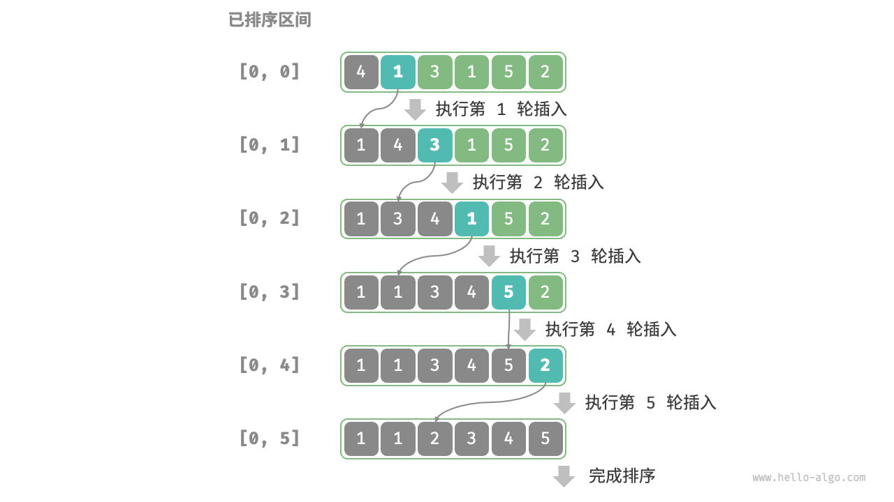

# 概念
插入排序（insertion sort）是一种简单的排序算法，它的工作原理与手动整理一副牌的过程非常相似。

具体来说，我们在未排序区间选择一个基准元素，将该元素与其左侧已排序区间的元素逐一比较大小，并将该元素插入到正确的位置。

图 11-6 展示了数组插入元素的操作流程。设基准元素为 `base` ，我们需要将从目标索引到 `base` 之间的所有元素向右移动一位，然后将 `base` 赋值给目标索引。

# 算法流程

插入排序的整体流程如图 11-7 所示。

1. 初始状态下，数组的第 1 个元素已完成排序。
2. 选取数组的第 2 个元素作为 `base` ，将其插入到正确位置后，**数组的前 2 个元素已排序**。
3. 选取第 3 个元素作为 `base` ，将其插入到正确位置后，**数组的前 3 个元素已排序**。
4. 以此类推，在最后一轮中，选取最后一个元素作为 `base` ，将其插入到正确位置后，**所有元素均已排序**。


# 代码
```cpp
// 插入排序
void insertionSort(std::vector<int> &nums)
{
    // 遍历序列
    for (int i = 1; i < nums.size(); i++)
    {
        int val = nums[i]; // 将遍历到的元素值储存在val变量中
        // 从后往前遍历当已排序元素
        int j = i - 1;
        while (j >= 0 && nums[j] > val)
        {
            nums[j + 1] = nums[j];
            j--;
        }
        nums[j + 1] = val;
    }
}
```
# 算法特性

- **时间复杂度为 𝑂(𝑛2)、自适应排序**：在最差情况下，每次插入操作分别需要循环 𝑛−1、𝑛−2、…、2、1 次，求和得到 (𝑛−1)𝑛/2 ，因此时间复杂度为 𝑂(𝑛2) 。在遇到有序数据时，插入操作会提前终止。当输入数组完全有序时，插入排序达到最佳时间复杂度 𝑂(𝑛) 。
- **空间复杂度为 𝑂(1)、原地排序**：指针 𝑖 和 𝑗 使用常数大小的额外空间。
- **稳定排序**：在插入操作过程中，我们会将元素插入到相等元素的右侧，不会改变它们的顺序。
# 插入排序的优势

- 如果数据趋于有序，那么插入排序是所有排序算法里效率最高的。
- 在基础排序中，排序效率：插入排序 > 选择排序 >冒泡排序。
- 插入排序不仅仅没有交换，而且比较次数少。
1. 插入排序的时间复杂度为 𝑂(𝑛2) ，而我们即将学习的快速排序的时间复杂度为 𝑂(𝑛log⁡𝑛) 。尽管插入排序的时间复杂度更高，**但在数据量较小的情况下，插入排序通常更快**。

2. 这个结论与线性查找和二分查找的适用情况的结论类似。快速排序这类 𝑂(𝑛log⁡𝑛) 的算法属于基于分治策略的排序算法，往往包含更多单元计算操作。而在数据量较小时，𝑛2 和 𝑛log⁡𝑛 的数值比较接近，复杂度不占主导地位，每轮中的单元操作数量起到决定性作用。

3. 实际上，许多编程语言（例如 Java）的内置排序函数采用了插入排序，大致思路为：对于长数组，采用基于分治策略的排序算法，例如快速排序；对于短数组，直接使用插入排序。

4. 虽然冒泡排序、选择排序和插入排序的时间复杂度都为 𝑂(𝑛2) ，但在实际情况中，**插入排序的使用频率显著高于冒泡排序和选择排序**，主要有以下原因。

	- 冒泡排序基于元素交换实现，需要借助一个临时变量，共涉及 3 个单元操作；插入排序基于元素赋值实现，仅需 1 个单元操作。因此，**冒泡排序的计算开销通常比插入排序更高**。
	- 选择排序在任何情况下的时间复杂度都为 𝑂(𝑛2) 。**如果给定一组部分有序的数据，插入排序通常比选择排序效率更高**。
	- 选择排序不稳定，无法应用于多级排序。