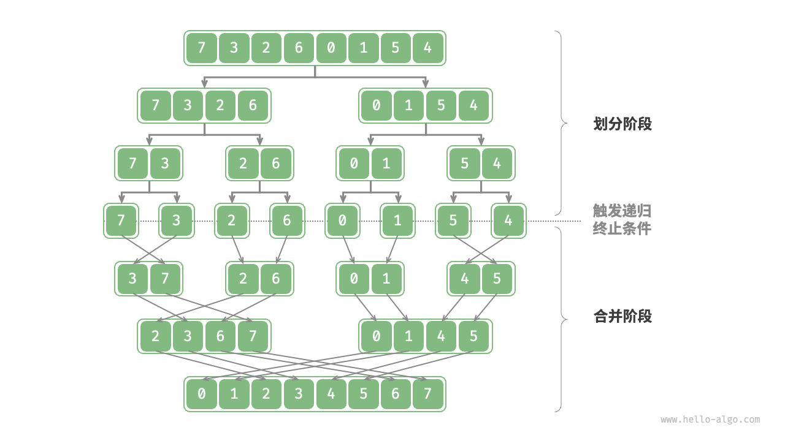

2024-08-19 10:00
Tags: #排序 #算法 
Reference：[1归并排序算法原理_ev_哔哩哔哩_bilibili](https://www.bilibili.com/video/BV1FT421k7LL?p=58&vd_source=0f765d25b29efef66dd4ff586509e026)
# 概念和特点
归并排序（merge sort）是一种基于分治策略的排序算法，包含图 11-10 所示的“划分”和“合并”阶段。
# 算法思想
1. **划分阶段**：通过递归不断地将数组从中点处分开，将长数组的排序问题转换为短数组的排序问题。
2. **合并阶段**：当子数组长度为 1 时终止划分，开始合并，持续地将左右两个较短的有序数组合并为一个较长的有序数组，直至结束。


# 实现步骤
- “划分阶段”从顶至底递归地将数组从中点切分为两个子数组。

1. 计算数组中点 `mid` ，递归划分左子数组（区间 `[left, mid]` ）和右子数组（区间 `[mid + 1, right]` ）。
2. 递归执行步骤  ，直至子数组区间长度为 1 时终止。
- 合并阶段”从底至顶地将左子数组和右子数组合并为一个有序数组。需要注意的是，从长度为 1 的子数组开始合并，合并阶段中的每个子数组都是有序的。
# 代码
```cpp
// 有序合并左子数组和右子数组
void merge(std::vector<int> &nums, size_t left, size_t mid, size_t right)
{
    // 左子序列区间为[left, mid], 右子数组区间为 [mid+1, right]
    std::vector<int> tmp(right - left + 1); // 创建临时数组
    size_t i = left, j = mid + 1, k = 0;

    // 当左右子数组都还有元素时，进行比较并将较小的元素复制到临时数组中
    while (i <= mid && j <= right)
    {
        if (nums[i] <= nums[j])
        {
            tmp[k++] = nums[i++];
        }
        else
        {
            tmp[k++] = nums[j++];
        }
    }

    // 将左子数组的剩余元素复制到临时数组中
    while (i <= mid)
    {
        tmp[k++] = nums[i++];
    }

    // 将右子数组的剩余元素复制到临时数组中
    while (j <= right)
    {
        tmp[k++] = nums[j++];
    }

    // 将临时数组 tmp 中的元素复制回原数组 nums 的对应区间
    for (k = 0; k < tmp.size(); k++)
    {
        nums[left + k] = tmp[k];
    }
}

// 归并排序
void mergeSort(std::vector<int> &nums, size_t left, size_t right)
{
    if (left >= right)
        return; // 递归终止条件

    size_t mid = (left + right) / 2; // 计算区间中点
    mergeSort(nums, left, mid);      // 递归左子序列
    mergeSort(nums, mid + 1, right); // 递归右子序列

    merge(nums, left, mid, right); // 合并已排序的子序列
}
```
# 算法分析
- **时间复杂度为 𝑂(𝑛log⁡𝑛)、非自适应排序**：划分产生高度为 log⁡𝑛 的递归树，每层合并的总操作数量为 𝑛 ，因此总体时间复杂度为 𝑂(𝑛log⁡𝑛) 。
- **空间复杂度为 𝑂(𝑛)、非原地排序**：递归深度为 log⁡𝑛 ，使用 𝑂(log⁡𝑛) 大小的栈帧空间。合并操作需要借助辅助数组实现，使用 𝑂(𝑛) 大小的额外空间。
- **稳定排序**：在合并过程中，相等元素的次序保持不变。
# 核心问题
## 问题1
>[!INFO] Question
>满足 `left >= right`，递归返回，函数不是就结束了么？为什么还会调用`merge`函数?
你提出的问题很关键！让我们仔细分析一下递归调用过程，以及为什么即使满足了 `left >= right` 之后，`merge` 函数仍然会被调用。

### 递归调用过程的深入分析

在`mergesort`算法中，满足 `left >= right` 的情况仅仅意味着当前子数组的长度是1或更小，此时不需要进一步拆分并直接返回。但整个排序过程并不因此结束，而是因为递归会继续**回到上一级**，继续完成分治（合并）过程。

### 递归调用并不意味着整个函数结束
当你调用`mergesort`时，你实际上是递归地处理了左右两个子数组。当处理完左右子数组后，`merge`函数会被调用，用来合并这两个已经排序好的子数组。这是分治算法的核心：将问题递归拆分成最小子问题，然后逐步合并。

让我们看看`mergesort`函数的具体结构：

```c
void mergesort(int arr[], int left, int right) {
    if (left >= right) return; // 递归终止条件，当子数组不可再划分时返回
    
    int mid = left + (right - left) / 2; // 找到中点
    mergesort(arr, left, mid); // 递归处理左半部分
    mergesort(arr, mid + 1, right); // 递归处理右半部分
    merge(arr, left, mid, right); // 合并两个有序的子数组
}
```

### 递归调用的关键点

- 每次调用`mergesort`时，数组会被划分为左右两个子数组，并分别递归处理。
- 当递归到最小的子数组时（即`left >= right`），函数返回。这仅仅意味着当前这个子数组已经处理完毕（对长度为1的子数组，不需要再进行排序）。
- 然后程序会**回到上层递归**，即处理完的子数组的父层，继续处理另一半子数组并合并。

### 为什么 `merge` 函数会被调用？
即使递归过程到达了最小的子数组，`mergesort`函数并没有整体结束，而是逐步回到上层递归。在回到上层时，**两个已经排好序的子数组会通过 `merge` 函数进行合并**。这是归并排序的重要步骤。

举个例子：

假设我们有一个数组 `[8, 4]`：

1. 第一次递归调用：
   - 划分为 `[8]` 和 `[4]`。
   - 递归处理 `[8]` 和 `[4]`，这两个子数组长度为1，满足 `left >= right`，返回。
   
2. 回到上层递归：
   - `[8]` 和 `[4]` 已经分别处理完毕，接下来调用 `merge` 函数合并 `[8]` 和 `[4]`，结果是 `[4, 8]`。

也就是说，**`merge`函数的调用发生在递归返回之后，用于合并两个已经排序好的子数组**。尽管一个递归分支返回了，但函数还会继续进行下一个分支的处理，最终合并结果。

### 总结

1. 递归终止 (`left >= right`) 表示当前子数组已经无法继续划分，递归返回并不会导致整个算法结束。
2. 每个递归分支都会分别处理两个子数组，最后在递归返回后调用`merge`函数，将两个排好序的子数组合并。
3. 整个排序过程直到所有子数组合并完成时才结束。

`merge`函数是在递归调用返回之后才被调用的，用于将已经排序好的子数组合并。
## 问题2
>[!INFO] Question
mergesort(arr, left, mid); // 递归处理左半部分
mergesort(arr, mid + 1, right);// 递归处理右半部分
merge(arr, left, mid, right); //合并两个有序的子数组
这三个函数的执行顺序是怎样的?

在 `mergesort` 算法中，这三行代码的执行顺序是至关重要的，因为它们涉及了递归处理和合并的过程。让我们逐步分析它们的执行顺序。

### 1. **递归处理左半部分**
```c
mergesort(arr, left, mid);
```
这行代码首先处理数组的左半部分 `[left, mid]`。在递归中，`mergesort` 会不断将这部分数组继续划分为更小的子数组，直到每个子数组的长度为1或0（即 `left >= right`）。

#### 举个例子：
如果数组是 `[38, 27, 43, 3, 9, 82, 10]`，假设当前调用是 `mergesort(arr, 0, 3)`，则这行代码会递归调用自己，继续划分为 `[38, 27]` 和 `[43, 3]`，并最终递归到 `[38]` 和 `[27]`。

当处理到最小的子数组时，递归会终止并返回。

### 2. **递归处理右半部分**
```c
mergesort(arr, mid + 1, right);
```
当左半部分完成处理并返回后，程序会继续处理数组的右半部分 `[mid + 1, right]`。这个过程和处理左半部分类似，也是不断递归划分为更小的子数组，直到处理完最小的子问题。

#### 继续刚才的例子：
在处理完左半部分 `[38, 27]` 之后，程序会开始递归处理右半部分 `[43, 3]`，并继续划分为 `[43]` 和 `[3]`，直到所有子数组都被划分并递归返回。

### 3. **合并两个有序子数组**
```c
merge(arr, left, mid, right);
```
当左右两部分都递归处理完毕后，程序会调用 `merge(arr, left, mid, right)`，将已经排序好的左半部分 `[left, mid]` 和右半部分 `[mid + 1, right]` 合并为一个有序数组。

#### 在我们的例子中：
当 `[38]` 和 `[27]` 处理完后，`mergesort` 返回，程序会调用 `merge` 函数，将 `[38]` 和 `[27]` 合并为 `[27, 38]`。同样的，右半部分 `[43]` 和 `[3]` 合并为 `[3, 43]`。然后最终再将 `[27, 38]` 和 `[3, 43]` 合并为 `[3, 27, 38, 43]`。

### 整体执行顺序
1. **先递归处理左半部分**，分割到最小的子数组。
2. **然后递归处理右半部分**，同样分割到最小的子数组。
3. **最后合并**左右两部分的有序子数组。

#### 举个完整的例子：
对数组 `[38, 27, 43, 3]` 执行 `mergesort(arr, 0, 3)`，具体执行顺序如下：
1. `mergesort(arr, 0, 1)`：处理左半部分 `[38, 27]`
   - `mergesort(arr, 0, 0)`：处理左半部分 `[38]`，递归终止。
   - `mergesort(arr, 1, 1)`：处理右半部分 `[27]`，递归终止。
   - `merge(arr, 0, 0, 1)`：合并 `[38]` 和 `[27]`，结果为 `[27, 38]`。
   
2. `mergesort(arr, 2, 3)`：处理右半部分 `[43, 3]`
   - `mergesort(arr, 2, 2)`：处理左半部分 `[43]`，递归终止。
   - `mergesort(arr, 3, 3)`：处理右半部分 `[3]`，递归终止。
   - `merge(arr, 2, 2, 3)`：合并 `[43]` 和 `[3]`，结果为 `[3, 43]`。

3. `merge(arr, 0, 1, 3)`：合并 `[27, 38]` 和 `[3, 43]`，结果为 `[3, 27, 38, 43]`。

### 总结
1. **首先递归处理左半部分**直到它被完全排序。
2. **接着递归处理右半部分**直到它被完全排序。
3. **最后合并左右两部分**，完成当前数组的排序。