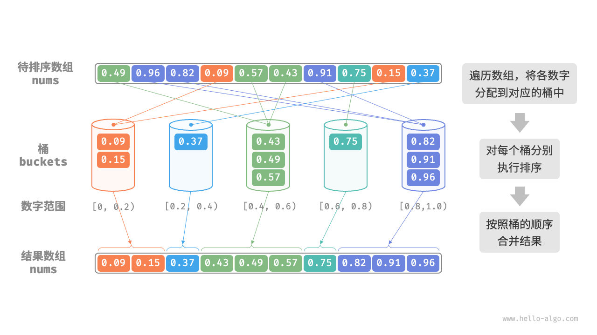
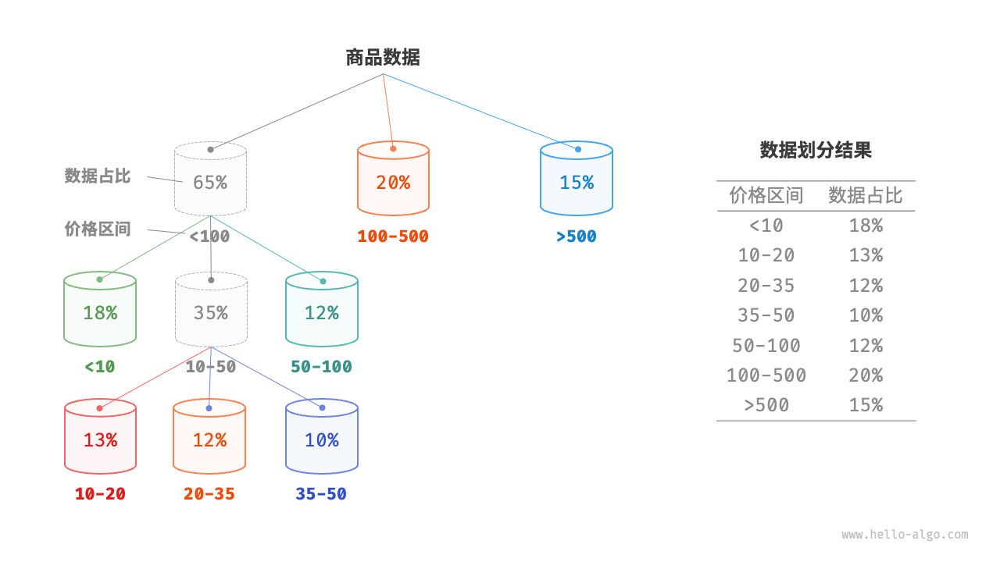
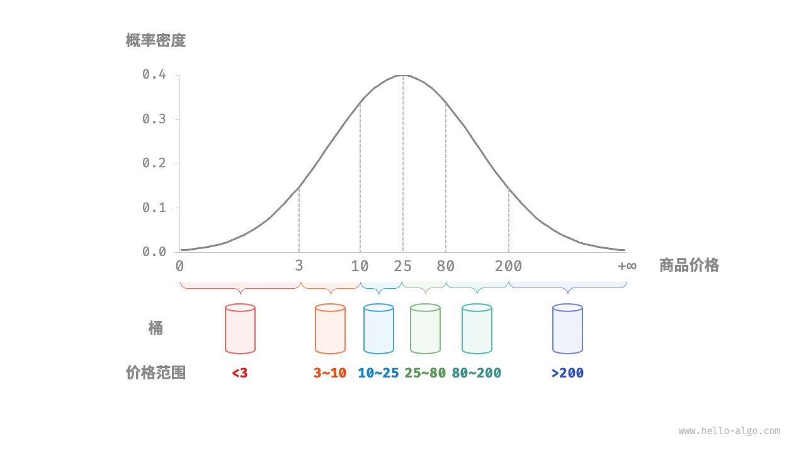

2024-08-26 06:44
Tags: #算法 #排序 
Reference：
# 概念和特点
桶排序（bucket sort）是分治策略的一个典型应用。属于“非比较排序算法”。
# 算法思想
它通过设置一些具有大小顺序的桶，每个桶对应一个数据范围，将数据平均分配到各个桶中；然后，在每个桶内部分别执行排序；最终按照桶的顺序将所有数据合并。
# 实现步骤
考虑一个长度为 n 的数组，其元素是范围 `[0,1)` 内的浮点数。桶排序的流程如图 11-13 所示。

1. 初始化 k 个桶，将 n 个元素分配到 k 个桶中。
2. 对每个桶分别执行排序（这里采用编程语言的内置排序函数）。
3. 按照桶从小到大的顺序合并结果。

图 11-13   桶排序算法流程
# 代码
```cpp
#include <algorithm>
#include <iostream>
#include <vector>

// 桶排序
void bucketSort(std::vector<float> &nums, int numBuckets = 0)
{
    // 初始化k = n / 2个桶，每个桶分配两个元素
    if (!numBuckets)
    {
        numBuckets = nums.size() / 2;
    }

    std::vector<std::vector<float>> buckets(numBuckets);
    // 1.将数组元素分配到桶中
    for (float num : nums)
    {
        // 输入数据范围为 [0, 1)，使用 num * k 映射到索引范围 [0, k-1]
        int bucketIndex = num * numBuckets;
        // 将 num 添加进桶 bucket_idx
        buckets[bucketIndex].push_back(num);
    }
    // 2.对各个桶进行排序
    for (std::vector<float> &bucket : buckets)
    {
        std::sort(bucket.begin(), bucket.end());
    }
    // 3.合并桶
    int i = 0;
    for (std::vector<float> &bucket : buckets)
    {
        for (float num : bucket)
        {
            nums[i++] = num;
        }
    }
}
```
# 算法分析
桶排序适用于处理体量很大的数据。例如，输入数据包含 100 万个元素，由于空间限制，系统内存无法一次性加载所有数据。此时，可以将数据分成 1000 个桶，然后分别对每个桶进行排序，最后将结果合并。

- **时间复杂度为 O(n+k)** ：假设元素在各个桶内平均分布，那么每个桶内的元素数量为 nk 。假设排序单个桶使用 O(nklog⁡nk) 时间，则排序所有桶使用 O(nlog⁡nk) 时间。**当桶数量 k 比较大时，时间复杂度则趋向于 O(n)** 。合并结果时需要遍历所有桶和元素，花费 O(n+k) 时间。在最差情况下，所有数据被分配到一个桶中，且排序该桶使用 O(n2) 时间。
- **空间复杂度为 O(n+k)、非原地排序**：需要借助 k 个桶和总共 n 个元素的额外空间。
- 桶排序是否稳定取决于排序桶内元素的算法是否稳定
# 实现平均分配
桶排序的时间复杂度理论上可以达到 O(n) ，**关键在于将元素均匀分配到各个桶中**，因为实际数据往往不是均匀分布的。例如，我们想要将淘宝上的所有商品按价格范围平均分配到 10 个桶中，但商品价格分布不均，低于 100 元的非常多，高于 1000 元的非常少。若将价格区间平均划分为 10 个，各个桶中的商品数量差距会非常大。

为实现平均分配，我们可以先设定一条大致的分界线，将数据粗略地分到 3 个桶中。**分配完毕后，再将商品较多的桶继续划分为 3 个桶，直至所有桶中的元素数量大致相等**。

如图 11-14 所示，这种方法本质上是创建一棵递归树，目标是让叶节点的值尽可能平均。当然，不一定要每轮将数据划分为 3 个桶，具体划分方式可根据数据特点灵活选择。



如果我们提前知道商品价格的概率分布，**则可以根据数据概率分布设置每个桶的价格分界线**。值得注意的是，数据分布并不一定需要特意统计，也可以根据数据特点采用某种概率模型进行近似。

如图 11-15 所示，我们假设商品价格服从正态分布，这样就可以合理地设定价格区间，从而将商品平均分配到各个桶中。

