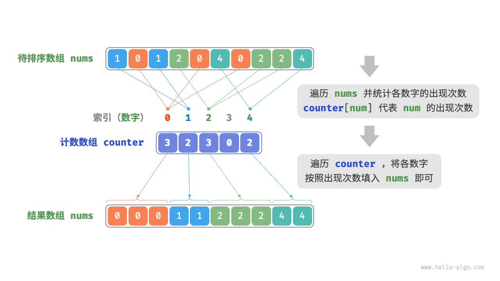

2024-08-26 06:44
Tags:
Reference：
# 概念和特点
计数排序（counting sort）通过统计元素数量来实现排序，通常应用于整数数组。
# 算法思想
先来看一个简单的例子。给定一个长度为 n 的数组 `nums` ，其中的元素都是“非负整数”，计数排序的整体流程如图 11-16 所示。

1. 遍历数组，找出其中的最大数字，记为 m ，然后创建一个长度为 m+1 的辅助数组 `counter` 。
2. **借助 `counter` 统计 `nums` 中各数字的出现次数**，其中 `counter[num]` 对应数字 `num` 的出现次数。统计方法很简单，只需遍历 `nums`（设当前数字为 `num`），每轮将 `counter[num]` 增加 1 即可。
3. **由于 `counter` 的各个索引天然有序，因此相当于所有数字已经排序好了**。接下来，我们遍历 `counter` ，根据各数字出现次数从小到大的顺序填入 `nums` 即可。

# 实现步骤
...
# 代码
```cpp
...
```
# 算法分析
...
