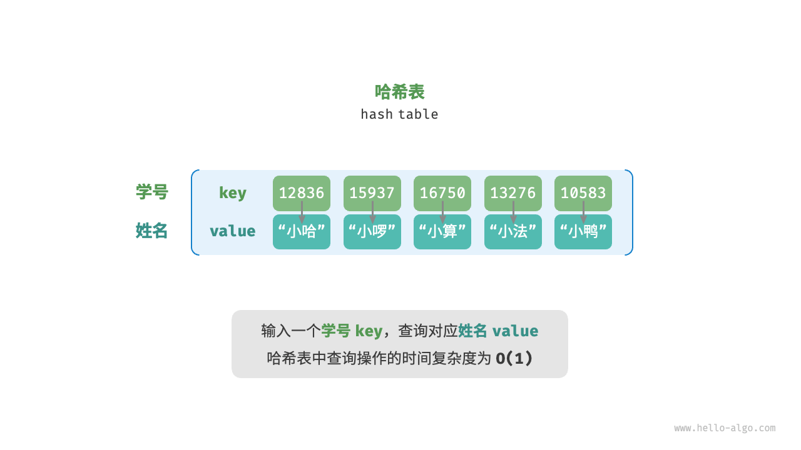
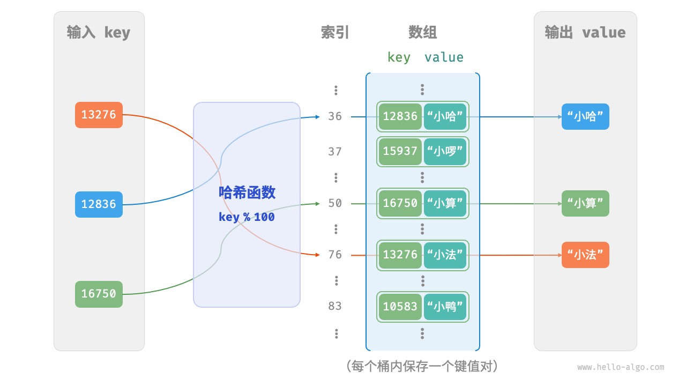
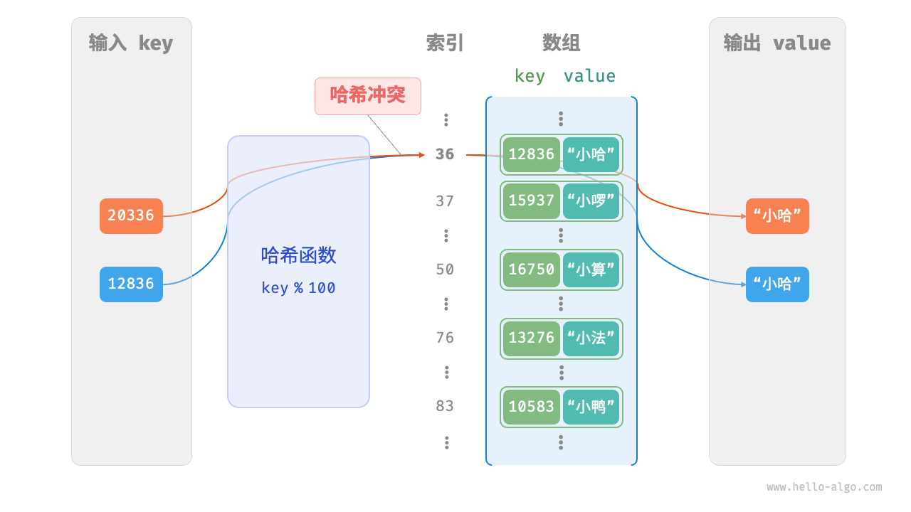
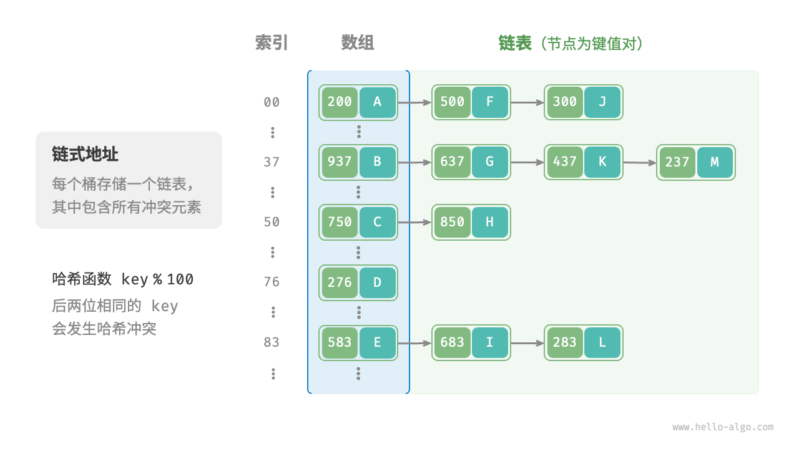
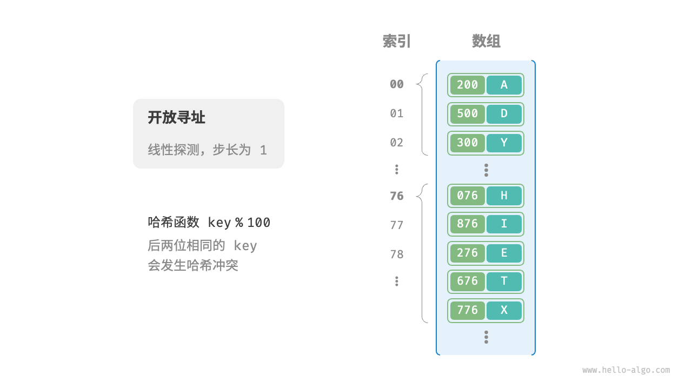
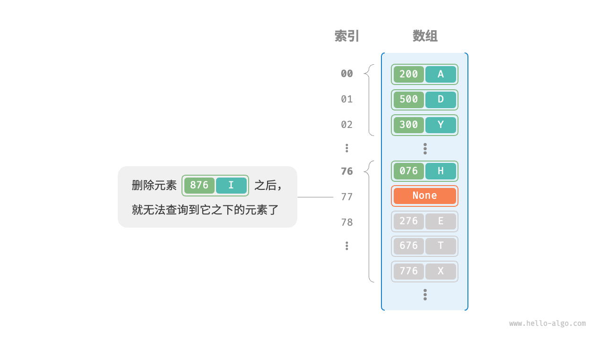
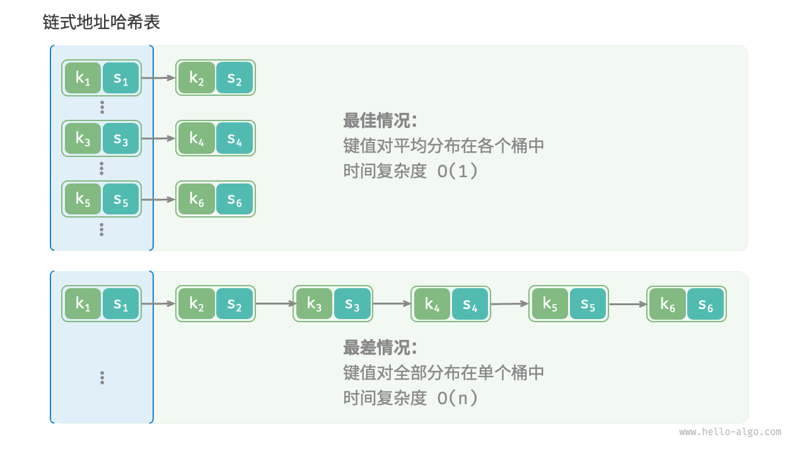

2024-08-26 09:45
Tags: #数据结构 #哈希表
Reference：
# 概念和特点
哈希表（hash table），又称散列表，它通过建立键 `key` 与值 `value` 之间的映射，实现高效的元素查询。
# 算法思想
具体而言，我们向哈希表中输入一个键 `key` ，则可以在 𝑂(1) 时间内获取对应的值 `value` 。**在哈希表中进行增删查改的时间复杂度都是 𝑂(1)** ，非常高效。

# 实现步骤
我们先考虑最简单的情况，**仅用一个数组来实现哈希表**。在哈希表中，我们将数组中的每个空位称为桶（bucket），每个桶可存储一个键值对。因此，查询操作就是找到 `key` 对应的桶，并在桶中获取 `value` 。

那么，如何基于 `key` 定位对应的桶呢？这是通过哈希函数（hash function）实现的。哈希函数的作用是将一个较大的输入空间映射到一个较小的输出空间。在哈希表中，输入空间是所有 `key` ，输出空间是所有桶（数组索引）。换句话说，输入一个 `key` ，**我们可以通过哈希函数得到该 `key` 对应的键值对在数组中的存储位置**。

输入一个 `key` ，哈希函数的计算过程分为以下两步。

1. 通过某种哈希算法 `hash()` 计算得到哈希值。
2. 将哈希值对桶数量（数组长度）`capacity` 取模，从而获取该 `key` 对应的数组索引 `index` 。

`index = hash(key) % capacity`

随后，我们就可以利用 `index` 在哈希表中访问对应的桶，从而获取 `value` 。

设数组长度 `capacity = 100`、哈希算法 `hash(key) = key` ，易得哈希函数为 `key % 100` 。图 6-2 以 `key` 学号和 `value` 姓名为例，展示了哈希函数的工作原理。

# 哈希冲突
从本质上看，哈希函数的作用是将所有 `key` 构成的输入空间映射到数组所有索引构成的输出空间，而输入空间往往远大于输出空间。因此，**理论上一定存在“多个输入对应相同输出”的情况**。

对于上述示例中的哈希函数，当输入的 `key` 后两位相同时，哈希函数的输出结果也相同。例如，查询学号为 12836 和 20336 的两个学生时，我们得到：
```
12836 % 100 = 36
20336 % 100 = 36
```
如图 6-3 所示，两个学号指向了同一个姓名，这显然是不对的。我们将这种多个输入对应同一输出的情况称为哈希冲突（hash collision）。

解决哈希冲突，有如下方案：
## 链式地址
在原始哈希表中，每个桶仅能存储一个键值对。链式地址（separate chaining）将单个元素转换为链表，将键值对作为链表节点，将所有发生冲突的键值对都存储在同一链表中。图 6-5 展示了一个链式地址哈希表的例子。

链式地址存在以下局限性。

- **占用空间增大**：链表包含节点指针，它相比数组更加耗费内存空间。
- **查询效率降低**：因为需要线性遍历链表来查找对应元素
### 实现步骤：

### 代码
1.哈希集合
```cpp
#include <algorithm>
#include <iostream>
#include <list>
#include <stdexcept>
#include <vector>

// 链式哈希表
class ChainHashTable
{
  private:
    std::vector<std::list<int>> table_; // 哈希表的数据结构
    int usedBucketNum_;                 // 记录桶个数
    double loadFactor_;                 // 记录装载因子

    static const int PRIME_SIZE = 10; // 素数表长度
    static int primes_[PRIME_SIZE];   // 素数表
    int primeIndex_;                  // 素数表索引
    // 哈希函数
    int hashFunction(int val, int size)
    {
        return abs(val) % size;
    }
    // 扩容函数
    void expand()
    {
        // 如果素数表已经到达最后一个元素42773，则抛出异常无法扩容
        if (primeIndex_ + 1 == PRIME_SIZE)
        {
            throw std::runtime_error("HashTable is too long! can`t expand anymore!");
        }
        primeIndex_++;      // 素数表索引自增
        usedBucketNum_ = 0; // 重置桶的个数，需要重新计算
        // 创建新的扩容后的哈希表
        std::vector<std::list<int>> newTable(primes_[primeIndex_]);
        // 遍历旧哈希表将数据存入新哈希表并重新计算桶个数
        for (const auto &list : table_)
        {
            for (int val : list)
            {
                int idx = hashFunction(val, newTable.size());
                if (newTable[idx].empty())
                {
                    usedBucketNum_++;
                }
                newTable[idx].push_back(val);
            }
        }
        // 交换哈希表
        table_.swap(newTable);
    }

  public:
    // 构造函数
    ChainHashTable(int size = primes_[0], double loadFactor = 0.75)
        : usedBucketNum_(0), loadFactor_(loadFactor), primeIndex_(0)
    {
        // 如果用户输入的数值大于素数表首元素大小，则调整数值为合适的素数表数值
        if (size > primes_[0])
        {
            // 通过素数表下标遍历素数表，找到大于用户输入的size的位置跳出循环
            for (; primeIndex_ < PRIME_SIZE; primeIndex_++)
            {
                if (primes_[primeIndex_] >= size)
                {
                    break;
                }
            }
            // 如果用户输入数值过大，素数表遍历至最终也没有找到合适的结果，那么就采用素数表末尾值
            if (primeIndex_ == PRIME_SIZE)
            {
                primeIndex_--;
            }
        }
        // 初始化哈希表
        table_.resize(primes_[primeIndex_]);
    }
    // 增加元素，不能重复插入
    void insert(int val)
    {
        // 判断扩容
        double factor = (double)usedBucketNum_ / table_.size();
        if (factor > loadFactor_)
        {
            expand();
        }
        // 通过哈希函数获取索引
        int idx = hashFunction(val, table_.size());
        // 如果桶为空，则插入元素，桶个数自增
        if (table_[idx].empty())
        {
            usedBucketNum_++;
            table_[idx].push_back(val);
        }
        // 如果桶不为空，则判断值是否已存在，不存在插入，存在不操作。
        else
        {
            // 使用algorithm中的find方法，查找值是否已存在在链表中，返回值是迭代器，未找到返回end().
            auto it = std::find(table_[idx].begin(), table_[idx].end(), val);
            // 如果该值不存在，则插入
            if (it == table_[idx].end())
            {
                table_[idx].push_back(val);
            }
        }
    }
    // 删除元素
    void erase(int val)
    {
        // 通过哈希函数获取索引
        int idx = hashFunction(val, table_.size());
        auto it = std::find(table_[idx].begin(), table_[idx].end(), val);
        // 如果该值存在，则删除,如果删除后桶为空，则usedBucketNum_自减
        if (it != table_[idx].end())
        {
            table_[idx].erase(it);
            if (table_[idx].empty())
            {
                usedBucketNum_--;
            }
        }
    }
    // 查找元素
    bool find(int val)
    {
        int idx = hashFunction(val, table_.size());
        auto it = std::find(table_[idx].begin(), table_[idx].end(), val);
        return it != table_[idx].end();
    }
    // 打印函数
    void print()
    {
        for (auto list : table_)
        {
            for (auto val : list)
            {
                std::cout << val << " ";
            }
        }
        std::cout << std::endl;
    }
};
// 素数表，静态成员变量需要在类外初始化
int ChainHashTable::primes_[PRIME_SIZE] = {3, 7, 23, 47, 97, 251, 443, 911, 1471, 42773};
// 测试函数
int main()
{
    ChainHashTable table;
    table.insert(37);
    table.insert(17);
    table.insert(-46);
    table.insert(17);
    table.insert(19);
    table.print();

    table.erase(17);
    table.print();
}
```
2.哈希映射
```cpp
#include <functional>
#include <iostream>
#include <list>
#include <vector>

// 素数表，用于扩展哈希表大小
std::vector<int> primeNumbers = {53, 97, 193, 389, 769, 1543, 3079, 6151, 12289, 24593, 49157};

// 哈希表类
template <typename Key, typename Value>
class HashTable
{
  private:
    std::vector<std::list<std::pair<Key, Value>>> table;
    int tableSize;
    int elementCount;

    // 获取负载因子
    float loadFactor() const
    {
        return static_cast<float>(elementCount) / tableSize;
    }

    // 哈希函数
    int hashFunction(const Key &key) const
    {
        return std::hash<Key>{}(key) % tableSize;
    }

    // 获取下一个素数作为新的表大小
    int getNextPrime(int currentSize)
    {
        for (int prime : primeNumbers)
        {
            if (prime > currentSize)
            {
                return prime;
            }
        }
        return primeNumbers.back(); // 如果当前大小超过素数表，返回最后一个素数
    }

    // 重新哈希
    void rehash()
    {
        int newSize = getNextPrime(tableSize);
        std::vector<std::list<std::pair<Key, Value>>> newTable(newSize);

        for (const auto &bucket : table)
        {
            for (const auto &pair : bucket)
            {
                int newIndex = std::hash<Key>{}(pair.first) % newSize;
                newTable[newIndex].emplace_back(pair);
            }
        }

        table = std::move(newTable);
        tableSize = newSize;
    }

  public:
    // 构造函数，初始化哈希表
    HashTable() : tableSize(primeNumbers[0]), elementCount(0)
    {
        table.resize(tableSize);
    }

    // 默认析构函数
    ~HashTable() = default;

    // 插入键值对
    bool insert(const Key &key, const Value &value)
    {
        if (loadFactor() > 0.75)
        {
            rehash();
        }

        int index = hashFunction(key);
        for (const auto &pair : table[index])
        {
            if (pair.first == key)
            {
                return false; // 键已经存在
            }
        }

        table[index].emplace_back(key, value);
        ++elementCount;
        return true;
    }

    // 删除键值对
    bool remove(const Key &key)
    {
        int index = hashFunction(key);
        for (auto it = table[index].begin(); it != table[index].end(); ++it)
        {
            if (it->first == key)
            {
                table[index].erase(it);
                --elementCount;
                return true;
            }
        }
        return false;
    }

    // 查找键值对
    Value *search(const Key &key)
    {
        int index = hashFunction(key);
        for (auto &pair : table[index])
        {
            if (pair.first == key)
            {
                return &pair.second;
            }
        }
        return nullptr;
    }

    // 获取哈希表中的元素数量
    int size() const
    {
        return elementCount;
    }
};

int main()
{
    HashTable<int, std::string> hashTable;

    hashTable.insert(1, "Hello");
    hashTable.insert(2, "World");

    if (auto value = hashTable.search(1))
    {
        std::cout << "Key 1 has value: " << *value << std::endl;
    }

    hashTable.remove(1);

    if (!hashTable.search(1))
    {
        std::cout << "Key 1 not found" << std::endl;
    }

    return 0;
}
```

### 优化
- 链式哈希表中每个桶的链表比较长时，将桶内的链表转化为红黑树或AVL 树，达到O(logn)的时间复杂度。
- 链式哈希表每个桶都可以创建自己的互斥锁，不同桶中的链表操作可以并发执行。
## 开放寻址
开放寻址（open addressing）不引入额外的数据结构，而是通过“多次探测”来处理哈希冲突，探测方式主要包括线性探测、平方探测和多次哈希等。
### 线性探测

线性探测采用固定步长的线性搜索来进行探测，其操作方法与普通哈希表有所不同。

- **插入元素**：通过哈希函数计算桶索引，若发现桶内已有元素，则从冲突位置向后线性遍历（步长通常为 1 ），直至找到空桶，将元素插入其中。
- **查找元素**：若发现哈希冲突，则使用相同步长向后进行线性遍历，直到找到对应元素，返回 `value` 即可；如果遇到空桶，说明目标元素不在哈希表中，返回 `None` 。

然而，**线性探测容易产生“聚集现象”**。具体来说，数组中连续被占用的位置越长，这些连续位置发生哈希冲突的可能性越大，从而进一步促使该位置的聚堆生长，形成恶性循环，最终导致增删查改操作效率劣化。
值得注意的是，**我们不能在开放寻址哈希表中直接删除元素**。这是因为删除元素会在数组内产生一个空桶 `None` ，而当查询元素时，线性探测到该空桶就会返回，因此在该空桶之下的元素都无法再被访问到，程序可能误判这些元素不存在，如图 6-7 所示。

为了解决该问题，我们可以采用懒删除（lazy deletion）机制：它不直接从哈希表中移除元素，**而是利用一个常量 `TOMBSTONE` 来标记这个桶**。在该机制下，`None` 和 `TOMBSTONE` 都代表空桶，都可以放置键值对。但不同的是，线性探测到 `TOMBSTONE` 时应该继续遍历，因为其之下可能还存在键值对。

然而，**懒删除可能会加速哈希表的性能退化**。这是因为每次删除操作都会产生一个删除标记，随着 `TOMBSTONE` 的增加，搜索时间也会增加，因为线性探测可能需要跳过多个 `TOMBSTONE` 才能找到目标元素。

为此，考虑在线性探测中记录遇到的首个 `TOMBSTONE` 的索引，并将搜索到的目标元素与该 `TOMBSTONE` 交换位置。这样做的好处是当每次查询或添加元素时，元素会被移动至距离理想位置（探测起始点）更近的桶，从而优化查询效率。我们将哈希表看作一个“环形数组”，当越过数组尾部时，回到头部继续遍历。
#### 实现原理：
- 定义枚举类型 enum State记录元素状态，包含三种状态：
	- STATE_USING，正在使用
	- STATE_UNUSE，没有使用
	- STATE_USED，当前元素被删除
- 定义元素节点struct Node,包含两个属性：
	- int val，元素值
	- State state，元素状态
- 增加：通过哈希函数计算数据存放位置
	- 该位置空闲，直接储存元素
	- 该位置被占用（哈希冲突），从当前位置向后找空闲位置，存放元素。
- 查询：通过哈希函数计算数据存放位置，从该位置取值
	- 如果该值等于要查询的元素值，则查询完毕
	- 如果该值不等于要查询的元素值（哈希冲突），继续遍历向后查询该元素。
		-  如果后面的元素状态是 STATE_USING，则对比值，如果不相等，继续向后查找
		- 如果后面的元素状态是 STATE_UNUSE，一直未使用，则不必查询了，没有这个元素
		- 如果后续元素状态是STATE_USED，之前放过元素，后来删除了，则继续向后查询
- 删除：通过哈希函数计算数据存放位置，从该位置取值并判断状态STATE_USING
	- 如果该值等于要删除的值，则修改状态为 STATE_USED.
	- 如果该值不等于要删除的值（哈希冲突），从当前位置向后遍历，找到该元素修改状态，如果遇到 STATE_UNUSE，结束查询，没有该值的元素。
#### 代码
```cpp
#include <iostream>
#include <stdexcept>

// 哈希表元素状态枚举
enum State
{
    STATE_UNUSE, // 从未使用过的桶
    STATE_USING, // 正在使用的桶
    STATE_DEL,   // 元素被删除的桶
};
// 桶的类型
struct Bucket
{
    int val_;     // 存储的数据
    State state_; // 桶的状态
    // 构造函数
    Bucket(int val = 0, State state = STATE_UNUSE) : val_(val), state_(state)
    {
    }
};
// 线性探测哈希表类
class HashTable
{
  private:
    Bucket *table_;     // 指向动态开辟的哈希表
    int tableSize_;     // 哈希表长度
    int usedBucketNum_; // 已经使用的桶的个数
    double loadFactor_; // 装载因子

    static const int PRIME_SIZE = 10; // 素数表大小
    static int prime_[PRIME_SIZE];    // 素数表,静态成员变量要类外实现
    int primeIndex_;                  // 当前使用的素数表索引
    // 扩容函数
    void expand()
    {
        // 素数表索引自增，达到扩容效果
        ++primeIndex_;
        // 如果素数表已经到达最后一个元素42773，则抛出异常无法扩容
        if (primeIndex_ == PRIME_SIZE)
        {
            throw std::runtime_error("HashTable is too long! cannot expand anymore!");
        }
        // 分配新的扩容后的哈希表
        Bucket *newTable = new Bucket[prime_[primeIndex_]];
        // 遍历旧哈希表数据拷贝到新哈希表
        for (int i = 0; i < tableSize_; i++)
        {
            // 如果哈希表中的数据是有效数据(STATE_USING)，则重新哈希放入新哈希表
            if (table_[i].state_ == STATE_USING)
            {
                // 重新哈希计算获取新哈希表索引
                int idx = table_[i].val_ % prime_[primeIndex_];
                // 拷贝数据
                int j = idx;
                do
                {
                    if (newTable[j].state_ != STATE_USING)
                    {
                        newTable[j].val_ = table_[i].val_;
                        newTable[j].state_ = STATE_USING;
                        break;
                    }
                    j = (j + 1) % prime_[primeIndex_];
                } while (j != idx);
            }
        }
        delete[] table_;                  // 删除旧的哈希表
        table_ = newTable;                // 指向新哈希表
        tableSize_ = prime_[primeIndex_]; // 更新哈希表长度
    }

  public:
    // 构造函数
    HashTable(int size = prime_[0], double loadFactor = 0.75)
        : usedBucketNum_(0), loadFactor_(loadFactor), primeIndex_(0)
    {
        // 把用户传入的size调整到最近较大的素数
        if (size > prime_[0])
        {
            // 通过素数表下标遍历素数表，找到大于用户输入的size的位置跳出循环
            for (; primeIndex_ < PRIME_SIZE; primeIndex_++)
            {
                if (prime_[primeIndex_] > size)
                {
                    break;
                }
            }
            // 如果用户输入数值过大，素数表遍历至最终也没有找到合适的结果，那么就采用素数表末尾值
            if (primeIndex_ == PRIME_SIZE)
            {
                primeIndex_--;
            }
        }
        // 素数表元素赋值哈希表大小
        tableSize_ = prime_[primeIndex_];
        // 构建桶数组
        table_ = new Bucket[tableSize_];
    }
    // 析构函数
    ~HashTable()
    {
        delete[] table_;
        table_ = nullptr;
    }
    // 插入元素
    bool insert(int val)
    {
        // 考虑扩容，转化为double类型
        double factor = usedBucketNum_ * 1.0 / tableSize_;
        if (factor > loadFactor_)
        {
            expand();
        }
        // 通过哈希函数获取索引
        int idx = val % tableSize_;
        // 使用do...while循环结构遍历插入,如果位置空闲直接插入，否则循环遍历环形数组在下个空闲位置插入
        int i = idx;
        do
        {
            // 如果位置空闲直接插入
            if (table_[i].state_ != STATE_USING)
            {
                table_[i].val_ = val;
                table_[i].state_ = STATE_USING;
                usedBucketNum_++;
                return true;
            }
            // 进入下个位置，继续判断
            i = (i + 1) % tableSize_;
        } while (i != idx); // 退出条件为环形数组遍历一轮，回到idx位置
        return false;
    }
    // 删除元素
    bool erase(int val)
    {
        // 通过哈希函数获取索引
        int idx = val % tableSize_;
        // 遍历移除,如果位置使用中并且值相等则移除元素，否则循环遍历环形数组在下个空闲位置查找移除
        int i = idx;
        do
        {
            // 如果位置使用中并且值相等则移除元素
            if (table_[i].state_ == STATE_USING && table_[i].val_ == val)
            {
                table_[i].state_ = STATE_DEL;
                usedBucketNum_--;
            }
            // 跳转到下个位置
            i = (i + 1) % tableSize_;
            // 循环退出条件为：元素未使用或者遍历一轮结束
        } while (table_[i].state_ != STATE_UNUSE && i != idx);
        return true;
    }
    // 查询元素
    bool find(int val)
    {
        int idx = val % tableSize_;
        int i = idx;
        do
        {
            if (table_[i].state_ == STATE_USING && table_[i].val_ == val)
            {
                return true;
            }
            i = (i + 1) % tableSize_;
        } while (table_[i].state_ != STATE_UNUSE && i != idx);
        return false;
    }
    // 打印元素
    void print()
    {
        for (int i = 0; i < tableSize_; ++i)
        {
            if (table_[i].state_ == STATE_USING)
            {
                std::cout << table_[i].val_ << " ";
            }
        }
        std::cout << std::endl;
    }
};
// 类外实现静态成员变量，素数表
int HashTable::prime_[PRIME_SIZE] = {3, 7, 23, 47, 97, 251, 443, 911, 1471, 42773};
```
#### 缺点
- 线性探测哈希表发生哈希冲突时，接近O(n)的时间复杂度，因为底层使用数组的数据结构，无法优化
- 在多线程运行环境中，因为线性探测哈希表是基于数组实现的，多线程在一个数组中同时进行查询和修改操作是不可以的。只能给全局表用**互斥锁**来保证哈希表的原子操作，保证哈希表的线程安全。
- 在多线程运行环境中链式哈希表，可以采用分段锁来保证线程安全。又有一定的并发量，提高了效率。
### 平方探测

平方探测与线性探测类似，都是开放寻址的常见策略之一。当发生冲突时，平方探测不是简单地跳过一个固定的步数，而是跳过“探测次数的平方”的步数，即 1,4,9,… 步。

平方探测主要具有以下优势。

- 平方探测通过跳过探测次数平方的距离，试图缓解线性探测的聚集效应。
- 平方探测会跳过更大的距离来寻找空位置，有助于数据分布得更加均匀。

然而，平方探测并不是完美的。

- 仍然存在聚集现象，即某些位置比其他位置更容易被占用。
- 由于平方的增长，平方探测可能不会探测整个哈希表，这意味着即使哈希表中有空桶，平方探测也可能无法访问到它。
### 多次哈希

顾名思义，多次哈希方法使用多个哈希函数 𝑓1(𝑥)、𝑓2(𝑥)、𝑓3(𝑥)、… 进行探测。

- **插入元素**：若哈希函数 𝑓1(𝑥) 出现冲突，则尝试 𝑓2(𝑥) ，以此类推，直到找到空位后插入元素。
- **查找元素**：在相同的哈希函数顺序下进行查找，直到找到目标元素时返回；若遇到空位或已尝试所有哈希函数，说明哈希表中不存在该元素，则返回 `None` 。

与线性探测相比，多次哈希方法不易产生聚集，但多个哈希函数会带来额外的计算量
>[!INFO] Tips
>注意，开放寻址（线性探测、平方探测和多次哈希）哈希表都存在“不能直接删除元素”的问题。

# 哈希算法
然而无论是开放寻址还是链式地址，**它们只能保证哈希表可以在发生冲突时正常工作，而无法减少哈希冲突的发生**。
如果哈希冲突过于频繁，哈希表的性能则会急剧劣化。如图 6-8 所示，对于链式地址哈希表，理想情况下键值对均匀分布在各个桶中，达到最佳查询效率；最差情况下所有键值对都存储到同一个桶中，时间复杂度退化至 𝑂(𝑛) 。

**键值对的分布情况由哈希函数决定**。回忆哈希函数的计算步骤，先计算哈希值，再对数组长度取模：
```
index = hash(key) % capacity
```
观察以上公式，当哈希表容量 `capacity` 固定时，**哈希算法 `hash()` 决定了输出值**，进而决定了键值对在哈希表中的分布情况。
这意味着，为了降低哈希冲突的发生概率，我们应当将注意力集中在哈希算法 `hash()` 的设计上。
## 哈希算法的目标
为了实现“既快又稳”的哈希表数据结构，哈希算法应具备以下特点。

- **确定性**：对于相同的输入，哈希算法应始终产生相同的输出。这样才能确保哈希表是可靠的。
- **效率高**：计算哈希值的过程应该足够快。计算开销越小，哈希表的实用性越高。
- **均匀分布**：哈希算法应使得键值对均匀分布在哈希表中。分布越均匀，哈希冲突的概率就越低。
## 哈希算法的设计

降低哈希冲突的办法：
- 取模质数
- 装载因子(LoadFactor)，已占用桶的个数 / 桶的总数量，如果已占用的桶的个数达到桶总个数的3/4或者0.75，我们就认为此哈希表出现哈希冲突的可能性过大，效率偏低，哈希表需要扩容。
- 哈希表数组扩容，扩容后取模值发生了变化，原来哈希表中的元素需要在新的哈希表中重新哈希。
哈希算法的设计是一个需要考虑许多因素的复杂问题。然而对于某些要求不高的场景，我们也能设计一些简单的哈希算法。

- **加法哈希**：对输入的每个字符的 ASCII 码进行相加，将得到的总和作为哈希值。
- **乘法哈希**：利用乘法的不相关性，每轮乘以一个常数，将各个字符的 ASCII 码累积到哈希值中。
- **异或哈希**：将输入数据的每个元素通过异或操作累积到一个哈希值中。
- **旋转哈希**：将每个字符的 ASCII 码累积到一个哈希值中，每次累积之前都会对哈希值进行旋转操作。
代码：
```cpp
/* 加法哈希 */
int addHash(string key) {
    long long hash = 0;
    const int MODULUS = 1000000007;
    for (unsigned char c : key) {
        hash = (hash + (int)c) % MODULUS;
    }
    return (int)hash;
}

/* 乘法哈希 */
int mulHash(string key) {
    long long hash = 0;
    const int MODULUS = 1000000007;
    for (unsigned char c : key) {
        hash = (31 * hash + (int)c) % MODULUS;
    }
    return (int)hash;
}

/* 异或哈希 */
int xorHash(string key) {
    int hash = 0;
    const int MODULUS = 1000000007;
    for (unsigned char c : key) {
        hash ^= (int)c;
    }
    return hash & MODULUS;
}

/* 旋转哈希 */
int rotHash(string key) {
    long long hash = 0;
    const int MODULUS = 1000000007;
    for (unsigned char c : key) {
        hash = ((hash << 4) ^ (hash >> 28) ^ (int)c) % MODULUS;
    }
    return (int)hash;
}
```
观察发现，每种哈希算法的最后一步都是对大质数 1000000007 取模，以确保哈希值在合适的范围内。值得思考的是，为什么要强调对质数取模，或者说对合数取模的弊端是什么？这是一个有趣的问题。

先抛出结论：**使用大质数作为模数，可以最大化地保证哈希值的均匀分布**。因为质数不与其他数字存在公约数，可以减少因取模操作而产生的周期性模式，从而避免哈希冲突。

举个例子，假设我们选择合数 9 作为模数，它可以被 3 整除，那么所有可以被 3 整除的 `key` 都会被映射到 0、3、6 这三个哈希值。
总而言之，我们通常选取质数作为模数，并且这个质数最好足够大，以尽可能消除周期性模式，提升哈希算法的稳健性。
