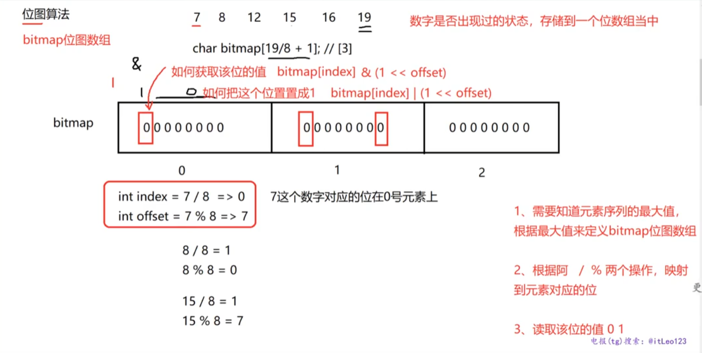
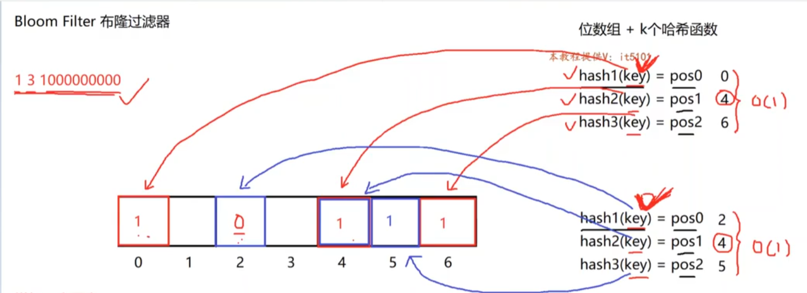

# 查重/去重
## 哈希表
- 查重或者统计重复次数。查询的效率高，但是占用内存空间较大。
- 大多数情况使用`unordered_set`或者`unordered_map`的去重性来解决问题
### 案例
#### 1. 找重复的数字
```cpp
std::vector<int> findDupNums(const std::vector<int> &vec)
{

    std::unordered_set<int> s1; // 创建一个无序集合
    // 用于储存重复的元素
    std::unordered_set<int> dupNums;
    // 遍历数组，在每次插入之前判断集合内是否已有该元素，如果没有则插入，否则打印输出。
    for (auto key : vec)
    {
        auto it = s1.find(key); // 哈希表查询，O(1)时间复杂度。
        // 判断集合内是否已有该元素
        if (it == s1.end())
        {
            s1.insert(key); // 没有，插入集合
        }
        else
        {
            dupNums.insert(key); // 有，插入数组
        }
    }
    return std::vector<int>(dupNums.begin(), dupNums.end()); // 返回数组
}
```
#### 2.数据去重
```cpp
void removeDupNums(std::vector<int> &vec)
{

    std::unordered_set<int> s1; // 创建一个无序集合

    for (auto key : vec)
    {
        s1.emplace(key); // 插入集合,set会自动移除重复元素，multiset可以储存重复元素
    }
    vec.clear();
    for (auto elem : s1)
    {
        vec.push_back(elem);
    }
}
```
#### 3.统计重复数字
```cpp
std::unordered_map<int, int> countDupNums(const std::vector<int> &vec)
{
    std::unordered_map<int, int> m1; // 创建无序映射用于储存值和出现次数的键值对
    // 遍历数组,判断映射内是否已有该元素，无则新增，有则value++
    for (int key : vec)
    {
        auto it = m1.find(key);
        if (it == m1.end())
        {
            m1.emplace(key, 1);
        }
        else
        {
            it->second++;
        }
    }
    //  打印数值和出现次数
    for (auto pair : m1)
    {
        if (pair.second > 1)
        {
            std::cout << "重复的数值->重复次数" << std::endl;
            std::cout << pair.first << "->" << pair.second << std::endl;
        }
        else
        {
            std::cout << "不重复的数值" << std::endl;
            std::cout << pair.first << std::endl;
        }
    }
    return m1;
}
```
#### 4.找出字符串中第一个没有重复出现的字符
```cpp
char firstUndupChar(const std::string &str)
{
    // 创建无序映射用来储存元素和元素出现次数
    std::unordered_map<char, int> m1;
    // 遍历数组填充无序映射
    for (char ch : str)
    {
        /*
         * 运用中括号运算符增加元素
         * 当key不存在于m1时，中括号运算符会在m1中新增pair(key,0)元素
         * 当key存在于m1时，value++
         */
        m1[ch]++;
    }
    // 遍历数组检查每个字符出现次数为1的元素，找到就返回该元素
    for (char ch : str)
    {
        if (m1[ch] == 1)
        {
            return ch;
        }
    }
    // 找不到返回
    return '\0';
}
```
### 常见问题
#### 问题1
- 问题：有两个文件分别是a和b，里面放了很多ip地址(url地址、email地址)，让你找出来两个文件重复的ip，输出出来。
- 解答：把a文件中所有的地址存到到哈希表中，然后依次遍历b文件中的地址，每遍历一个地址，在哈希表中查询次地址是否存在，如果存在将此地址输出。主要用到了哈希表的查询功能，时间复杂度为O(1)。
#### 问题2
- 问题：有两个文件分别是a和b，里面各自存放了**一亿条**ip地址(url地址、email地址)，每个地址占用内存4字节，**限制内存**使用100M，让你找出来两个文件重复的ip，输出出来。
- 解答：
	- 一亿 = 100M个地址，每个地址4字节，400M，写入链式哈希表增加地址域内存后为800M内存，大于限制内存100M。因此我们要采用分治思想，分别将a，b两个文件通过哈希计算拆分为11个桶文件（11为素数，方便哈希计算），然后比对索引相同的桶的文件。
	1. 将文件a内储存的地址依次读取，转化为数值 ，并取模 11，得到桶的索引：`index = (int)address % 11`。放入相应的桶文件中，得到a0, a1, ...a10。
	2. 文件b同样操作，得到b0, b1...b10。这样两个文件内地址相同的元素肯定被放到相同索引的桶中。
	3. 比对索引相同的桶的文件，从b0文件中依次读取地址与a0中的元素比对。查看他们之间的相同元素即可。
## 位图
- 位图法，就是用一个位（0或者1）来储存数据状态，比较适合**状态简单**，**数据量大**，要求**内存占用率低**的问题场景。
- **数据的最大值**决定了位图的长度。位图的每一位对应一个具体的数值位置，因此位图的长度必须足够长以容纳所有可能的数值。即使实际数据量较小，但如果数据的最大值很大，位图仍然需要足够的长度来覆盖所有可能的数值。
- 位图法解决问题，首先要知道待处理数据的最大值，然后按照`size = (maxNumber / typeSize) + 1`的大小来分配一个`char`类型的数组，当需要在位图中查找某个元素是否存在时，首先计算该数字对应数组中的比特位，然后读取值，0表示不存在，1表示已存在。
- 位图法有一个很大的缺点，就是数据量没有多少，但是最大值却很大时，太浪费内存空间。比如有10个整数，最大值却是10亿，那么就得按10亿这个数字计算开辟位图数组的大小。
### 实现步骤
1. 需要知道元素序列的 最大值，根据最大值来定义bitmap位图数组的长度，`size = (maxNumber / typeSize) + 1`，其中typeSize是看一个元素占多少位，如果是`char`类型，typeSize = 8；如果是short类型，typeSize = 16；如果是int或者long类型，typeSize = 32；
2. 根据 `/`和`%`两个操作映射到元素对应的位。比如：typeSize = 8，查看7这个元素的位置，`int index = 7 / 8 = 0`说明7这个数字在位图0号索引元素上，`int offset = 7 % 8 = 7`说明7这个数字在位图0号索引元素上的第七位。
3. 如果元素出现过了，就将位图中的位设为1：`bitmap[index] | (1 << offset)`，1按位或任何数都是1
4. 读取该位的值`bitmap[index] & (1 << offset)`，1按位与任何数都是其本身，如果是0，则没有出现过，如果是1，则表示该值出现过

### 案例
#### 问题1
- 有一亿个整数，最大值不超过一亿，问有哪些元素重复了。谁是第一个重复的，谁是第一个不重复的。内存限制100M。
1. 一亿 = 100M；每个整数占4字节，100M * 4 = 400M，用哈希表还要增加地址域 400M * 2 = 800M。超出了内存限制，不能使用哈希表。
2. 使用位图算法，`int bitmap[100000000 / 32 + 1] = int bitmap[3125001]`,位图数组占用内存3M。
#### 代码
```cpp
#include <iostream>
#include <stdexcept>
#include <vector>

class Bitmap
{
  private:
    int size_;                // 位图大小
    std::vector<int> bitmap_; // 位图，整型数组
  public:
    /*构造函数，位图长度为数组最大值加一
     *这是因为位图用于表示从 0 到某个最大整数范围内的所有值。因此，如果要表示范围从 0 到 max 的数字，位图的大小就需要是
     * max + 1 位。
     */
    Bitmap(int maxVal) : size_(maxVal + 1)
    {
        if (size_ <= 0) // 检查位图大小是否有效
        {
            throw std::invalid_argument("Size must be positive");
        }
        // 初始化位图大小，每个int有32位
        bitmap_.resize((size_ + 31) / 32, 0);
    }
    // 添加元素
    void add(int val)
    {
        if (val >= size_ || val < 0)
        {
            throw std::out_of_range("Number out of range");
        }
        int index = val / 32;  // 获取位图元素索引
        int offset = val % 32; // 获取位图元素索引的位数
        // 置一操作，任何数位或 1都是 1
        bitmap_[index] |= (1 << offset);
    }
    // 移除元素
    void remove(int val)
    {
        if (val >= size_ || val < 0)
        {
            throw std::out_of_range("Number out of range");
        }
        int index = val / 32;  // 获取位图元素索引
        int offset = val % 32; // 获取位图元素索引的位数
        // 置零操作，任何数位与 0都是 0,任何数位与 1都是自身
        bitmap_[index] &= ~(1 << offset);
    }
    // 反转元素,0变1,1变0
    void flip(int val)
    {
        if (val >= size_ || val < 0)
        {
            throw std::out_of_range("Number out of range");
        }
        int index = val / 32;  // 获取位图元素索引
        int offset = val % 32; // 获取位图元素索引的位数
        // 反转操作，异或：相同为0,不同为1,任何数异或 0是本身,任何数异或 1是取反
        bitmap_[index] ^= (1 << offset);
    }
    bool check(int val) const
    {
        if (val < 0 || val >= size_)
            throw std::out_of_range("Number out of range");
        int index = val / 32;
        int offset = val % 32;
        // 任何数位与 1都是自身,将要检测的位右移至末尾然后位与1
        return (bitmap_[index] >> offset) & 1;
    }
};
// 位图算法
int main()
{
    std::vector<int> vec = {12, 78, 90, 123, 8, 78, 9};
    int max = vec[0];
    for (int i = 1; i < vec.size(); i++)
    {
        if (vec[i] > max)
            max = vec[i];
    }
    std::cout << "Max: " << max << std::endl;

    Bitmap map(max); // 不需要手动加一，构造函数内部处理
    for (const auto elem : vec)
    {
        map.add(elem);
    }

    std::cout << "Check 90: " << map.check(90) << std::endl;
    std::cout << "Check 6: " << map.check(6) << std::endl;

    map.remove(90);
    std::cout << "After removal, check 90: " << map.check(90) << std::endl;

    map.flip(8);
    std::cout << "After flip, check 8: " << map.check(8) << std::endl;
}
```
## 布隆过滤器
### 概念
- 布隆过滤器（Bloom Filter）是一种空间效率极高的概率型数据结构，用于判断一个元素是否属于某个集合。它可以快速判断某个元素是否在集合中，但它的查询结果可能包含误判（即，可能错误地认为某个不存在的元素存在），但绝对不会出现漏判（即，如果布隆过滤器判断一个元素不存在，那它一定不存在）
### 工作原理
- 布隆过滤器（bloom filter）是通过一个位数组和若干哈希函数所组成的，结合了哈希表和位图的算法。
1. **位数组**：布隆过滤器使用一个固定大小的位数组（bit array）作为底层存储结构，所有位初始时都被设置为0。
2. **多个哈希函数**：布隆过滤器使用多个哈希函数（通常是独立的哈希函数）来处理输入元素。每个哈希函数会将元素映射为一个位数组中的位置索引。
3. **插入操作**：插入一个元素时，通过所有哈希函数计算该元素的哈希值，并将哈希函数对应的位数组位置设置为1。
4. **查询操作**：查询某个元素是否存在时，通过相同的哈希函数计算该元素的哈希值，检查这些哈希函数对应的位数组位置是否全为1。如果全为1，则认为该元素可能存在；如果其中有一位为0，则可以确定该元素不存在。

### 特点

1. **高效性**：布隆过滤器的插入和查询操作时间复杂度都是O(k)，其中k是哈希函数的数量。因此，布隆过滤器非常高效，尤其在需要处理大规模数据时表现出色。
2. **节省空间**：相比传统的数据结构（如哈希表或数组），布隆过滤器可以用更少的空间来存储大量数据。但需要注意，布隆过滤器的节省空间是以引入误判为代价的。
3. **不支持删除**：布隆过滤器不支持删除操作。不同的值经过若干哈西计算可能共用一些位，删除一个元素可能会影响其他共享相同哈希位置的元素，导致误判率大幅上升。
4. Bloom Filter 说数据在，其实数据不一定在！！！Bloom Filter 说数据不在，数据肯定不在！！！
### 应用场景
1. 提示过滤一些非法网站，或者钓鱼网站。https://www.abcde.com
	- 将所有可疑网址URL添加到Bloom Filter当中。当用户要访问时，查找用户输入的网址URL是否在过滤器黑名单中。
	- 如果判断可能存在，会进行提示，当前网站可能存在风险。
	- 如果判断不存在，肯定是白名单上的合法网站，直接访问。
2. Redis缓存中的应用，MySQL数据库是一个磁盘IO，增删改查效率较低。所以会把热点数据放置到Redis缓存中。查询数据优先从Redis缓存中查找，找不到再去数据库中查找。
	- 使用布隆过滤器查询数据是否存在于Redis缓存中，如果不存在再去MySQL数据库种查询。速度快，效率高，占用小。
### 代码
```cpp
#include <iostream>
#include <string>
#include <vector>

// Bloom Filter
class BloomFilter
{
  private:
    int bitsize_;             // 位图长度
    std::vector<int> bitMap_; // 位图

    // 加法哈希
    int addHash(const std::string &key)
    {
        long long hash = 0;
        const int MODULUS = 1000000007;
        for (char c : key)
        {
            hash = (hash + c) % MODULUS;
        }
        return (int)hash;
    }
    // 乘法哈希
    int mulHash(const std::string &key)
    {
        long long hash = 0;
        const int MODULUS = 1000000007;
        for (char c : key)
        {
            hash = (31 * hash + c) % MODULUS;
        }
        return (int)hash;
    }
    // 异或哈希
    int xorHash(const std::string &key)
    {
        int hash = 0;
        for (char c : key)
        {
            hash ^= c;
        }
        return hash;
    }

  public:
    // 构造函数,位图长度为1407字节，resize转化为int长度
    BloomFilter(int bitSize = 1471) : bitsize_(bitSize)
    {
        bitMap_.resize((bitsize_ + 31) / 32);
    }

    // 添加元素到布隆过滤器
    void setMap(const std::string &str)
    {
        // 哈希值取模位图长度
        int idx1 = addHash(str) % bitsize_;
        int idx2 = mulHash(str) % bitsize_;
        int idx3 = xorHash(str) % bitsize_;
        // 设置位图值，任何数位或1都是1
        bitMap_[idx1 / 32] |= (1 << (idx1 % 32));
        bitMap_[idx2 / 32] |= (1 << (idx2 % 32));
        bitMap_[idx3 / 32] |= (1 << (idx3 % 32));
    }

    // 查询元素
    bool getBit(const std::string &str)
    {
        // 哈希值取模位图长度
        int idx1 = addHash(str) % bitsize_;
        int idx2 = mulHash(str) % bitsize_;
        int idx3 = xorHash(str) % bitsize_;
        // 查询位图值，任何数位与1是本身
        if (!(bitMap_[idx1 / 32] & (1 << (idx1 % 32))))
            return false;
        if (!(bitMap_[idx2 / 32] & (1 << (idx2 % 32))))
            return false;
        if (!(bitMap_[idx3 / 32] & (1 << (idx3 % 32))))
            return false;
        // 如果所有值都是1，返回true
        return true;
    }
};

int main()
{
    BloomFilter filter;
    filter.setMap("https://www.baidu.com");
    filter.setMap("https://www.tencent.com");
    filter.setMap("https://www.taobao.com");
    filter.setMap("https://www.tiktok.com");

    std::cout << "Contains baidu? " << filter.getBit("https://www.baidu.com") << std::endl;
    std::cout << "Contains google? " << filter.getBit("https://www.google.com") << std::endl;
}
```
## 总结
- 哈希表查询速度快，但是缺点是占用内存空间比较大
- 位图查询速度快，占用内存空间也比较小，但是在数据量比较小，数据值比较大的情况下，也浪费了大量的内存空间
- 布隆过滤器结合了哈希表和位图的特点，占用小，效率高，但是有可能存在误判。