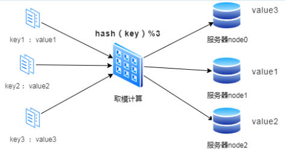
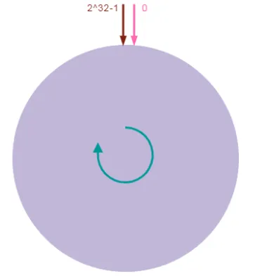
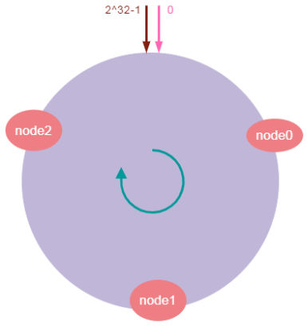
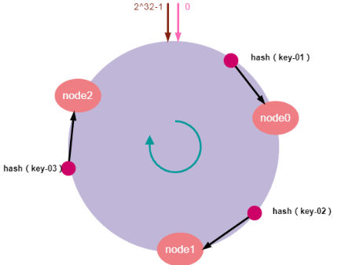
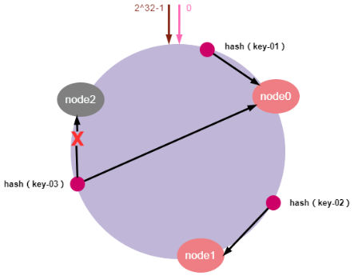
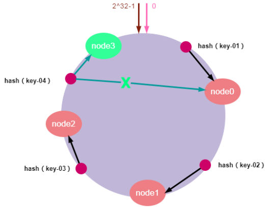
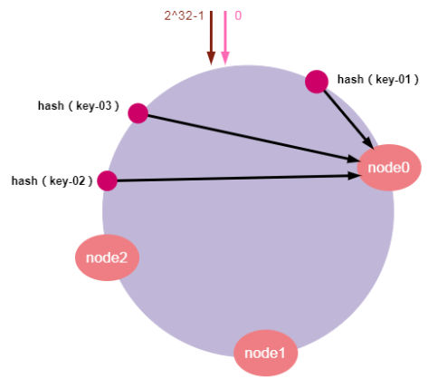
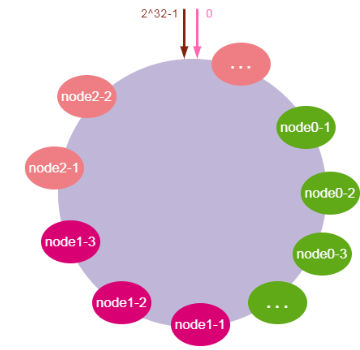

# 一、背景
- 分布式系统负载均衡的首选算法：一致性哈希算法 Consistent Hashing
	- 服务器负载均衡环境下，可以配置负载均衡的算法有很多。如轮询算法，哈希算法，权重比算法，最少连接法等等。
	- 一个良好的分布式哈希算法方案应该具有良好的单调性，即服务节点的增减不会造成大量的哈希重定位。

在具体介绍一致性哈希算法之前，先问一个问题：为什么需要一致性哈希算法？下面我们通过一个案例来回答这个问题。

假设有这么一种场景：我们有三台缓存服务器分别为：node0、node1、node2，有3000万个缓存数据需要存储在这三台服务器组成的集群中，希望可以将这些数据均匀的缓存到三台机器上，你会想到什么方案呢？

我们可能首先想到的方案是：取模算法`hash（key）% N`，即：对缓存数据的key (IP地址和端口) 进行hash运算后取模，N是机器的数量；运算后的结果映射对应集群中的节点。具体如下图所示：



如上图所示，首先对key进行hash计算后的结果对3取模，得到的结果一定是0、1或者2；然后映射对应的服务器node0、node1、node2，最后直接找对应的服务器存取数据即可。

通过取模算法将每个数据请求都均匀的分散到了三个不同的服务器节点上，看起来很完美！但是，在分布式集群系统的负载均衡实现上，这种模型在集群扩容和收缩时却有一定的局限性：因为在生产环境中根据业务量的大小，调整服务器数量是常有的事，而服务器数量N发生变化后hash（key）%N计算的结果也会随之变化！导致整个集群的缓存数据必须重新计算调整，进而导致大量缓存在同一时间失效，造成缓存的雪崩，最终导致整个缓存系统的不可用，这是不能接受的。为了解决优化上述情况，一致性哈希算法应运而生。
# 二、一致性哈希简介

有些朋友一听到算法就头大，其实大可不必，一致性哈希算法听起来高大上，其实非常简单。接下来开始介绍什么是一致性哈希算法，它解决了什么问题。

## 2.1 什么是一致性哈希？

一致性哈希(Consistent Hash)算法是1997年提出，是一种特殊的哈希算法，目的是解决分布式系统的数据分区问题：当分布式集群移除或者添加一个服务器时，必须尽可能小地改变已存在的服务请求与处理请求服务器之间的映射关系。

## 2.2 一致性哈希主要解决问题

我们知道，传统的按服务器节点数量取模在集群扩容和收缩时存在一定的局限性。而一致性哈希算法正好解决了简单哈希算法在分布式集群中存在的动态伸缩的问题。降低节点上下线的过程中带来的数据迁移成本，同时节点数量的变化与分片原则对于应用系统来说是无感的，使上层应用更专注于领域内逻辑的编写，使得整个系统架构能够动态伸缩，更加灵活方便。

## 2.3 一致性哈希的使用场景

一致性哈希算法是分布式系统中的重要算法，使用场景也非常广泛。主要是是负载均衡、缓存数据分区等场景。

一致性哈希应该是实现负载均衡的首选算法，它的实现比较灵活，既可以在客户端实现，也可以在中间件上实现，比如日常使用较多的缓存中间件memcached 使用的路由算法用的就是一致性哈希算法。

此外，其它的应用场景还有很多：
- RPC框架Dubbo用来选择服务提供者
- 分布式关系数据库分库分表：数据与节点的映射关系
- LVS负载均衡调度器
# 三、一致性哈希算法描述
## 1.哈希环
- 一致性哈希算法将整个哈希值空间理解成一个环，取值范围是unsigned int，即$0 - (2^{32} - 1)$，共4G整数空间。按顺时针方向开始从$0 - (2^{32} - 1)$排列，最后的节点$0 - (2^{32} - 1)$在0开始位置重合，形成一个虚拟的圆环。如下图所示：

## 2.服务器映射到哈希环
将服务器节点映射到哈希环上对应的位置。我们可以对服务器IP地址进行哈希计算，比如MD5。哈希计算后的结果对$2^{32}$取模，结果一定是一个0到$2^{32-1}$之间的整数。最后将这个整数映射在哈希环上，整数的值就代表了一个服务器节点的在哈希环上的位置。即：hash（服务器ip）% $2^{32}$。下面我们依次将node0、node1、node2三个缓存服务器映射到哈希环上，如下图所示：


## 3. 对象key映射到服务器
- 当服务器接收到数据请求时，首先需要计算请求Key（一般为IP : port）的哈希值；然后将计算的哈希值映射到哈希环上的具体位置；接下来，从这个位置沿着哈希环顺时针查找，遇到的第一个节点就是key对应的节点；最后，将请求发送到具体的服务器节点执行数据操作。
假设我们有“key-01：张三”、“key-02：李四”、“key-03：王五”三条缓存数据。经过哈希算法计算后，映射到哈希环上的位置如下图所示：

如上图所示，通过哈希计算后，key-01顺时针寻找将找到node0，key-02顺时针寻找将找到node1，key-03顺时针寻找将找到node2。最后，请求找到的服务器节点执行具体的业务操作。

以上便是一致性哈希算法的工作原理，服务器节点的增减不会造成大量的哈希重定位。
## 4.服务器缩容
- 服务器缩容就是减少集群中服务器节点的数量或是集群中某个节点故障。假设，集群中的某个节点故障，原本映射到该节点的请求，会找到哈希环中的下一个节点，数据也同样被重新分配至下一个节点，其它节点的数据和请求不受任何影响。这样就确保节点发生故障时，集群能保持正常稳定。如下图所示：



如上图所示：节点node2发生故障时，数据key-01和key-02不会受到影响，只有key-03的请求被重定位到node0。在一致性哈希算法中，如果某个节点宕机不可用了，那么受影响的数据仅仅是会寻址到此节点和前一节点之间的数据。其他哈希环上的数据不会受到影响。
## 5.服务器扩容
服务器扩容就是集群中需要增加一个新的数据节点，假设，由于需要缓存的数据量太大，必须对集群进行扩容增加一个新的数据节点。此时，只需要计算新节点的哈希值并将新的节点加入到哈希环中，然后将哈希环中从上一个节点到新节点的数据映射到新的数据节点即可。其他节点数据不受影响，具体如下图所示：



如上图所示，加入新的node3节点后，key-01、key-02不受影响，只有key-03的寻址被重定位到新节点node3，受影响的数据仅仅是会寻址到新节点和前一节点之间的数据。

通过一致性哈希算法，集群扩容或缩容时，只需要重新定位哈希环空间内的一小部分数据。其他数据保持不变。当节点数越多的时候，使用哈希算法时，需要迁移的数据就越多，使用一致哈希时，需要迁移的数据就越少。所以，一致哈希算法具有较好的容错性和可扩展性。

## 6.数据倾斜
- 前面说了一致性哈希算法的原理以及扩容缩容的问题。但是，由于哈希计算的随机性，导致一致性哈希算法存在一个致命问题：数据倾斜，，也就是说大多数访问请求都会集中少量几个节点的情况。特别是节点太少情况下，容易因为节点分布不均匀造成数据访问的冷热不均。这就失去了集群和负载均衡的意义。如下图所示：



如上图所示，key-1、key-2、key-3可能被映射到同一个节点node0上。导致node0负载过大，而node1和node2却很空闲的情况。这有可能导致个别服务器数据和请求压力过大和崩溃，进而引起集群的崩溃。
## 7.虚拟节点
- 为了解决数据倾斜的问题，一致性哈希算法引入了虚拟节点机制，即对每一个物理服务节点映射多个虚拟节点，将这些虚拟节点计算哈希值并映射到哈希环上，当请求找到某个虚拟节点后，将被重新映射到具体的物理节点。虚拟节点越多，哈希环上的节点就越多，数据分布就越均匀，从而避免了数据倾斜的问题。

说起来可能比较复杂，一句话概括起来就是：原有的节点、数据定位的哈希算法不变，只是多了一步虚拟节点到实际节点的映射。具体如下图所示：



如上图所示，我们可以在服务器ip或主机名的后面增加编号来实现，将全部的虚拟节点加入到哈希环中，增加了节点后，数据在哈希环上的分布就相对均匀了。当有访问请求寻址到node0-1这个虚拟节点时，将被重新映射到物理节点node0。真实主机，一般放置100-200个虚拟节点。
# 四、实现
- 一致性哈希算法代码：
```cpp
#include <functional>
#include <iostream>
#include <map>
#include <sstream>
#include <string>
#include <vector>

class ConsistentHash
{
  private:
    std::map<size_t, std::string> hashRing; // 哈希环，key 是哈希值，value 是节点ID
    size_t numReplicas;                     // 虚拟节点的数量

    // 将节点ID映射到哈希值
    size_t hash(const std::string &key) const
    {
        std::hash<std::string> hasher;
        return hasher(key);
    }

  public:
    // 构造函数，传入虚拟节点数量
    ConsistentHash(size_t replicas) : numReplicas(replicas)
    {
    }

    // 添加节点到哈希环
    void addNode(const std::string &nodeId)
    {
        for (size_t i = 0; i < numReplicas; ++i)
        {
            std::stringstream ss;
            ss << nodeId << "#" << i; // 每个虚拟节点的唯一ID
            size_t hashValue = hash(ss.str());
            hashRing[hashValue] = nodeId;
        }
    }

    // 从哈希环中移除节点
    void removeNode(const std::string &nodeId)
    {
        for (size_t i = 0; i < numReplicas; ++i)
        {
            std::stringstream ss;
            ss << nodeId << "#" << i;
            size_t hashValue = hash(ss.str());
            hashRing.erase(hashValue);
        }
    }

    // 查找最近的节点
    std::string getNode(const std::string &key) const
    {
        if (hashRing.empty())
        {
            throw std::runtime_error("Hash ring is empty");
        }

        size_t hashValue = hash(key);
        auto it = hashRing.lower_bound(hashValue); // 找到第一个不小于 hashValue 的位置

        if (it == hashRing.end())
        {
            it = hashRing.begin(); // 如果超出范围，回到环的起点
        }

        return it->second; // 返回找到的节点ID
    }
};

int main()
{
    // 创建一致性哈希实例，使用 3 个虚拟节点
    ConsistentHash ch(3);

    // 添加节点
    ch.addNode("NodeA");
    ch.addNode("NodeB");
    ch.addNode("NodeC");

    // 测试查找节点
    std::vector<std::string> keys = {"key1", "key2", "key3", "key4"};

    for (const auto &key : keys)
    {
        std::cout << "Key: " << key << " is mapped to Node: " << ch.getNode(key) << std::endl;
    }

    // 移除一个节点
    ch.removeNode("NodeB");

    std::cout << "After removing NodeB:" << std::endl;
    for (const auto &key : keys)
    {
        std::cout << "Key: " << key << " is mapped to Node: " << ch.getNode(key) << std::endl;
    }

    return 0;
}
```
