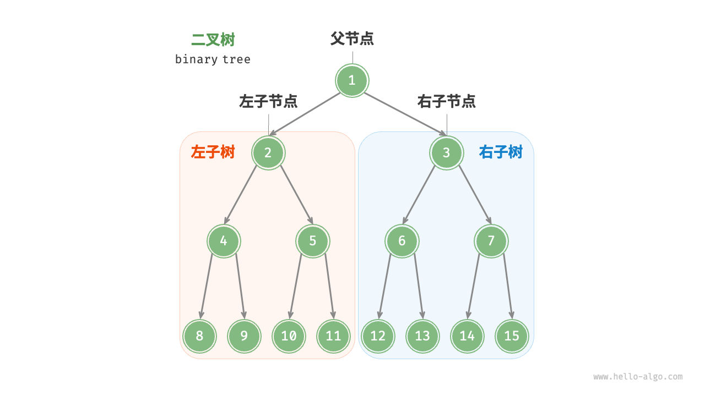
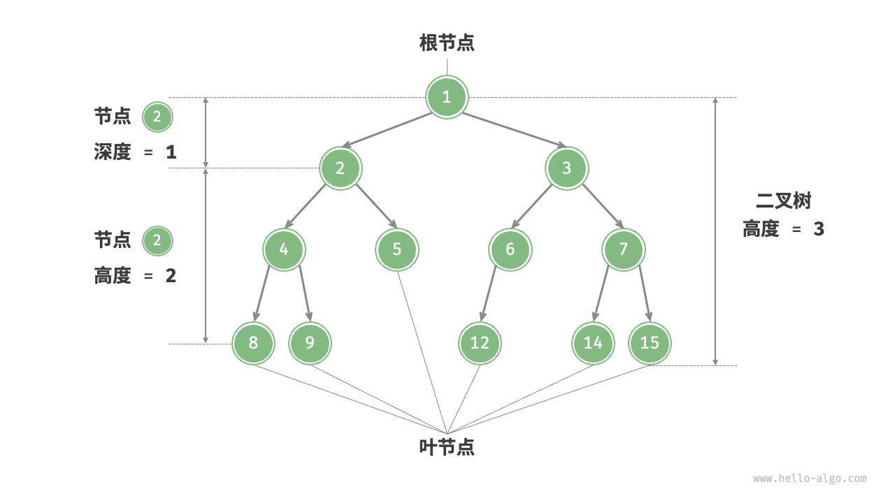
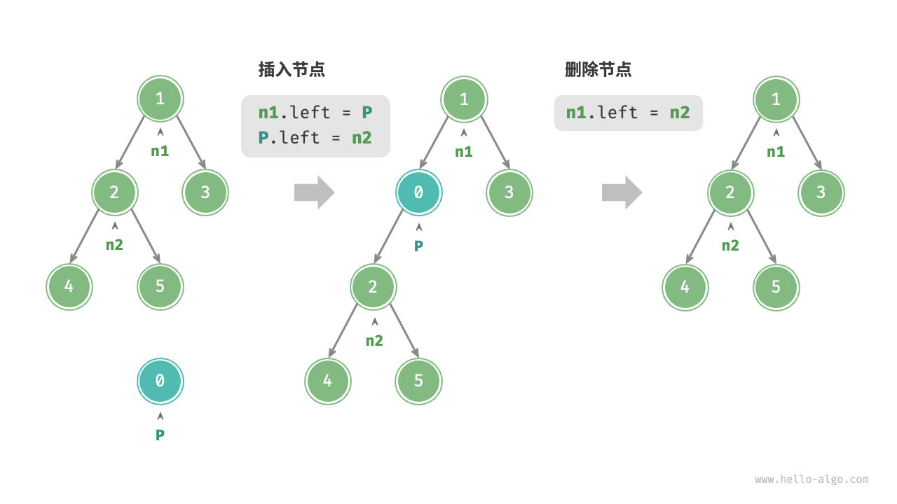
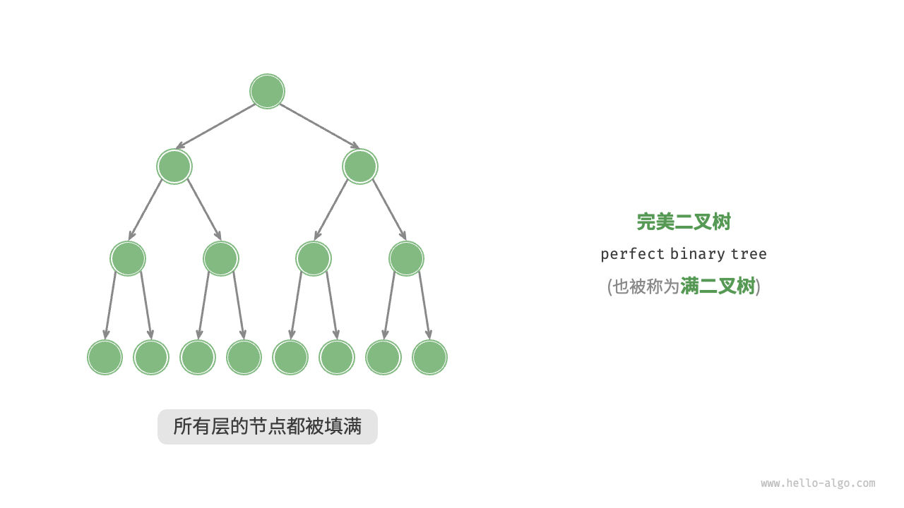
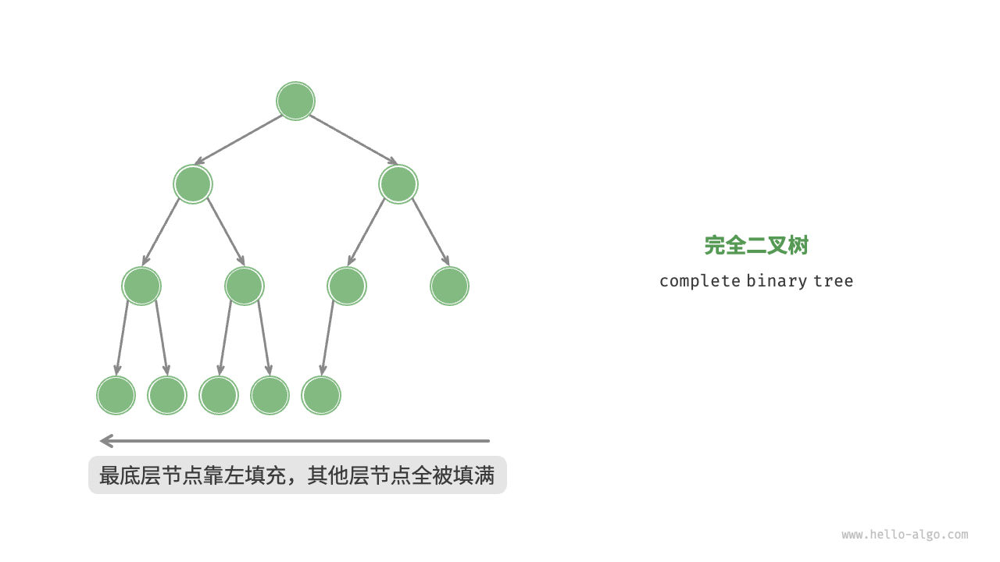
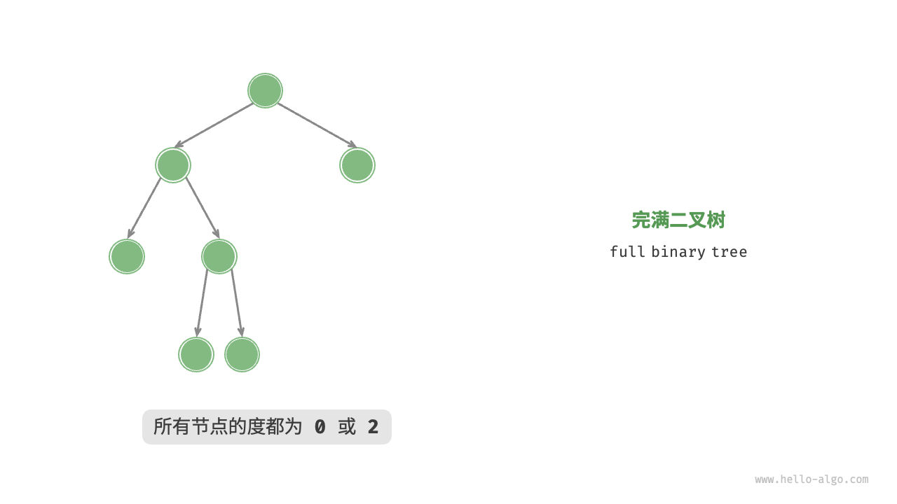
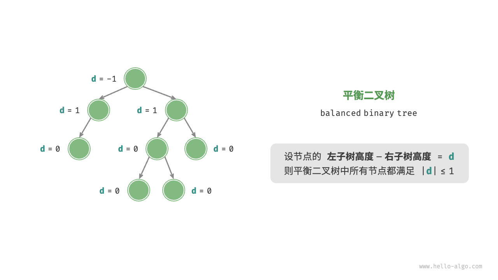
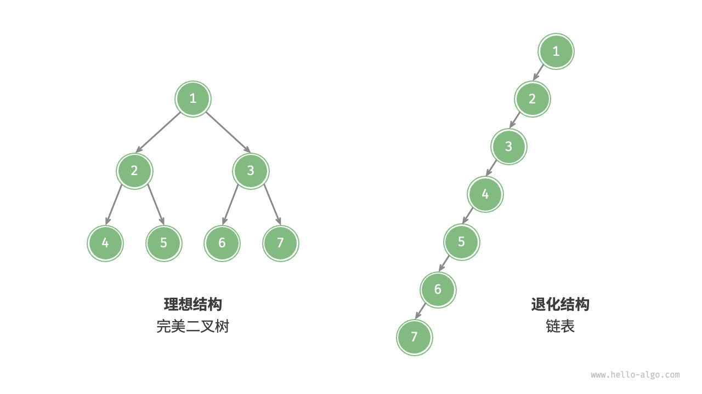
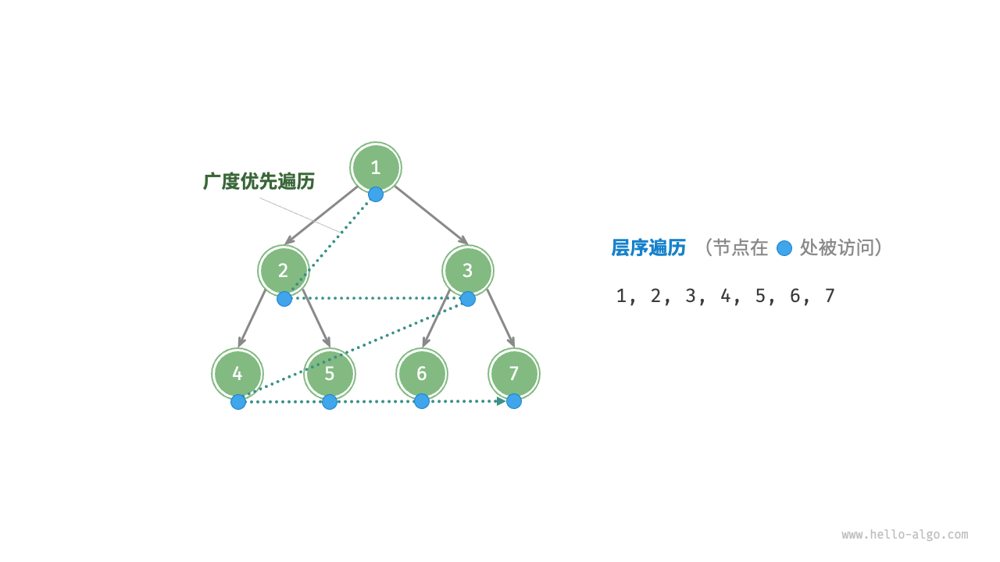

二叉树（binary tree）是一种非线性数据结构，代表“祖先”与“后代”之间的派生关系，体现了“一分为二”的分治逻辑。与链表类似，二叉树的基本单元是节点，每个节点包含值、左子节点引用和右子节点引用。
```cpp
/* 二叉树节点结构体 */
struct TreeNode {
    int val;          // 节点值
    TreeNode *left;   // 左子节点指针
    TreeNode *right;  // 右子节点指针
    TreeNode(int x) : val(x), left(nullptr), right(nullptr) {}
};
```

每个节点都有两个引用（指针），分别指向左子节点（left-child node）和右子节点（right-child node），该节点被称为这两个子节点的父节点（parent node）。当给定一个二叉树的节点时，我们将该节点的左子节点及其以下节点形成的树称为该节点的左子树（left subtree），同理可得右子树（right subtree）。

**在二叉树中，除叶节点外，其他所有节点都包含子节点和非空子树**。如图 7-1 所示，如果将“节点 2”视为父节点，则其左子节点和右子节点分别是“节点 4”和“节点 5”，左子树是“节点 4 及其以下节点形成的树”，右子树是“节点 5 及其以下节点形成的树”。

[](attachments/0289852c4467683c398939a55ecce1cb_MD5.jpg)

图 7-1   父节点、子节点、子树

## 7.1.1   二叉树常见术语

二叉树的常用术语如图 7-2 所示。

- 根节点（root node）：位于二叉树顶层的节点，没有父节点。
- 叶节点（leaf node）：没有子节点的节点，其两个指针均指向 `None` 。
- 边（edge）：连接两个节点的线段，即节点引用（指针）。
- 节点所在的层（level）：从顶至底递增，根节点所在层为 1 。
- 节点的度（degree）：节点的子节点的数量。在二叉树中，度的取值范围是 0、1、2 。
- 二叉树的高度（height）：从根节点到最远叶节点所经过的边的数量。
- 节点的深度（depth）：从根节点到该节点所经过的边的数量。
- 节点的高度（height）：从距离该节点最远的叶节点到该节点所经过的边的数量。

[

图 7-2   二叉树的常用术语

>[!INFO] Tip
请注意，我们通常将“高度”和“深度”定义为“经过的边的数量”，但有些题目或教材可能会将其定义为“经过的节点的数量”。在这种情况下，高度和深度都需要加 1 。## 7.1.2   二叉树基本操作[¶](https://www.hello-algo.com/chapter_tree/binary_tree/#712 "Permanent link")

### 1.   初始化二叉树

与链表类似，首先初始化节点，然后构建引用（指针）。

```cpp
/* 初始化二叉树 */
// 初始化节点
TreeNode* n1 = new TreeNode(1);
TreeNode* n2 = new TreeNode(2);
TreeNode* n3 = new TreeNode(3);
TreeNode* n4 = new TreeNode(4);
TreeNode* n5 = new TreeNode(5);
// 构建节点之间的引用（指针）
n1->left = n2;
n1->right = n3;
n2->left = n4;
n2->right = n5;
```
### 2.   插入与删除节点

与链表类似，在二叉树中插入与删除节点可以通过修改指针来实现。图 7-3 给出了一个示例。



图 7-3   在二叉树中插入与删除节点

```cpp
/* 插入与删除节点 */
TreeNode* P = new TreeNode(0);
// 在 n1 -> n2 中间插入节点 P
n1->left = P;
P->left = n2;
// 删除节点 P
n1->left = n2;
```

>[!INFO] Tip
需要注意的是，插入节点可能会改变二叉树的原有逻辑结构，而删除节点通常意味着删除该节点及其所有子树。因此，在二叉树中，插入与删除通常是由一套操作配合完成的，以实现有实际意义的操作。

## 7.1.3   常见二叉树类型

### 1.   完美二叉树

如图 7-4 所示，完美二叉树（perfect binary tree）所有层的节点都被完全填满。在完美二叉树中，叶节点的度为 0 ，其余所有节点的度都为 2 ；若树的高度为 h ，则节点总数为 2h+1−1 ，呈现标准的指数级关系，反映了自然界中常见的细胞分裂现象。

>[!INFO] Tip
请注意，在中文社区中，完美二叉树常被称为满二叉树。



图 7-4   完美二叉树

### 2.   完全二叉树

如图 7-5 所示，完全二叉树（complete binary tree）只有最底层的节点未被填满，且最底层节点尽量靠左填充。



图 7-5   完全二叉树

### 3.   完满二叉树

如图 7-6 所示，完满二叉树（full binary tree）除了叶节点之外，其余所有节点都有两个子节点。



图 7-6   完满二叉树

### 4.   平衡二叉树

^a4f407

如图 7-7 所示，平衡二叉树（balanced binary tree）中任意节点的左子树和右子树的高度之差的绝对值不超过 1 。



图 7-7   平衡二叉树

## 7.1.4   二叉树的退化

图 7-8 展示了二叉树的理想结构与退化结构。当二叉树的每层节点都被填满时，达到“完美二叉树”；而当所有节点都偏向一侧时，二叉树退化为“链表”。

- 完美二叉树是理想情况，可以充分发挥二叉树“分治”的优势。
- 链表则是另一个极端，各项操作都变为线性操作，时间复杂度退化至 O(n) 。



图 7-8   二叉树的最佳结构与最差结构

如表 7-1 所示，在最佳结构和最差结构下，二叉树的叶节点数量、节点总数、高度等达到极大值或极小值。
表 7-1   二叉树的最佳结构与最差结构
# 二叉树的遍历
从物理结构的角度来看，树是一种基于链表的数据结构，因此其遍历方式是通过指针逐个访问节点。然而，树是一种非线性数据结构，这使得遍历树比遍历链表更加复杂，需要借助搜索算法来实现。

二叉树常见的遍历方式包括层序遍历、前序遍历、中序遍历和后序遍历等。
## 递归获取树的高度
```cpp
    // 递归求二叉树层数实现: 求以Node为根节点的子树高度并返回高度值
    /*这个函数巧妙地利用了递归来遍历整个树，并在回溯过程中计算高度。每个非叶节点的高度都是其子树中较高者加1，而叶节点的高度为1。*/
    int Height(Node *node)
    {
        // 递归出口，当节点为空时返回0
        if (!node)
            return 0;
        // 递归地计算左子树和右子树的高度。
        int left = Height(node->left_);
        int right = Height(node->right_);
        // 比较左右子树的高度，选择较大的一个，然后加1（当前节点的高度）。这是因为树的高度等于最深子树的高度加上根节点本身。
        return left > right ? left + 1 : right + 1;
    }
```
## 递归获取节点个数
```cpp
    // 递归求二叉树节点个数实现,求以Node为根节点的节点总数并返回
    int node_num(Node *node)
    {
        // 递归出口，当节点为空时返回0
        if (!node)
            return 0;
        // 递归地计算左子树和右子树的节点个数。
        int left = node_num(node->left_);
        int right = node_num(node->right_);
        return left + right + 1;
    }
```
## 层序遍历
- 层序遍历（level-order traversal）从顶部到底部逐层遍历二叉树，并在每一层按照从左到右的顺序访问节点。
- 层序遍历本质上属于广度优先遍历（breadth-first traversal），也称广度优先搜索（breadth-first search, BFS），它体现了一种“一圈一圈向外扩展”的逐层遍历方式。
- 
### 递归层序遍历
- 有多少层就进行多少次递归，要控制一个层数
- 当遍历到某一层数时进行打印
### 代码
```cpp
    // 递归层序遍历实现
    void levelOrder(Node *node, int height)
    {
        if (!node)
            return;
        if (height == 0)
        {
            std::cout << node->data_ << " ";
            return;
        }
        levelOrder(node->left_, height - 1);
        levelOrder(node->right_, height - 1);
    }
    // 递归层序遍历接口
    void levelOrder()
    {
        std::cout << "递归层序遍历" << std::endl;

        int height = Height(); // 树的层数
        // 遍历树的层数
        for (int i = 0; i < height; i++)
        {
            levelOrder(root_, i); // 递归调用树的层数次
        }

        std::cout << std::endl;
    }
```
### 非递归层序遍历
- 层序遍历是一个广度遍历，要借助队列的数据结构
1. 根节点1入队，节点1出队打印：1
2. 1节点的左子节点2入队，节点1的右子节点3入队
3. 节点2出队打印：2
4. 节点2的左子节点4入队，右子节点5入队
5. 节点3出队：3
6. 节点3的左子节点6入队，右子节点7入队
7. 节点4，5，6，7出队
代码
```cpp
    // 非递归层序遍历
    void levelOrder_nRec()
    {
        std::cout << "非递归层序遍历" << std::endl;
        // 树为空，返回
        if (root_ == nullptr)
            return;

        std::queue<Node *> que; // 构建队列用于储存节点指针
        que.push(root_);        // 根节点入队
        // 遍历队列
        while (!que.empty())
        {
            Node *front = que.front();        // 获取队首
            que.pop();                        // 出队
            std::cout << front->data_ << " "; // 打印队首
            // 如果队首节点有左子节点，则入队
            if (front->left_)
                que.push(front->left_);
            // 如果队首节点有右子节点，则入队
            if (front->right_)
                que.push(front->right_);
        }
        std::cout << std::endl;
    }
```
## 前序、中序、后序遍历
- 前序、中序和后序遍历都属于深度优先遍历（depth-first traversal），也称深度优先搜索（depth-first search, DFS），它体现了一种“先走到尽头，再回溯继续”的遍历方式。
- 图 展示了对二叉树进行深度优先遍历的工作原理。**深度优先遍历就像是绕着整棵二叉树的外围“走”一圈**，在每个节点都会遇到三个位置，分别对应前序遍历、中序遍历和后序遍历。
- 我们将当前节点看做`V`，他的左子节点看做`L`，右子节点看做`R`。而且规定`L`总是出现在`R`之前，所以顺序有：`VLR`，`LVR`，`LRV`。根据`V`的位置，决定了遍历方式。
	- `VLR`：前序遍历
	- `LVR`：中序遍历
	- `LRV`：后序遍历
- 
### 前序遍历
- 前序遍历首先访问根结点然后遍历左子树，最后遍历右子树。在遍历左、右子树时，仍然先访问根结点，然后遍历左子树，最后遍历右子树。
- 在每个节点上都是以`VLR`的方式访问节点
遍历顺序：
1. 访问根节点：1
2. 访问根节点的左子节点：2
3. 访问左子节点的左子节点：4
4. 4节点没有子节点，回退到2节点，2节点已被遍历过，2节点的左子节点4已被遍历过，访问2节点的右子节点：5
5. 5节点没有子节点，回退到2，2已被遍历过，回退到1,1已被遍历过，遍历1节点的右子节点：3
6. 访问3节点的左子节点：6
7. 节点6已被遍历过，回退到节点3,3已被遍历过，访问3节点的右子节点节点7
#### 递归前序遍历
- `preOrder(1)`，先输出 1。
- 递归调用 `preOrder(2)`，输出 2，然后继续递归遍历左子树。
- 调用 `preOrder(4)`，输出 4，继续递归左、右子树（但 4的左右子树都是空，直接返回）。
- 回到 2，继续递归右子树，调用 `preOrder(5)`，输出 5。
- 回到 1，递归遍历右子树，调用 `preOrder(3)`，输出 3。
- 调用 `preOrder(6)`，输出6
- 6没有子节点回到3。递归调用调用 `preOrder(7)`，输出7
- 回到1
代码
```cpp
    // 递归前序遍历的实现,VLR
    void preOrder(Node *node)
    {
        if (node)
        {
            std::cout << node->data_ << " "; // 访问V
            preOrder(node->left_);           // 访问L
            preOrder(node->right_);          // 访问R
        }
    }
```
#### 非递归前序遍历
- 利用栈的数据结构储存数据，前序遍历的顺序为`VLR`，所以：
1. 打印根节点：1
2. 将根节点右子节点3入栈
3. 将根节点左子节点2入栈
4. 栈顶元素2出栈打印：2
5. 将2元素的右子节点5入栈
6. 将2元素的左子节点4入栈
7. 将栈顶元素4出栈打印：4
8. 4没有子节点，栈顶元素5出栈打印：5
9. 5没有子节点，栈顶元素3出栈打印：3
10. 将3节点右子节点7入栈
11. 将3节点左子节点6入栈
12. 6没有子节点，将栈顶元素6出栈打印：6
13. 7没有子节点，将栈顶元素7出栈打印：7

代码：
```cpp
// 非递归前序遍历
    void preOrder_nRec()
    {
        std::cout << "非递归前序遍历" << std::endl;
        // 数为空，无需遍历
        if (!root_)
            return;
        // 栈，用于储存节点指针
        std::stack<Node *> s;
        // 根节点入栈
        s.push(root_);
        // 遍历栈,如果栈不为空
        while (!s.empty())
        {
            // 打印栈顶并出栈
            Node *top = s.top();
            std::cout << top->data_ << " "; // 处理v
            s.pop();
            // 节点的右子节点如果存在，入栈
            if (top->right_)
                s.push(top->right_); // 处理R
            // 节点的左子节点如果存在，入栈
            if (top->left_)
                s.push(top->left_); // 处理L
        }

        std::cout << std::endl;
    }
```
### 中序遍历
- 在二叉树中，中序遍历从根节点开始，首先遍历左子树，然后访问根结点，最后遍历右子树。
- 在每个节点上都是以`LVR`的方式访问节点
遍历顺序：
1. 访问根节点1的左子节点2的左子节点：4
2. 4节点没有子节点，回退到2,2节点的左子节点已被遍历过，访问2节点的根节点：2
3. 访问2节点的右子节点：5
4. 5节点没有子节点回退到2节点，2节点的左中右都被遍历过了，回退到1节点，1节点的左子节点已被遍历过，访问1节点的根节点：1
5. 1节点的左子节点和根节点已被遍历过，访问1节点的右子节点3，访问节点3的左子节点：6
6. 6没有子节点，回退到3,3的左子节点已被遍历过，访问3节点的根节点：3
7. 3节点的左子节和根节点都被遍历过了，访问3节点的右子节点：7
- 在二叉搜索树（BST树）中，因为L < V < R，所以中序遍历结果是升序排列的。
#### 递归中序遍历
```cpp
    // 递归中序遍历的实现,LVR
    void inOrder(Node *node)
    {
        if (node)
        {
            inOrder(node->left_);            // 访问L
            std::cout << node->data_ << " "; // 访问V
            inOrder(node->right_);           // 访问R
        }
    }
```
#### 非递归中序遍历
1. 根节点1入栈
2. 节点1的左子节点2入栈
3. 节点2的左子节点4入栈
4. 节点4没有子节点，节点4出栈：4
5. 回到节点2，节点2出栈：2
6. 节点2的右子节点5入栈，节点5没有子节点，节点5出栈：5
7. 回到节点1，节点1出栈：1
8. 节点1的左子节点3入栈
9. 节点3的左子节点6入栈
10. 节点6没有子节点，节点6出栈：6
11. 回到节点3，节点3出栈：3
12. 节点3的右子节点7入栈
13. 节点7没有子节点，节点7出栈：7
代码：
```cpp
// 非递归中序遍历
    void inorder_nRec()
    {
        std::cout << "非递归中序遍历" << std::endl;

        // 树为空，无需遍历
        if (!root_)
            return;

        // 栈，用于存储节点指针
        std::stack<Node *> s;
        Node *cur = root_;

        // 只要栈不为空或者当前节点不为空，继续循环
        while (!s.empty() || cur != nullptr)
        {
            // 先将左子树的所有节点入栈
            if (cur != nullptr)
            {
                s.push(cur);
                cur = cur->left_;
            }
            else
            {
                // 弹出栈顶元素并访问
                Node *top = s.top();
                s.pop();
                std::cout << top->data_ << " "; // 访问当前节点

                // 处理右子树
                cur = top->right_;
            }
        }
    }
```
### 后序遍历
- 在二叉树中，后序遍历从根节点开始，即首先遍历左子树，然后遍历右子树，最后访问根结点。
- 在每个节点上都是以`LRV`的方式访问节点
遍历顺序：
1. 访问根节点1的左子节点2的左子节点：4
2. 4节点没有子节点，回退到2节点，2节点的左子节点已被遍历过，访问2节点的右子节点：5
3. 5节点是叶节点，回退到2节点，2节点的左子节点和右子节点都被遍历过了，访问2节点的根节点：2
4. 2节点的左中右都被遍历过了，回退到节点1,1节点的左子节点已被遍历过，访问1的右子节点3的左子节点：6
5. 6节点是叶节点，回退到节点3，节点3的左子节点已被遍历过，访问节点3的右子节点7
6. 节点7是叶节点，回退到节点3，节点3 的左右子节点都被遍历过了，访问3节点的根节点：3
7. 节点3的左右中都被遍历过了，回退到节点1，节点1的左右节点都被遍历过了，访问1节点的根节点：1
#### 递归后序遍历
#### 代码
```cpp
    // 递归后序遍历的实现,LRV
    void postOrder(Node *node)
    {
        if (node)
        {
            postOrder(node->left_);          // 访问L
            postOrder(node->right_);         // 访问R
            std::cout << node->data_ << " "; // 访问V
        }
    }
```
#### 非递归后序遍历
- 非递归后序遍历`LRV`，难以实现，所以要使用两个栈，第一个栈实现`VRL`排序，第二个栈将其逆序，实现`LRV`排序
```cpp
// 非递归后序遍历
    void postOrder_nRec()
    {
        std::cout << "递归后序遍历" << std::endl;
        // 树为空，无需遍历
        if (!root_)
            return;

        std::stack<Node *> s1; // 用于排序VRL
        std::stack<Node *> s2; // 用于逆序VRL，得到LRV

        s1.push(root_); // 根节点入栈
        // 遍历栈s1
        while (!s1.empty())
        {
            Node *top = s1.top(); // 获取栈顶
            s1.pop();             // 弹出栈顶
            s2.push(top);         // V：栈顶入栈s2
            // 如果栈顶的左子节点不为空，左子节点入栈s1
            if (top->left_ != nullptr)
            {
                s1.push(top->left_); // L
            }
            // 如果栈顶的右子节点不为空，右子节点入栈s1
            if (top->right_ != nullptr)
            {
                s1.push(top->right_); // R
            }
        }
        // 输出s2
        while (!s2.empty())
        {
            std::cout << s2.top() << " ";
            s2.pop();
        }
        std::cout << std::endl;
    }
```