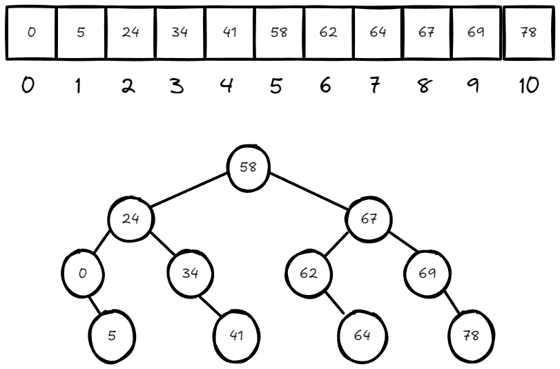
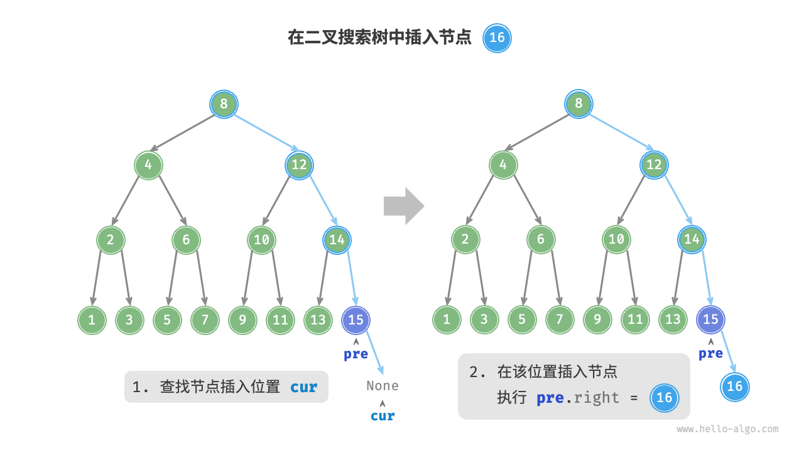
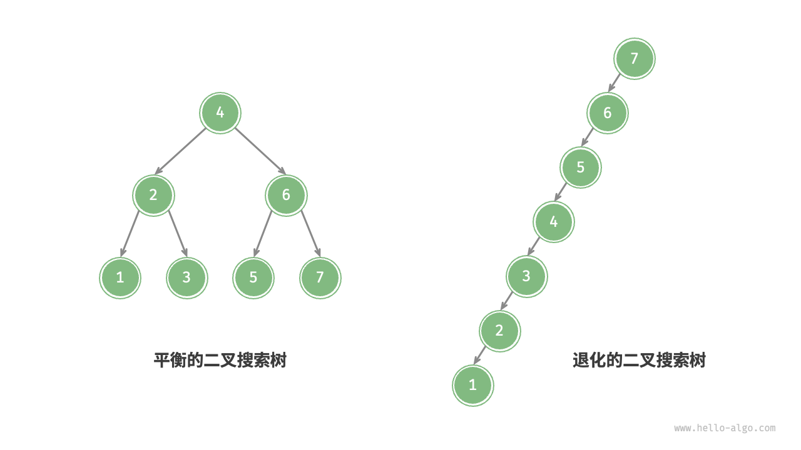

2024-09-09 09:41
Tags: #树 #数据结构 
Reference：
# 概念和特点
## 概念
- 二叉搜索树（binary search tree）简称BST树，二叉树上的每个节点满足以下条件。
	- 左子节点的值 < 父节点的值 < 右子节点的值

## 性质
- 若左子树不为空，则左子树上所有节点的值均小于她根节点的值
- 若右子树不为空，则右子树所有节点的值均大于他根节点的值
- 左右子树也分别满足二叉搜索树的性质
## 特点
- 每层树节点的数量：$2^{L-1}$，L为层数。第3层节点个数为：$2^{3-1} = 2^{2}= 4$
- 层数L和节点个数n之间的关系
	- $2^{0}+ 2^{1}+ 2^{2}+... +2^{L-1} = n$
	- 利用等比数求和公式：$a + ar + ar^2 + \dots + ar^{n-1}$，其前 n项和 S的公式为：$S_n​=a⋅\frac{1−r^n}{1−r}​$，其中a 是首项，r 是公比，n 是项数。
	- 表达式可被简化为$2^L−1=n$,即$L= log_2^n$，二叉树的高度L为$log_2^n$
# 算法思想
二分查找算法实际上就是一种二叉搜索树的搜索算法

# 实现步骤
## BST树的构建
- 节点包含三个属性，`val`：节点值；`*left`：左子节点指针；`*right`：右子节点指针。
- 私有属性包含指向根节点的指针和一个比较函数对象
### 代码
```cpp
// BTSTree
template <typename T, typename compare = std::less<T>>
class BSTTree
{
  private:
    // 节点结构体
    struct Node
    {
        T data_;      // 数据域
        Node *left_;  // 左子节点地址域
        Node *right_; // 右子节点地址域
        // 结构体构造函数，T data = T()是一个置零操作，调用构造函数，int为0，float为0.0.
        Node(T data = T()) : data_(data), left_(nullptr), right_(nullptr)
        {
        }
    };
    Node *root_;   // 指向树的根节点
    compare comp_; // 定义一个函数对象，用于比较数值
}
```
## BST树的非递归查询操作
1. 设置游标节点`cur`指向根节点`root`
2. 进行节点值和查询值的比对
	1. 如果节点值等于查询值，返回true
	2. 如果节点值大于查询值，继续查找左子树
	3. 如果节点值小于查询值，继续查找右子树
### 代码
```cpp
    // 非递归查询
    bool query_nRec(const T &val)
    {
        Node *cur = root_;
        while (cur)
        {
            if (cur->data_ == val)
                return true;
            else if (comp_(cur->data_, val))
                cur = cur->right_;
            else
                cur = cur->left_;
        }
        return false;
    }
```
## BST树的递归查询操作
### 代码
```cpp
    // 递归查询实现
    Node *query_rec(Node *node, const T &val)
    {
        if (!node)
            return nullptr;
        if (node->data_ == val)
            return node;
        else if (comp_(node->data_, val))
        {
            return query_rec(node->right_, val);
        }
        else
        {
            return query_rec(node->left_, val);
        }
    }
```
## BST树的非递归插入操作
1. 定义指针`root`指向根节点，
	1. 根节点如果为空，根节点指向新生成的节点
	2. 根节点如果不为空，从根节点开始进行比较，找到合适的位置，生成新的节点。并把节点的地址写入父节点相应的地址域中。


### 代码：
```cpp
// 非递归插入操作
    void insert_nRec(const T &val)
    {
        // 如果树为空,生成根节点
        if (root_ == nullptr)
        {
            root_ = new Node(val);
            return;
        }
        // 如果根节点不为空，遍历树开始查找合适位置
        Node *parent = nullptr; // 定义当前节点父节点指针
        Node *cur = root_;      // 定义当前节点指针
        while (cur)
        {
            // 不插入元素相同的值
            if (cur->data_ == val)
                return;
            // 如果插入值小于节点值，继续查找左子树
            else if (comp_(val, cur->data_))
            {
                parent = cur;
                cur = cur->left_;
            }
            // 如果插入值大于节点值，继续遍历右子树
            else
            {
                parent = cur;
                cur = cur->right_;
            }
        }
        // 将新节点插入到父节点的子节点上
        if (comp_(val, parent->data_)) // 小于关系
        {
            parent->left_ = new Node(val);
        }
        else
        {
            parent->right_ = new Node(val);
        }
    }
```
## BST树的递归插入操作
```cpp
// 递归插入操作实现
    Node *insert_rec(Node *node, const T &val)
    {
        // 如果节点为空
        if (!node)
            return new Node(val); // 递归结束，找到插入val的位置，生成新节点并返回其节点地址

        // 如果节点值等于插入值
        if (node->data_ == val)
            return node; // 不插入，返回节点地址
        // 如果插入值大于节点值
        else if (comp_(node->data_, val))
        {
            // 递归调用函数查找右子树，找到位之后地址赋予父节点的右地址域
            node->right_ = insert_rec(node->right_.val);
            return node;
        }
        // 如果插入值小于节点值
        else
        {
            // 递归调用函数查找左子树，找到位之后地址赋予父节点的左地址域
            node->left_ = insert_rec(node->left_, val);
            return node;
        }
    }
    // 递归插入操作接口
    void insert_rec(const T &val)
    {
        // 递归函数会返回，当前节点的地址，如果树为空，直接生成一个根节点
        root_ = insert_rec(root_, val);
    }
```
## BST树的非递归删除操作
- 先在二叉树中查找到目标节点，再将其删除。与插入节点类似，我们需要保证在删除操作完成后，二叉搜索树的“左子树 < 根节点 < 右子树”的性质仍然满足。因此，我们根据目标节点的子节点数量，分 0、1 和 2 三种情况，执行对应的删除节点操作。
	- 当待删除节点的度为 0 时，表示该节点是叶节点，可以直接删除，其父节点的地址域置空。
	- 当待删除节点的度为 1 时，将待删除节点替换为其子节点即可。
	- 当待删除节点的度为 2 时，我们无法直接删除它，而需要使用一个节点替换该节点。由于要保持二叉搜索树“左子树 < 根节点 < 右子树”的性质，**因此这个节点可以是左子树的最大节点（前趋）或右子树的最小节点（后继）**。
- **前驱节点**或者**后继节点**替换当前节点不影响BST树的性质
### 代码：
```cpp
    // 非递归删除操作
    void remove_nRec(const T val)
    {
        // 如果树为空，返回
        if (root_ == nullptr)
            return;

        // 搜索待删除节点
        Node *parent = nullptr;
        Node *cur = root_;
        while (cur)
        {
            // 找到待删除节点
            if (cur->data_ == val)
                break;
            // 如果数值小于当前节点，向左子树查找
            else if (comp_(val, cur->data_))
            {
                parent = cur;
                cur = cur->left_;
            }
            // 如果数值大于当前节点，向右子树查找
            else
            {
                parent = cur;
                cur = cur->right_;
            }
        }
        // 未找到待删除节点，返回
        if (cur == nullptr)
            return;

        // 情况3：当前节点有左右子节点
        if (cur->left_ && cur->right_)
        {
            // 找到前驱节点：左子树的最大值节点
            Node *preParent = cur;
            Node *pre = cur->left_;
            while (pre->right_)
            {
                preParent = pre;
                pre = pre->right_;
            }
            // 将前驱节点的值覆盖当前节点的值
            cur->data_ = pre->data_;
            // 让cur指向要删除的前驱节点
            parent = preParent;
            cur = pre;
        }

        // 情况1和情况2：当前节点是叶子节点或者只有一个子节点
        Node *child = (cur->left_ != nullptr) ? cur->left_ : cur->right_;

        // 如果删除的是根节点
        if (parent == nullptr)
        {
            root_ = child;
        }
        else
        {
            // 更新父节点的指针
            if (parent->left_ == cur)
                parent->left_ = child;
            else
                parent->right_ = child;
        }

        // 删除当前节点
        delete cur;
    }
```
## BST树的递归删除操作
```cpp
  // 递归删除操作实现
    Node *remove_rec(Node *node, const T &val)
    {
        // 如果树为空，返回空
        if (!node)
            return nullptr;

        // 找到待删除节点
        if (node->data_ == val)
        {
            // 判断情况3：当前节点有左右子节点
            if (node->left_ != nullptr && node->right_ != nullptr)
            {
                // 找前驱节点：左子树的最大值节点
                Node *pre = node->left_;
                while (pre->right_)
                {
                    pre = pre->right_;
                }
                // 前驱节点的值赋予当前节点值
                node->data_ = pre->data_;
                // 递归删除前驱节点
                node->left_ = remove_rec(node->left_, pre->data_);
            }
            // 情况1和情况2：当前节点是叶子节点或者只有一个子节点
            else
            {
                Node *child = (node->left_ != nullptr) ? node->left_ : node->right_;
                delete node;  // 删除当前节点
                return child; // 返回子节点用于更新父节点的子节点域
            }
        }
        // 如果节点值大于待删除值
        else if (comp_(node->data_, val))
        {
            node->right_ = remove_rec(node->right_, val);
        }
        // 如果节点值小于待删除节点值
        else
        {
            node->left_ = remove_rec(node->left_, val);
        }
        // 将当前节点返回给父节点，目的是更新父节点相应的地址域
        return node;
    }
```
# 算法分析
给定一组数据，我们考虑使用数组或二叉搜索树存储。观察表 7-2 ，二叉搜索树的各项操作的时间复杂度都是对数阶，具有稳定且高效的性能。只有在高频添加、低频查找删除数据的场景下，数组比二叉搜索树的效率更高。

表 7-2   数组与搜索树的效率对比

| 操作   | 无序数组 | 二叉搜索树    |
| ---- | ---- | -------- |
| 查找元素 | O(n) | O(log⁡n) |
| 插入元素 | O(1) | O(log⁡n) |
| 删除元素 | O(n) | O(log⁡n) |

在理想情况下，二叉搜索树是“平衡”的，这样就可以在 log⁡n 轮循环内查找任意节点。
然而，如果我们在二叉搜索树中不断地插入和删除节点，可能导致二叉树退化为图 7-23 所示的链表，这时各种操作的时间复杂度也会退化为 O(n) 。

# 二叉搜索树常见应用

- 用作系统中的多级索引，实现高效的查找、插入、删除操作。
- 作为某些搜索算法的底层数据结构。
- 用于存储数据流，以保持其有序状态。