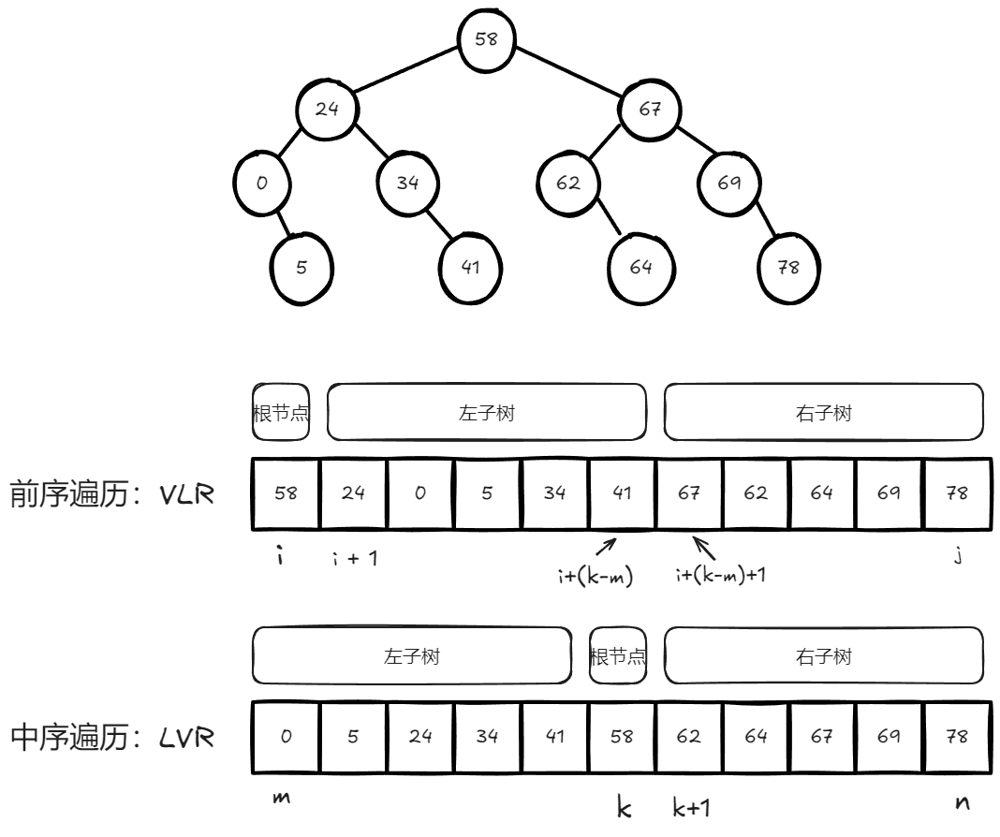

# BST树区间查找
## 解题思想
- 利用中序遍历，使节点值升序排列，然后区间查找。
## 代码
```cpp
    // 区间查找，满足区间[i, j]的元素值
    std::vector<T> searchRange(Node *node, int i, int j)
    {
        std::vector<T> vec;
        // 层序遍历，顺序：LVR
        if (node != nullptr)
        {
            // 如果当前节点的值大于区间下限，继续搜索左子树,如果当前值小于等于区间下限，没有必要搜索左子树。
            if (node->data_ > i)
            {
                std::vector<T> leftResult = searchRange(node->left_, i, j);
                vec.insert(vec.end(), leftResult.begin(), leftResult.end());
            }

            // 存储满足区间元素的值
            if (node->data_ >= i && node->data_ <= j)
            {
                vec.push_back(node->data_);
            }
            // 如果当前节点的值小于区间上限，继续搜索右子树。如果当前值大于等于区间上界，没有必要搜索右子树。
            if (node->data_ < j)
            {
                std::vector<T> rightResult = searchRange(node->right_, i, j);
                vec.insert(vec.end(), rightResult.begin(), rightResult.end());
            }
        }
        return vec;
    }
```
# 判断二叉树是否是二叉搜索树
[98. 验证二叉搜索树 - 力扣（LeetCode）](https://leetcode.cn/problems/validate-binary-search-tree/description/)
## 解题思想
此题要判断二叉搜索树的局部性质和整体性质
- 局部性质： 左子节点的值 < 父节点的值 < 右子节点的值
- 整体性质：左子树所有节点的值 < 父节点的值 < 右子树所有节点的值
因此，要利用二叉搜索树**中序遍历**值为升序排列的特点进行判断，二叉树是否为二叉搜索树
## 代码
```cpp
/**
 * Definition for a binary tree node.
 * struct TreeNode {
 *     int val;
 *     TreeNode *left;
 *     TreeNode *right;
 *     TreeNode() : val(0), left(nullptr), right(nullptr) {}
 *     TreeNode(int x) : val(x), left(nullptr), right(nullptr) {}
 *     TreeNode(int x, TreeNode *left, TreeNode *right) : val(x), left(left), right(right) {}
 * };
 */
class Solution {
public:
    TreeNode *pre = nullptr;
    bool isValidBST(TreeNode* root) 
    {
        //如果树为空，返回true
        if (root == nullptr) return true;

        //中序遍历：顺序LVR

        //递归左子树
        bool left = isValidBST(root->left);

        //判断节点值是否有序
        if (pre != nullptr && pre->val >= root->val)
        {
            return false;//判断递归结束条件
        }
        pre = root;//更新中序遍历的前驱节点

        //递归右子树
        bool right = isValidBST(root->right);

        return left && right;
    }
};
```
# 判断二叉树的子树问题
- [572. 另一棵树的子树 - 力扣（LeetCode）](https://leetcode.cn/problems/subtree-of-another-tree/description/)
## 解题思想
- 利用递归思想
- 先判断两棵树是否完全相同
- 在判断一棵树是否是另一棵树的子树
## 代码
```cpp
/**
 * Definition for a binary tree node.
 * struct TreeNode {
 *     int val;
 *     TreeNode *left;
 *     TreeNode *right;
 *     TreeNode() : val(0), left(nullptr), right(nullptr) {}
 *     TreeNode(int x) : val(x), left(nullptr), right(nullptr) {}
 *     TreeNode(int x, TreeNode *left, TreeNode *right) : val(x), left(left), right(right) {}
 * };
 */
class Solution {
public:
    // 判断两棵树 s 和 t 是否完全相同
    bool isSameTree(TreeNode* s, TreeNode* t) 
    {
        //如果 s 和 t 都为空（两棵树都不存在），则它们是相同的，所以返回 true。
        if (s == nullptr && t == nullptr) return true;
        //如果 s 或 t 其中之一为空，而另一棵树存在，则两棵树不同，返回 false。
        if (s == nullptr || t == nullptr) return false;
        //如果 s 和 t 的根节点值不同，则它们不同，返回 false。
        if (s->val != t->val) return false;
        //递归比较它们的左子树和右子树是否相同。只有当左子树和右子树都相同（&& 操作）时，整棵树才相同。
        return isSameTree(s->left, t->left) && isSameTree(s->right, t->right);
    }
    
    // 判断 subRoot 是否是 root 的子树。
    bool isSubtree(TreeNode* root, TreeNode* subRoot) 
    {
        //如果 root 为空树，而 subRoot 不为空，那么 subRoot 不可能是 root 的子树，返回 false。
        //在这个判断之前，subRoot 不需要判断为空，因为 subRoot 一旦为空，即使 root 为空或非空都可以看作 true。
        if (root == nullptr) return false; // 子树不可能为空
        //如果 root 和 subRoot 完全相同（通过 isSameTree 检查），则 subRoot 是 root 的子树，返回 true。
        if (isSameTree(root, subRoot)) return true;
        //如果 root 和 subRoot 不完全相同，那么递归判断 subRoot 是否是 root 的左子树或右子树的子树。
        //只要 subRoot 是 root 的任意一侧的子树（左侧或右侧），就返回 true。
        return isSubtree(root->left, subRoot) || isSubtree(root->right, subRoot);
    }
};
```
# 二叉树的LCA问题：寻找两个值的最近公共祖先节点
- [235. 二叉搜索树的最近公共祖先 - 力扣（LeetCode）](https://leetcode.cn/problems/lowest-common-ancestor-of-a-binary-search-tree/submissions/566328084/)
## 解题思想：
最近的公共祖先节点肯定比其中一个值大，比其中另一个值小
- 从根节点开始搜索
- 如果根节点比两个值大，继续搜索左子树
- 如果根节点比两个值小，继续搜索右子树
- 如果根节点比其中一个值大，比其中另一个值小，那么这个节点就是最近的公共祖先节点
## 代码
```cpp
class Solution {
public:
    TreeNode* lowestCommonAncestor(TreeNode* root, TreeNode* p, TreeNode* q) 
    {
        //如果是为空，返回空
         if (root == nullptr)
        {
            return nullptr;
        }
        //如果当前节点值小于提供的两个节点值，查找右子树
        if (root->val < p->val && root->val < q->val)
        {
            return lowestCommonAncestor(root->right, p, q);
        }
        //如果当前节点值大于提供的两个节点值，查找做子树
        else if (root->val > p->val && root->val > q->val)
        {
            return lowestCommonAncestor(root->left, p, q);
        }
        //如果当前节点值小于其中一个节点，大于其中另一个节点，则最近公共祖先节点被找到
        else
        {
            return root;
        }
        
    }
};
```
# 二叉树的镜像反转
- [226. 翻转二叉树 - 力扣（LeetCode）](https://leetcode.cn/problems/invert-binary-tree/description/?envType=problem-list-v2&envId=binary-tree)
## 解题思路
- 利用递归思想
- 对当前节点调用递归函数，先递归到它的左子树和右子树，直到遇到空节点为止。
- 然后从底向上依次交换每个节点的左右子树，最终得到镜像反转的二叉树。
## 代码
```cpp
class Solution {
public:
    TreeNode* invertTree(TreeNode* root) 
    {
        //如果树为空，返回空
        if (root == nullptr)
        {
            return nullptr;
        }
        //递归左右子树到叶节点，返回其父节点
        TreeNode *left = invertTree(root->left);
        TreeNode *right = invertTree(root->right);
        //父节点左右交换
        root->left = right;
        root->right = left;
        //返回根节点
        return root;
    }
};
```
# 对称二叉树
[101. 对称二叉树 - 力扣（LeetCode）](https://leetcode.cn/problems/symmetric-tree/description/)
## 解题思想
利用递归思想
- 创建一个辅助函数用于检查两个子树是否对称
- 在主函数中检查根节点的左右子树是否对称
## 代码
```cpp
class Solution 
{
public:
    // 辅助函数，用于检查两个子树是否对称
    bool isMirror(TreeNode *left, TreeNode *right)
    {
        //如果左右子节点同时为空，返回true
        if (left == nullptr && right == nullptr)
        {
            return true;
        }
        //如果左右子节点中只有一个为空，返回false
        if (left == nullptr || right == nullptr)
        {
            return false;
        }
        //如果左右子节点的值不想等，则说明不对称，返回false
        if (left->val != right->val)
        {
            return false;
        }
        //递归检查左右子树是否对称
        bool l = isMirror(left->left, right->right);
        bool r = isMirror(left->right, right->left);
        //返回结果
        return l && r;
    }
    bool isSymmetric(TreeNode* root) 
    {
        //如果父节点为空，返回true
        if (root == nullptr)
        {
            return true;
        }
        // 检查根节点的左右子树是否对称
        return isMirror(root->left, root->right);

    }
};
```
# 通过前序遍历和中序遍历重建二叉树
- [LCR 124. 推理二叉树 - 力扣（LeetCode）](https://leetcode.cn/problems/zhong-jian-er-cha-shu-lcof/)
## 解题思路
- 通过前序遍历可以知道哪个元素为根节点
- 通过中序遍历可以知道根节点左子树都有哪些节点，右子树都有哪些节点
## 解题步骤
1. 前序遍历首元素为根节点58，根节点在前序遍历中索引为i
2. 在中序遍历中查找根节点58，其索引为k，中序遍历首元素索引为m
3. 则有：则`i+1`为根节点左子节点，`i + (k - m) + 1`为右子节点
4. 以此类推，递归执行。

## 代码
```cpp
class Solution 
{
public:
    //构建二叉树递归函数
    TreeNode *helper(vector<int>& preorder, int preStart, int preEnd, vector<int>& inorder, int inStart, int inEnd)
    {
        // 如果起点大于终点，返回空节点
        if (preStart > preEnd || inStart > inEnd)
        {
            return nullptr;
        }
        // 取当前前序遍历的第一个元素作为根节点
        TreeNode *node = new TreeNode(preorder[preStart]);
        // 获取该根节点在中序遍历中的位置k
        for (int k = inStart; k <= inEnd; k++)
        {
            if (preorder[preStart] == inorder[k])
            {
                // 构建左子树
                node->left = helper(preorder, preStart + 1, preStart + (k - inStart), inorder, inStart, k - 1);
                // 构建右子树
                node->right = helper(preorder, preStart + (k - inStart) + 1, preEnd, inorder, k + 1, inEnd);
            }
        }
        return node;

    }
    TreeNode* deduceTree(vector<int>& preorder, vector<int>& inorder) 
    {
        // 调用递归函数构建二叉树
        return helper(preorder, 0, preorder.size() - 1, inorder, 0, inorder.size() - 1);
    }
};
```
# 判断二叉树是否是平衡二叉树
- [LCR 176. 判断是否为平衡二叉树 - 力扣（LeetCode）](https://leetcode.cn/problems/ping-heng-er-cha-shu-lcof/description/)
## 解题思想
- 如果某二叉树中任意节点的左右子树的深度相差不超过1，那么它就是一棵平衡二叉树。
## 解题步骤
1. 创建一个递归函数求取树的高度和平衡性，如果树不平衡则返回-1，如果树平衡则返回树的高度
2. 通过递归判断树是否平衡
## 代码
```cpp
class Solution 
{
public:
    //计算树的高度，同时计算平衡性，如果树不平衡则返回-1，如果树平衡则返回树的高度
    int height_Balanc(TreeNode *node)
    {
        // 空节点高度为 0
        if (node == nullptr) return 0;
        //递归检查做右子树
        int left = height_Balanc(node->left);
        int right = height_Balanc(node->right);
        // 如果左右子树有一个不平衡，或者当前节点不平衡，返回 -1 表示不平衡
        if (abs(left - right) > 1) return -1;
        if (left == -1) return -1;
        if (right == -1) return -1; 

        // 返回当前节点的高度
        return max(left, right) + 1;
    }
    bool isBalanced(TreeNode* root) 
    {
        // 通过递归判断树是否平衡
        return height_Balanc(root) != -1;
    }
};
```
# [二叉搜索树中第 K 小的元素](https://leetcode.cn/problems/kth-smallest-element-in-a-bst/)
## 解题思路
- **中序遍历**：我们使用中序遍历来遍历树的节点。中序遍历是先遍历左子树，再访问根节点，最后遍历右子树。
- **计数节点**：我们维护一个计数器，当计数器等于 k 时，当前节点即为第 k小的节点。
- **提前终止遍历**：一旦找到了第 k小的节点，可以提前结束遍历，提升效率。
## 代码
```cpp
class Solution 
{
public:
    void inOrder(TreeNode *node, int k, int &count, int &result)
    {
        //如果节点为空，返回空
        if (node == nullptr) return;
        
        //递归左子树
        inOrder(node->left, k, count, result);
        
        //访问当前节点
        count++;//计数器自增
        //如果计数器抵达K,记录结果并返回
        if (count == k)
        {
            result = node->val;
            return;
        }
        
        //递归右子树
        inOrder(node->right, k, count, result);
    }
    int kthSmallest(TreeNode* root, int k) 
    {
        int count = 0;//计数器
        int result = 0;//结果
        inOrder(root, k, count, result);//调用函数递归查找
        return result;//返回结果
    }
};
```
## 扩展
如果是求第k大的元素，应当如何处理
- 求二叉搜索树（BST）中的第 k大的元素可以通过对树的**反向中序遍历**（右-根-左）来实现。反向中序遍历的顺序是先遍历右子树，再访问根节点，最后遍历左子树。这样遍历得到的节点序列是从大到小排列的。
```cpp
    void inOrder(TreeNode *node, int k, int &count, int &result)
    {
        //如果节点为空，返回空
        if (node == nullptr) return;

		//递归右子树
        inOrder(node->right, k, count, result);
        
        //访问当前节点
        count++;//计数器自增
        //如果计数器抵达K,记录结果并返回
        if (count == k)
        {
            result = node->val;
            return;
        }
        
        //递归左子树
        inOrder(node->left, k, count, result);

    }
```