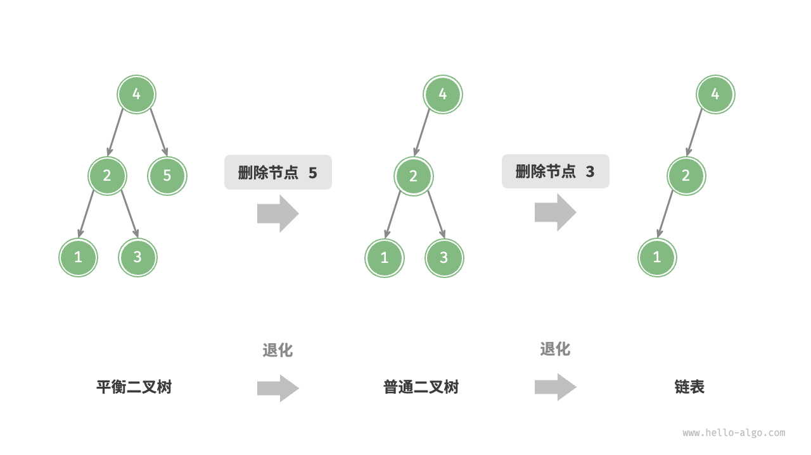
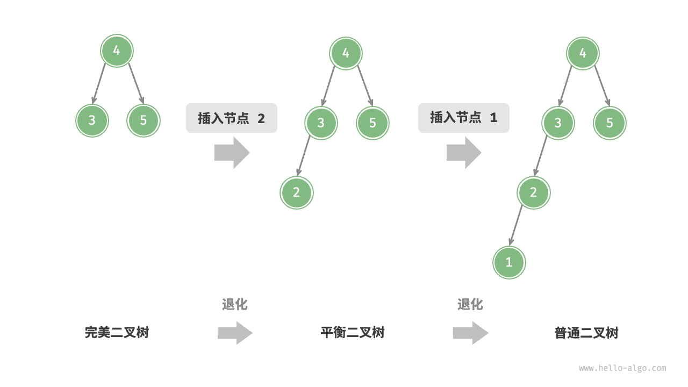
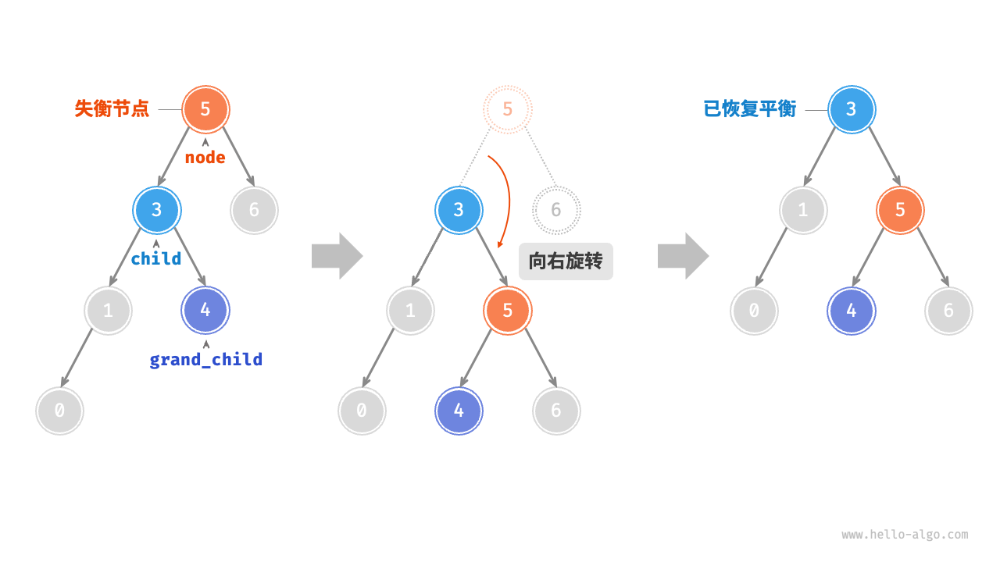
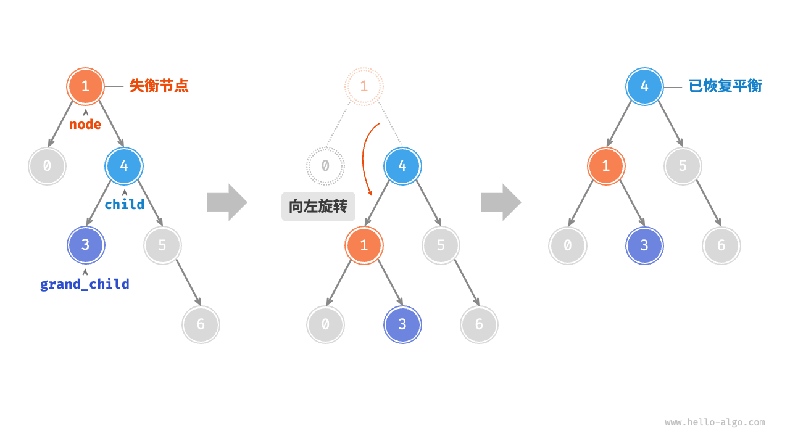
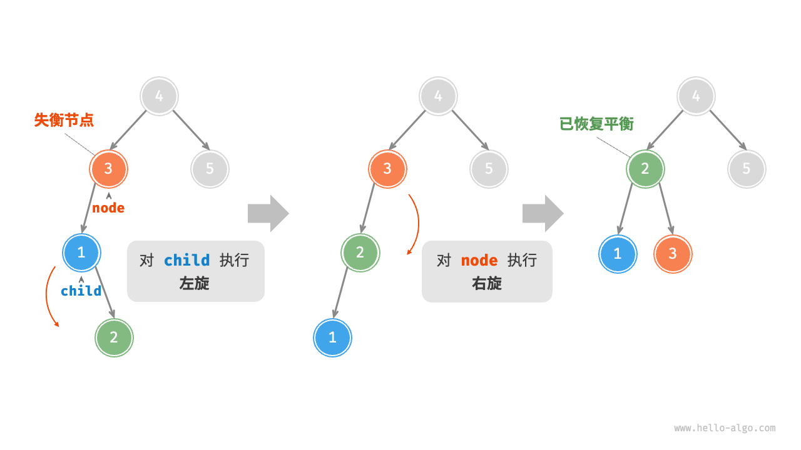
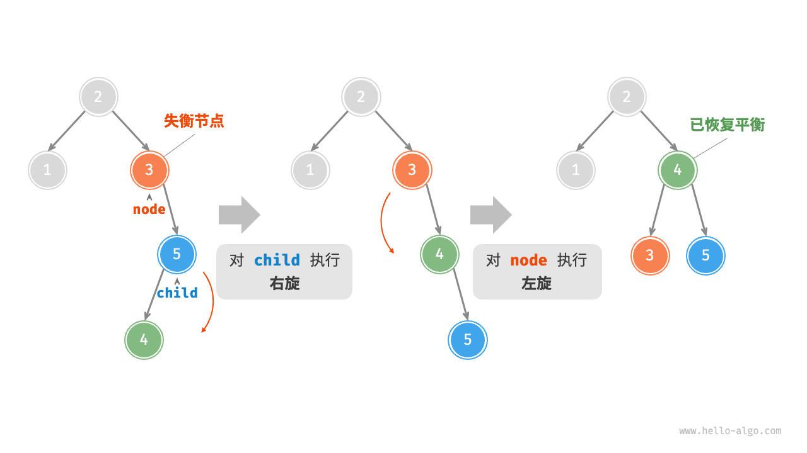
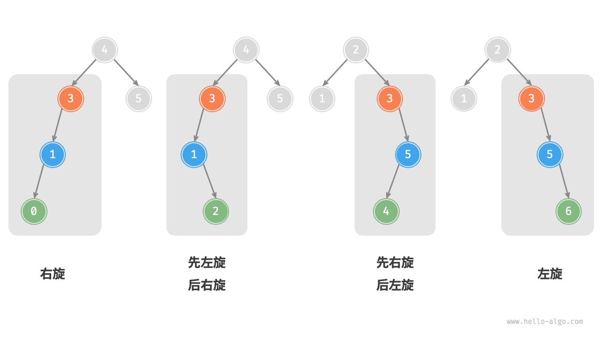

2024-09-24 09:33
Tags: #数据结构 #树 
Reference：[1AVL树的节点平衡旋转理论讲解_ev_哔哩哔哩_bilibili](https://www.bilibili.com/video/BV1FT421k7LL/?p=119&vd_source=0f765d25b29efef66dd4ff586509e026)
# 概念和特点
AVL 树既是二叉搜索树，也是[平衡二叉树](13.0-二叉树.md#^a4f407)（任意节点的左子树和右子树的高度之差的绝对值不超过 1），同时满足这两类二叉树的所有性质，因此是一种平衡二叉搜索树（balanced binary search tree）。
- 在[13.0-二叉树](13.0-二叉树.md)章节中我们提到，在多次插入和删除操作后，二叉搜索树可能退化为链表。在这种情况下，所有操作的时间复杂度将从 O(log⁡n) 劣化为 O(n) 。
        
- 1962 年 G. M. Adelson-Velsky 和 E. M. Landis 在论文“An algorithm for the organization of information”中提出了 AVL 树。论文中详细描述了一系列操作，确保在持续添加和删除节点后，AVL 树不会退化，从而使得各种操作的时间复杂度保持在 O(log⁡n) 级别。换句话说，在需要频繁进行增删查改操作的场景中，AVL 树能始终保持高效的数据操作性能，具有很好的应用价值。
# 算法思想
- 节点高度
	- 由于 AVL 树的相关操作需要获取节点高度，因此我们需要为节点类添加 `height` 变量：
- 节点平衡因子
	- 节点的平衡因子（balance factor）定义为节点左子树的高度减去右子树的高度，同时规定空节点的平衡因子为 0 。
# AVL 树旋转：
AVL 树的特点在于“旋转”操作，它能够在不影响二叉树的中序遍历序列的前提下，使失衡节点重新恢复平衡。换句话说，**旋转操作既能保持“二叉搜索树”的性质，也能使树重新变为“平衡二叉树”**。 
## 右旋
- 当节点失衡的原因是左子节点的左子树太高时，节点执行顺时针右旋，使节点成为左子节点的右子节点，如果左子节点本来就有右子节点，则使该右子节点成为节点的左子节点。

## 左旋
- 当节点失衡的原因是右子节点的右子树太高时，节点执行逆时针左旋，使节点成为右子节点的左子节点，如果右子节点本来就有左子节点，则使该左子节点成为节点的右子节点。


## 先左旋后右旋
- 当节点失衡的原因是左子节点的右子树太高时，先对 `child` 执行“左旋”，再对 `node` 执行“右旋”。

## 先右旋后左旋
- 当节点失衡的原因是右子节点的左子树太高时，需要先对 `child` 执行“右旋”，再对 `node` 执行“左旋”。

## 旋转的选择

# 代码
```cpp
#include <algorithm>
#include <iostream>

template <typename T>
class AVLTree
{
public:
    // 构造函数
    AVLTree() : root_(nullptr)
    {
    }
    // 析构函数
    ~AVLTree()
    {
        destroy(root_);
    }
    // 插入操作接口
    void insert(const T &val)
    {
        root_ = insert(root_, val);
    }
    // 删除操作接口
    void remove(const T &val)
    {
        root_ = remove(root_, val);
    }
    // 中序遍历接口
    void inorderTraversal()
    {
        return inorderTraversal(root_);
    }

private:
    // 定义节点类型
    struct Node
    {
        T data_;
        Node *left_;
        Node *right_;
        int height_; // 记录节点高度值
        // 结构体构造函数
        Node(T data = T()) : data_(data), left_(nullptr), right_(nullptr), height_(1)
        {
        }
    };
    // 根节点指针
    Node *root_;

    // 递归销毁节点
    void destroy(Node *node)
    {
        if (node)
        {
            destroy(node->left_);
            destroy(node->right_);
            delete node;
        }
    }

    // 求节点高度
    int height(Node *node)
    {
        // 判断节点是否为空，不为空返回节点高度，为空返回0；
        return node ? node->height_ : 0;
    }

    // 更新节点高度
    void updateHeight(Node *node)
    {
        // 节点高度值 = 最高子节点高度 + 1
        node->height_ = std::max(height(node->left_), height(node->right_)) + 1;
    }

    // 获取平衡因子
    int balanceFactor(Node *node)
    {
        // 判断节点是否存在，存在返回左右子树高度差，不存在返回0
        return node ? height(node->left_) - height(node->right_) : 0;
    }

    // 右旋操作：以参数node为轴做右旋操作，并返回根节点
    Node *rightRotate(Node *node)
    {
        // 旋转操作
        Node *child = node->left_;
        node->left_ = child->right_;
        child->right_ = node;
        // 高度更新,先更新位置低的node再更新位置高的child
        updateHeight(node);
        updateHeight(child);
        // 返回新的父节点
        return child;
    }

    // 左旋操作：以参数node为轴做左旋操作，并返回根节点
    Node *leftRotate(Node *node)
    {
        // 旋转操作
        Node *child = node->right_;
        node->right_ = child->left_;
        child->left_ = node;
        updateHeight(node);
        updateHeight(child);
        return child;
    }

    // 左平衡操作：左右旋转，并把新的根节点返回
    Node *leftBalance(Node *node)
    {
        node->left_ = leftRotate(node->left_);
        return rightRotate(node);
    }

    // 右平衡操作：右左旋转，并把新的根节点返回
    Node *rightBalance(Node *node)
    {
        node->right_ = rightRotate(node->right_);
        return leftRotate(node);
    }

    // 旋转操作，使该树重新恢复平衡
    Node *rotate(Node *node)
    {
        // 获取平衡因子
        int factor_node = balanceFactor(node);
        // 左偏树
        if (factor_node > 1)
        {
            // 左偏树中左子树高于右子树，执行右旋
            if (balanceFactor(node->left_) >= 0)
            {
                return rightRotate(node);
            }
            // 左偏树种右子树高于左子树，执行左平衡
            else
            {
                return leftBalance(node);
            }
        }
        // 右偏树
        if (factor_node < -1)
        {
            // 右偏树中右子树高于左子树，执行左旋
            if (balanceFactor(node->right_) <= 0)
            {
                return leftRotate(node);
            }
            // 右偏树中左子树高于右子树，执行右平衡
            else
            {
                return rightBalance(node);
            }
        }
        // 返回根节点
        return node;
    }

    // 递归插入功能实现
    Node *insert(Node *node, const T &val)
    {
        // 如果node为空，递推结束,找到插入位置,返回节点
        if (node == nullptr)
        {
            return new Node(val);
        }
        // 如果插入值小于当前节点值，递归插入左子树，并用当前节点左子域接受返回值
        if (node->data_ > val)
        {
            node->left_ = insert(node->left_, val);
        }
        // 如果插入值大于当前节点值，递归插入右子树，并用当前节点右子域接受返回值
        else if (node->data_ < val)
        {
            node->right_ = insert(node->right_, val);
        }
        // 如果值相同，不操作,直接向上回溯
        else
        {
            return node;
        }
        updateHeight(node);  // 更新高度
        return rotate(node); // 返回平衡后的根节点
    }

    // 删除功能实现
    Node *remove(Node *node, const T &val)
    {
        // 没找到节点，返回空
        if (node == nullptr)
            return nullptr;
        // 如果节点值大于插入值，则递归删除左子树,并调整树平衡
        if (node->data_ > val)
        {
            node->left_ = remove(node->left_, val);
        }
        // 如果节点值小于插入值，则递归删除右子树,并调整树平衡
        else if (node->data_ < val)
        {
            node->right_ = remove(node->right_, val);
        }
        // 如果节点值等于插入值，则说明节点已找到
        else
        {
            // 如果要删除节点有两个子节点,要找这个节点的前趋或者后继节点值替换该节点值，然后移除替换节点
            if (node->left_ && node->right_)
            {
                // 为了避免删除前趋或者后继节点造成树失衡，谁高删除谁
                if (height(node->left_) > height(node->right_))
                {
                    // 找到前驱节点
                    Node *pre = node->left_;
                    while (pre->right_)
                    {
                        pre = pre->right_;
                    }
                    // 前驱节点赋值给当前节点
                    node->data_ = pre->data_;
                    // 递归删除前趋节点
                    node->left_ = remove(node->left_, pre->data_);
                }
                else
                {
                    // 删除后继节点
                    Node *post = node->right_;
                    while (post->left_)
                    {
                        post = post->left_;
                    }
                    node->data_ = post->data_;
                    node->right_ = remove(node->right_, post->data_);
                }
            }
            // 要删除的节点有1个或0个子节点
            else
            {
                // 获取子节点：如果左子节点存在，则子节点为左子节点，否则子节点为右子节点
                Node *child = node->left_ ? node->left_ : node->right_;
                delete node;  // 删除节点
                return child; // 返回子节点给父节点用于更新地址域
            }
        }
        updateHeight(node);  // 更新高度
        return rotate(node); // 返回平衡后的根节点
    }
    // 中序遍历
    void inorderTraversal(Node *root)
    {
        if (root)
        {
            inorderTraversal(root->left_);
            std::cout << root->data_ << " ";
            inorderTraversal(root->right_);
        }
    }
};

int main()
{
    AVLTree<int> tree;

    for (int i = 0; i <= 10; i++)
    {
        tree.insert(i);
    }
    tree.inorderTraversal();
    std::cout << std::endl;

    tree.remove(9);
    tree.remove(10);
    tree.remove(7);
    tree.inorderTraversal();
    std::cout << std::endl;

    return 0;
}
```
# 应用
- 组织和存储大型数据，适用于高频查找、低频增删的场景。
- 用于构建数据库中的索引系统。
- 红黑树也是一种常见的平衡二叉搜索树。相较于 AVL 树，红黑树的平衡条件更宽松，插入与删除节点所需的旋转操作更少，节点增删操作的平均效率更高。
