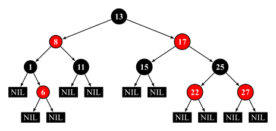
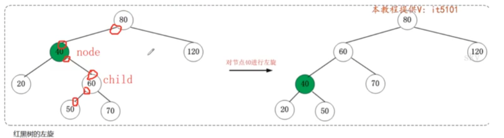
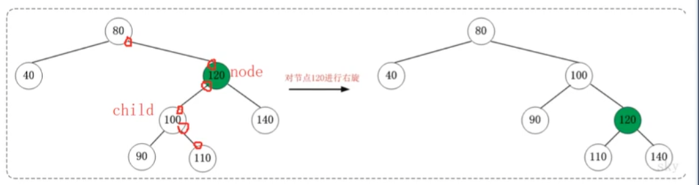
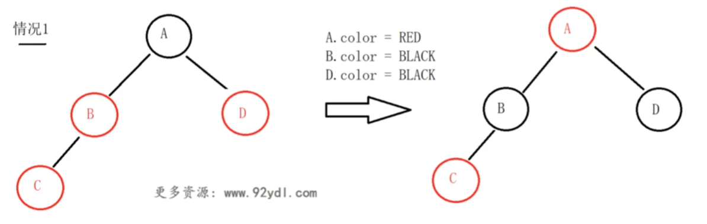
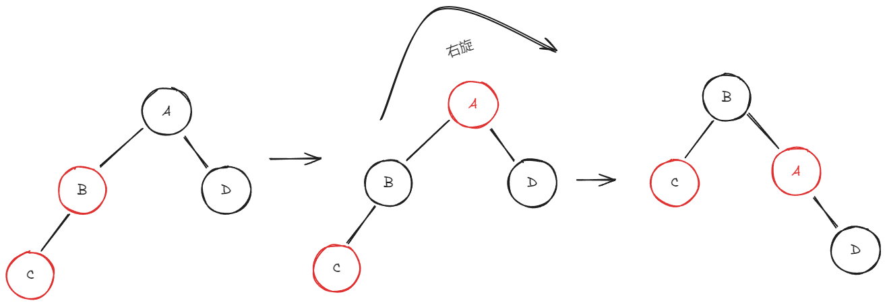
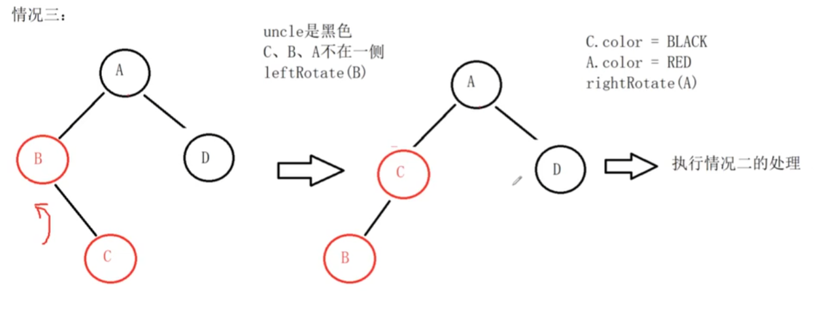
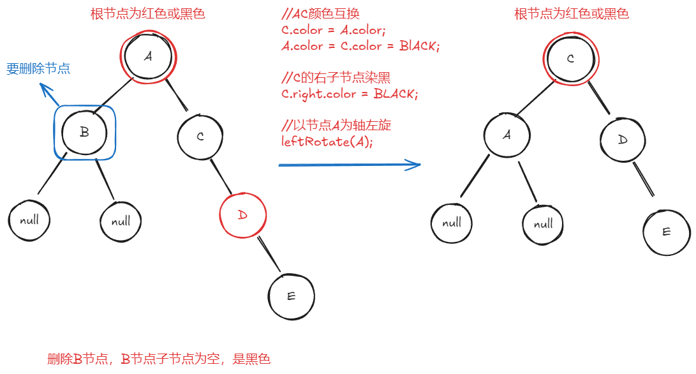
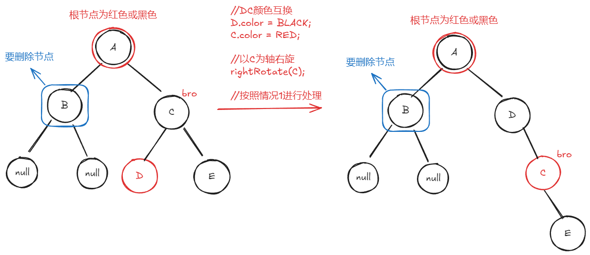
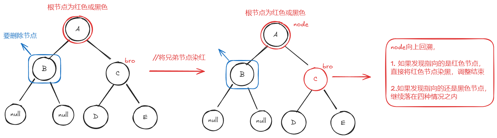
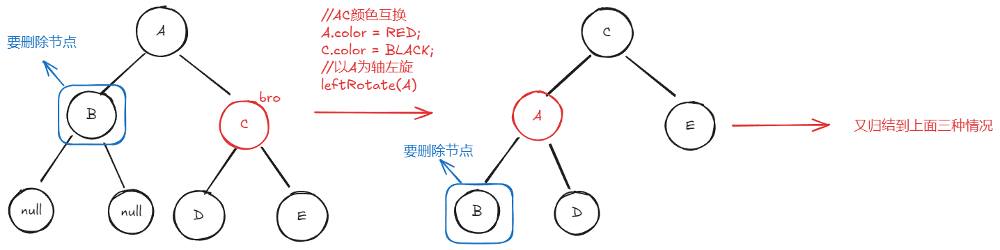

2024-09-25 09:39
Tags: #数据结构 #树
Reference：[1红黑树性质以及和AVL树的应用场景_ev_哔哩哔哩_bilibili](https://www.bilibili.com/video/BV1FT421k7LL/?p=123&spm_id_from=pageDriver&vd_source=0f765d25b29efef66dd4ff586509e026)
# 概念
红黑树是一种自平衡的二叉搜索树。红黑树是一种特化的AVL树。每个节点额外存储了一个 color 字段 ("RED" or "BLACK")，用于确保树在插入和删除时保持平衡。
# 性质
红黑树是每个节点都带有颜色属性的[二叉查找树](https://zh.wikipedia.org/wiki/%E4%BA%8C%E5%85%83%E6%90%9C%E5%B0%8B%E6%A8%B9 "二叉搜索树")，颜色为红色或黑色。在二叉查找树强制一般要求以外，对于任何有效的红黑树我们增加了如下的额外要求：

1. 节点是红色或黑色。
2. 根是黑色。
3. 所有叶子都是黑色（叶子是NIL节点）。
4. 从每个叶子到根的所有路径上不能有两个连续的红色节点。（或者说每个红色节点必须有两个黑色的子节点。）（或者说不存在两个相邻的红色节点，相邻指两个节点是父子关系。）（或者说红色节点的父节点和子节点均是黑色的。）
5. 从任一节点到其每个叶子的所有简单路径都包含相同数目的黑色节点。(保证了节点的左右子树高度差，长的不超过短的两倍,最差情况为: 一条路径全为黑色节点, 另一条路经黑红交替)

# 特点
- **红黑树不是一颗平衡树，节点的左右子树高度差，长的不超过短的两倍**。
- AVL树节点插入时，因为是在叶子节点插入，所以每次插入最多旋转两次。AVL树节点删除时。每次删除最多旋转$log_2^n$次。

| 操作       | AVL      | 红黑树      |
| -------- | -------- | -------- |
| 是否平衡     | 是        | 否        |
| 增删查时间复杂度 | O(log n) | O(log n) |
| 插入最多旋转次数 | 2        | 2        |
| 移除最多旋转次数 | O(log n) | 3        |
# 应用场景
- 如果查询场景比较多，选择AVL树。查询时AVL树是一颗平衡树，所以查询效率要高于红黑树。
- 如果删除场景比较多，使用红黑树。红黑树的移除最多旋转次数为3。
- 如果数据量比较小(十万，百万)的情况下，AVL树和红黑树效率差别不大，但是红黑树有着色所以选择AVL树。如果数据量比较大(百万，千万)，红黑树效率高。一千万的数据量大约为24层。
# 实现步骤
## 旋转操作
- 旋转操作：红黑树中的旋转为非递归旋转
	- 左旋
	- 
		- 图中红圈标出的地址域均需要修改
	- 右旋
	- 
	- 图中红圈标出的地址域均需要修改
## 插入操作
- 空树插入，插入节点为根节点，节点为黑色
- 非空树插入，插入节点为叶子节点，插入节点为红色。如果插入黑色节点会打破红黑树性质5（ 从任一节点到其每个叶子的所有简单路径都包含相同数目的黑色节点）导致旋转。
	- 此时要检查插入节点父节点的颜色，以维护性质4：从每个叶子到根的所有路径上不能有两个连续的红色节点。
		- 如果父节点为黑色，直接插入，不必调整。
		- 如果父节点为红色，出现连续红色节点，开始做红黑树的递归插入调整：
			- 如果插入节点为左子节点，插入节点要先看叔节点的颜色
				- 情况一，如果叔节点D为红色，则将插入节点C（红色）的父节点B（红色）和爷节点A（黑色）颜色交换，并将叔节点D染黑。递归结束后，根节点染黑。
				- 
				- 情况二，如果叔节点D为黑色，则将插入节点C（红色）的父节点B（红色）和爷节点A（黑色）颜色交换，但此时叔节点所在的路径会少一个黑色节点，不满足性质5。所以以父节点B为轴右旋，使其满足性质5。
				- 
			- 如果插入节点为右子节点
				- 以父节点为轴做左旋，使其成为情况二的状态，再执行情况二的操作
				- 
## 删除操作
- 删除一个节点，如果这个节点有两个子节点，那么互换删除节点和其前驱节点的值，然后删除其前驱节点，将其前驱节点的子节点链接到前趋节点的父节点上
	- 如果删除的是一个红色节点，因为红色节点的父节点和子节点都是黑色，那么不会破坏红黑树性质，直接采用BST树节点的删除方式即可，不用做任何调整
	- 如果删除的是黑色节点，那么此条路径上的黑色节点比其他路径的黑色节点要少一个，要用其子节点补充删除位置
		- 如果补上来的子节点是红色节点，那么直接将这个子节点染黑，调整完成
		- 如果补上来的子节点是黑色节点，那么在当前路径上没办法补充一个黑色节点出来，只能从兄弟节点借调黑色节点。
			- 情况1，如果删除的节点在左侧，右边的兄弟节点是黑色，兄弟的右子节点是红色
			- 
			- 情况2，如果删除的节点在左侧，右边的兄弟节点是黑色，兄弟的右子节点是黑色
			- 
			- 情况3.如果删除的节点在左侧，右边的兄弟节点是黑色，兄弟的左右节点都是黑色
			- 
			- 情况4，兄弟节点为红色
			- 
# 代码
```cpp
#include <iostream>

// 定义颜色枚举
enum Color
{
    RED,  // 红色
    BLACK // 黑色
};

// 定义节点结构
struct Node
{
    int data;                    // 节点数据
    Color color;                 // 节点颜色
    Node *left, *right, *parent; // 左子节点、右子节点和父节点指针

    // 构造函数
    Node(int data) : data(data), color(RED), left(nullptr), right(nullptr), parent(nullptr)
    {
    }
};

// 定义红黑树类
class RedBlackTree
{
private:
    Node *root; // 根节点

    // 左旋转
    void rotateLeft(Node *&node)
    {
        Node *node_right = node->right;
        node->right = node_right->left;

        if (node->right != nullptr)
        {
            node->right->parent = node;
        }

        node_right->parent = node->parent;

        if (node->parent == nullptr)
        {
            root = node_right;
        }
        else if (node == node->parent->left)
        {
            node->parent->left = node_right;
        }
        else
        {
            node->parent->right = node_right;
        }

        node_right->left = node;
        node->parent = node_right;
    }

    // 右旋转
    void rotateRight(Node *&node)
    {
        Node *node_left = node->left;
        node->left = node_left->right;

        if (node->left != nullptr)
        {
            node->left->parent = node;
        }

        node_left->parent = node->parent;

        if (node->parent == nullptr)
        {
            root = node_left;
        }
        else if (node == node->parent->left)
        {
            node->parent->left = node_left;
        }
        else
        {
            node->parent->right = node_left;
        }

        node_left->right = node;
        node->parent = node_left;
    }

    // 修复红黑树的违规情况
    void fixViolation(Node *&node)
    {
        Node *parent_node = nullptr;
        Node *grandparent_node = nullptr;

        while ((node != root) && (node->color == RED) && (node->parent->color == RED))
        {
            parent_node = node->parent;
            grandparent_node = node->parent->parent;

            if (parent_node == grandparent_node->left)
            {
                Node *uncle_node = grandparent_node->right;

                if (uncle_node != nullptr && uncle_node->color == RED)
                {
                    grandparent_node->color = RED;
                    parent_node->color = BLACK;
                    uncle_node->color = BLACK;
                    node = grandparent_node;
                }
                else
                {
                    if (node == parent_node->right)
                    {
                        rotateLeft(parent_node);
                        node = parent_node;
                        parent_node = node->parent;
                    }
                    rotateRight(grandparent_node);
                    std::swap(parent_node->color, grandparent_node->color);
                    node = parent_node;
                }
            }
            else
            {
                Node *uncle_node = grandparent_node->left;

                if ((uncle_node != nullptr) && (uncle_node->color == RED))
                {
                    grandparent_node->color = RED;
                    parent_node->color = BLACK;
                    uncle_node->color = BLACK;
                    node = grandparent_node;
                }
                else
                {
                    if (node == parent_node->left)
                    {
                        rotateRight(parent_node);
                        node = parent_node;
                        parent_node = node->parent;
                    }
                    rotateLeft(grandparent_node);
                    std::swap(parent_node->color, grandparent_node->color);
                    node = parent_node;
                }
            }
        }
        root->color = BLACK;
    }

    // 修复双黑节点的情况
    /*
     * 双黑节点的含义：双黑节点意味着当前节点原本是黑色的，且由于删除操作，导致它被赋予了两个黑色权重（相当于黑色的“双重负担”）。
     * 这是一个临时状态，最终需要通过调整来消除双黑色。
     */
    void fixDoubleBlack(Node *&node)
    {
        if (node == root)
            return;

        Node *sibling = nullptr;
        Node *parent = nullptr;

        while ((node == nullptr || node->color == BLACK) && (node != root))
        {
            parent = node->parent;

            if (node == parent->left)
            {
                sibling = parent->right;

                if (sibling != nullptr && sibling->color == RED)
                {
                    sibling->color = BLACK;
                    parent->color = RED;
                    rotateLeft(parent);
                    sibling = parent->right;
                }

                if ((sibling->left == nullptr || sibling->left->color == BLACK) &&
                    (sibling->right == nullptr || sibling->right->color == BLACK))
                {
                    sibling->color = RED;
                    node = parent;
                }
                else
                {
                    if (sibling->right == nullptr || sibling->right->color == BLACK)
                    {
                        sibling->left->color = BLACK;
                        sibling->color = RED;
                        rotateRight(sibling);
                        sibling = parent->right;
                    }

                    sibling->color = parent->color;
                    parent->color = BLACK;
                    sibling->right->color = BLACK;
                    rotateLeft(parent);
                    node = root;
                }
            }
            else
            {
                sibling = parent->left;

                if (sibling != nullptr && sibling->color == RED)
                {
                    sibling->color = BLACK;
                    parent->color = RED;
                    rotateRight(parent);
                    sibling = parent->left;
                }

                if ((sibling->right == nullptr || sibling->right->color == BLACK) &&
                    (sibling->left == nullptr || sibling->left->color == BLACK))
                {
                    sibling->color = RED;
                    node = parent;
                }
                else
                {
                    if (sibling->left == nullptr || sibling->left->color == BLACK)
                    {
                        sibling->right->color = BLACK;
                        sibling->color = RED;
                        rotateLeft(sibling);
                        sibling = parent->left;
                    }

                    sibling->color = parent->color;
                    parent->color = BLACK;
                    sibling->left->color = BLACK;
                    rotateRight(parent);
                    node = root;
                }
            }
        }
        if (node != nullptr)
        {
            node->color = BLACK;
        }
    }

    // 二叉搜索树删除节点
    Node *bstDelete(Node *root, int data)
    {
        if (root == nullptr)
            return root;

        if (data < root->data)
        {
            root->left = bstDelete(root->left, data);
        }
        else if (data > root->data)
        {
            root->right = bstDelete(root->right, data);
        }
        else
        {
            if (root->left == nullptr || root->right == nullptr)
            {
                Node *temp = root->left ? root->left : root->right;

                if (temp == nullptr)
                {
                    temp = root;
                    root = nullptr;
                }
                else
                {
                    *root = *temp;
                }
                delete temp;
            }
            else
            {
                Node *temp = minValueNode(root->right);
                root->data = temp->data;
                root->right = bstDelete(root->right, temp->data);
            }
        }
        return root;
    }

    // 找到最小值节点
    Node *minValueNode(Node *node)
    {
        Node *current = node;
        while (current && current->left != nullptr)
        {
            current = current->left;
        }
        return current;
    }

public:
    // 构造函数
    RedBlackTree() : root(nullptr)
    {
    }

    // 插入节点
    void insert(int data)
    {
        Node *new_node = new Node(data);
        root = bstInsert(root, new_node);
        fixViolation(new_node);
    }

    // 二叉搜索树插入节点
    Node *bstInsert(Node *root, Node *new_node)
    {
        if (root == nullptr)
        {
            return new_node;
        }

        if (new_node->data < root->data)
        {
            root->left = bstInsert(root->left, new_node);
            root->left->parent = root;
        }
        else if (new_node->data > root->data)
        {
            root->right = bstInsert(root->right, new_node);
            root->right->parent = root;
        }
        return root;
    }

    // 删除节点
    void deleteNode(int data)
    {
        Node *node_to_delete = search(root, data);
        if (node_to_delete != nullptr)
        {
            Node *temp = node_to_delete;
            Color original_color = temp->color;

            Node *x = nullptr;
            if (node_to_delete->left == nullptr)
            {
                x = node_to_delete->right;
                transplant(node_to_delete, node_to_delete->right);
            }
            else if (node_to_delete->right == nullptr)
            {
                x = node_to_delete->left;
                transplant(node_to_delete, node_to_delete->left);
            }
            else
            {
                temp = minValueNode(node_to_delete->right);
                original_color = temp->color;
                x = temp->right;

                if (temp->parent == node_to_delete)
                {
                    if (x)
                        x->parent = temp;
                }
                else
                {
                    transplant(temp, temp->right);
                    temp->right = node_to_delete->right;
                    temp->right->parent = temp;
                }
                transplant(node_to_delete, temp);
                temp->left = node_to_delete->left;
                temp->left->parent = temp;
                temp->color = node_to_delete->color;
            }
            delete node_to_delete;
            if (original_color == BLACK)
            {
                fixDoubleBlack(x);
            }
        }
    }

    // 搜索节点
    Node *search(Node *root, int data)
    {
        if (root == nullptr || root->data == data)
        {
            return root;
        }
        if (data < root->data)
        {
            return search(root->left, data);
        }
        return search(root->right, data);
    }

    // 替换节点
    void transplant(Node *u, Node *v)
    {
        if (u->parent == nullptr)
        {
            root = v;
        }
        else if (u == u->parent->left)
        {
            u->parent->left = v;
        }
        else
        {
            u->parent->right = v;
        }
        if (v != nullptr)
        {
            v->parent = u->parent;
        }
    }

    // 中序遍历
    void inorder()
    {
        inorderHelper(root);
    }

    // 中序遍历辅助函数
    void inorderHelper(Node *root)
    {
        if (root == nullptr)
            return;
        inorderHelper(root->left);
        std::cout << root->data << " ";
        inorderHelper(root->right);
    }
};

int main()
{
    RedBlackTree tree;
    tree.insert(10);
    tree.insert(20);
    tree.insert(30);
    tree.insert(15);

    std::cout << "Inorder traversal of the red-black tree before deletion: ";
    tree.inorder();
    std::cout << std::endl;

    tree.deleteNode(20);
    std::cout << "Inorder traversal of the red-black tree after deletion of 20: ";
    tree.inorder();
    std::cout << std::endl;

    return 0;
}

```
