# B-树
2024-09-29 09:34
Tags: #数据结构 #树 
Reference：[1B-树的插入操作理论讲解_ev_哔哩哔哩_bilibili](https://www.bilibili.com/video/BV1FT421k7LL?p=131&vd_source=0f765d25b29efef66dd4ff586509e026)
## 概念
- 在计算机科学中，B 树（B-tree）是一种自平衡的搜索树，能够保持数据有序。这种数据结构能够让查找数据、顺序访问、插入数据及删除的动作，都在对数时间内完成。B 树的每个节点可以拥有两个以上的子节点，因此 B 树是一种多路搜索树。
## 特点
- B树，即B-tree树，B是Balanced首字母，平衡的意思。
- B树是一个m阶平衡树，应用场景：文件索引系统的实现。
	- AVL树是一个2阶平衡树，一个节点有两个地址域，一个数据域
	- m阶平衡树：有m个地址域，m-1个数据域。
## 性质
一颗m阶B树需要满足：
- 树中每个节点最多含有m个子节点
- 除根节点和叶节点外，其他每个节点至少有`[ceil(m / 2)]`个子节点（ceil函数为取上限）
- 除根节点以外的节点的关键字个数n必须满足：`[ceil(m / 2) - 1] <= n <= m - 1`(叶子节点也必须满足)

## 实现步骤
### 插入节点
#### 插入原则：
1. 如果叶子结点空间足够，即该结点的关键字数小于m-1，则直接插入在叶子结点的左边或右边
2. 如果空间满了以致没有足够的空间去添加新的元素，即该结点的关键字数已经有了m个，则需要将该结点进行“分裂”，将一半数量的关键字元素分裂到新的其相邻左右结点中，中间关键字元素上移到父节点中，而且当结点中元素向右移动了，相关的指针也需要向右移。
3. 此外，如果在上述中间关键字上移到父结点的过程中，导致根结点空间满了，那么根结点也要进行分裂操作，这样原来的根节点中间元素上移到新的根节点中，因此导致树的高度增加一层。
#### 插入案例：
- 插入以下字符到一颗5阶B树中：C,N,G,A,H,E,K,Q,M,F,W,L,T,Z,D,P,R,X,Y,S
- 根据B树性质：5阶B树，非根节点关键字个数满足`2 <= n <= 4`，每个节点做多有5个子节点，除根节点叶节点外其他节点至少有3个子节点。
	- 如果叶子节点空间足够，即该节点的关键字数小于5-1,则直接插入在叶子节点的左边或右边，使其升序排列，插入后顺序为ACGN
	- 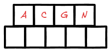
	- 插入H，如果节点空间满了，没有足够空间添加新元素，即该节点关键字数已有m个，则需要对该节点进行分裂，将一半数量的关键字元素HN分裂到新的其相邻左右节点中，中间关键字G元素上移到父节点中，而且当节点中关键字元素右移了，相关指针也要右移。
	- 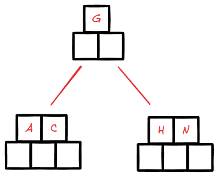
	- 插入E，E比G小，应当插入左子节点，左子节点还有空间，所以插入左子节点
	- 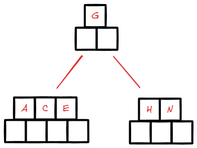
	- 插入KQ
	- 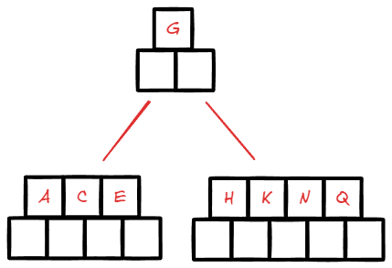
	- 插入M，应当插入右子节点，但是右子节点已满。右子节点要进行分裂,中间元素M提升到父节点
	- 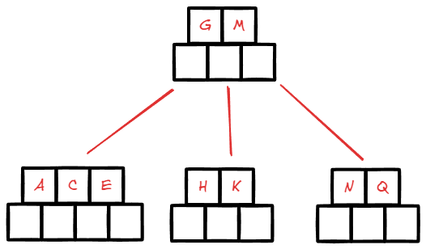
	- 插入FWLT
	- 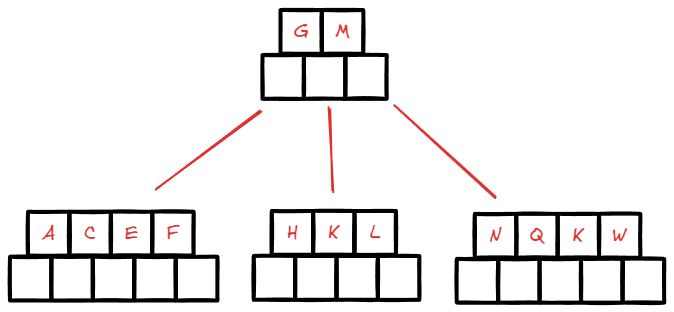
	- 插入,Z,D,P,R,X,Y
	- 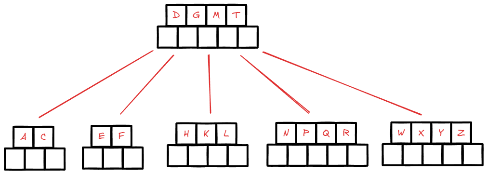
	- 插入S，S的插入位置应当在R之后，第三个子节点应当分裂，将Q提升到父节点，这样父节点也满了，将父节点中的M节点再提升为父节点。导致树增加一层。
	- 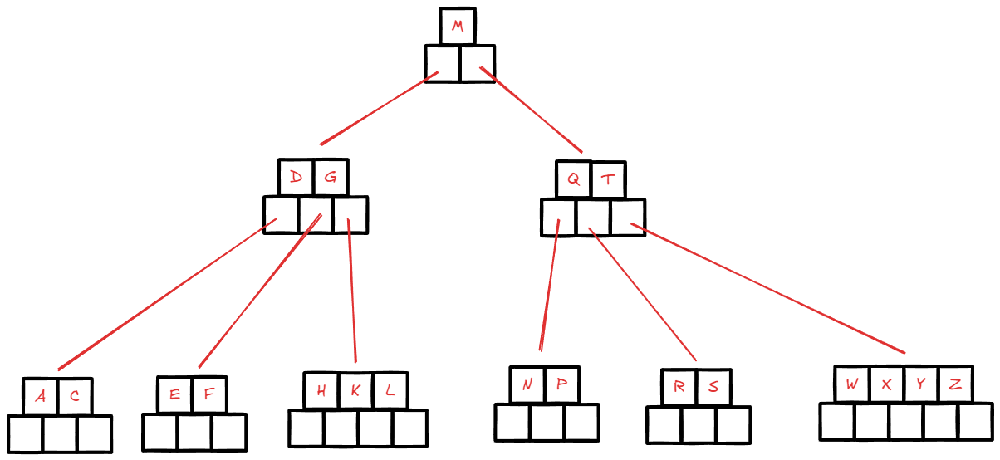
### 删除节点
#### 删除原则
首先查找B树中要删除的元素，若元素存在，则进行删除。除该元素后，需要判断该元素是否有左右孩子节点
1)如果有，则上移孩子节点中的相近元素(左孩子中最右边的节点或者右孩子中最左边的节点)到父节点中去。
2)如果没有，直接删除。

删除元素，然后进行元素移动之后，如果节点关键字数目不满足条件(小于ceil(m/2)-1),则需要看其相邻的兄弟节点是否丰满(关键字个数大于`ceil(m/2)-1)`
1)如果丰满，则向父节点借一个元素来满足
2)如果其相邻兄弟都刚脱贫，即借了之后其结点数目小于`cei(m/2)-1`，则该结点与其相邻的某一兄弟结点还有父节点中的一个元素进行“合并”成一个结点，以此来满足条件。
#### 删除案例：依次删除H，T，R，E元素
- 
- 以上B树删除H节点，H元素没有子节点直接删除
- 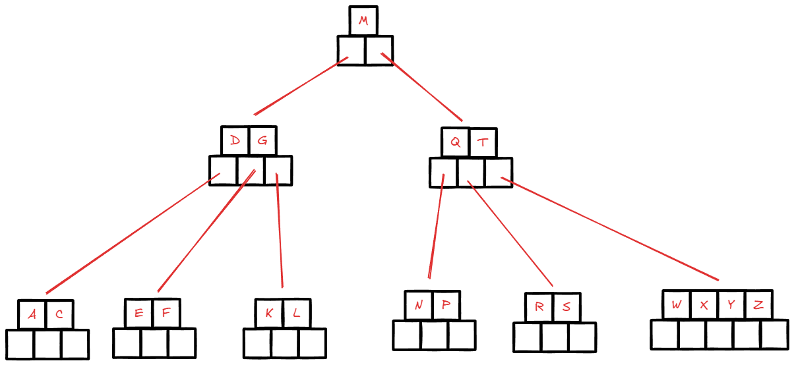
- 删除T节点，删除后根节点的右子节点只剩一个元素不满足B树性质，每个节点应有2-4个元素，上提临近元素w到父节点
- 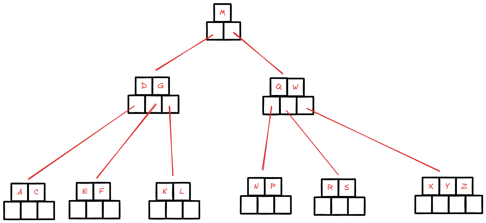
- 删除R节点，R节点没有子节点，直接删除，但是节点数量为1，不满足B树性质，要从兄弟节点借一个元素，此时兄弟节点必须丰满（元素数>2）。将兄弟节点中的X元素上提到父节点，将父节点中的W元素下降到删除位置。
- 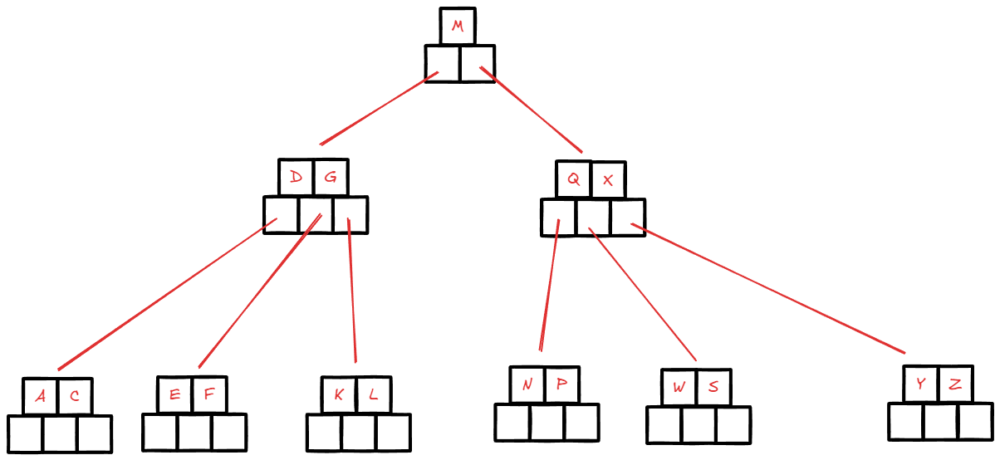
- 删除E元素，E所在的节点没有子节点，所以直接删除，但是删除后元素数量不满足B树性质，而其左右兄弟节点都不丰满，无法借元素，则将该节点与其一个兄弟节点合并来满足B树的性质。将ACDF合并为一个节点。此时其父节点只剩一个G元素，不符合B树性质，需要合并，那么根节点M下移。树的高度减少，搜索效率提高。
- 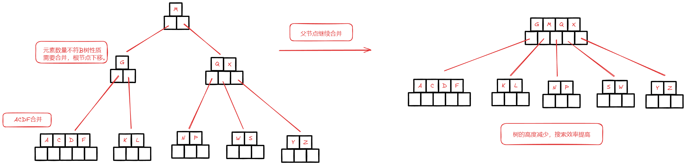
## 应用

- 文件索引系统，数据库的索引系统都会用到B树结构。实际上是B+树数据结构。
- 系统中的文件搜索，数据量非常大，数据存储在磁盘中，需要大量的IO操作。一般系统会给所有数据进行索引和排序，加速搜索。需要解决两个问题：
	- 更少的磁盘IO
		- 在系统中，管理内存，按页面（page）来管理，每页是4K大小。而管理磁盘，按块（Block）来管理，每块16K。
		- 假如现在有一千万个索引需要从磁盘中读取并且进行搜索
			- 如果使用AVL树进行搜索，树高为$log_2^{10000000}$，大约为24层，最差情况需要24次磁盘IO。
			- 使用300阶B树进行搜索，树高为$log_{300}^{10000000}$，大约为3层，最差情况需要3次磁盘IO。一个节点的数据量大小跟磁盘块（Block）的大小是差不多一样的。
	- 更快的所搜算法
		- B树的搜索，本质上仍然是二分查找，其时间复杂度仍为$log_2^n$。对每个节点进行二分查找，查找节点位置继续向下，在下一层节点再进行二分查找。
# B+树
## 概念
B+树是一种B树的变形树
- 所有叶子节点包含**全部**关键字信息，以及指向含有这些关键字记录的指针。
- 非叶子节点相当于是叶子节点的索引，叶子节点相当于是储存关键字数据的数据层。
- 叶子节点中的全部数据串联在一条有序链表当中进行有序链接。
- 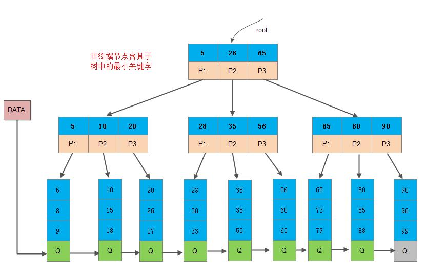
B树和B+树的主要区别：
1. B-树的每一个节点，存了关键字和对应的数据地址，而8+树的非叶子节点只存关键字，不存数据地址。因此B+树的每一个非叶子节点存储的关键字是远远多于B-树的，B+树的叶子节点存放关键字和数据，因此，从树的高度上来说，B+树的高度要小于B-树，使用的磁盘I/0次数少，因此查询会更快一些。
2. B-树由于每个节点都存储关键字和数据，因此离根节点近的数据，查询的就快，离根节点远的数据，查询的就慢;B+树所有的数据都存在叶子节点上，因此在B+树上搜索关键字，找到对应数据的时间是比较平均的，没有快慢之分。
3. 在B-树上如果做区间査找，遍历的节点是非常多的;B+树所有叶子节点被连接成了有序链表结构，因此做整表遍历和区间查找是非常容易的。
## 应用
- 问：B+树比B树更适合操作系统的文件索引和数据库索引的原因是什么？
- 答：
	- B+树的磁盘读写代价更低。B+树的内部节点没有指向关键字具体信息的指针，因此内部节点相比于B树更小。如果把所有同一内部节点的关键字放在同一块磁盘中，盘块所能容纳的关键字数量也就更多，一次性读入内存中的需要查找的关键字也越多，相应的IO读写次数降低。
	- B+树的查询效率更加稳定。由于非终结点并不是最终指向文件肉容的结点，而只是叶子结点中关键字的索引。所以任何关键字的查找必须走一条从根结点到叶子结点的路。所有关键字查询的路径长度相同，导致每一个数据的查询效率相当。
	- 举个例子，假设磁盘中的一个盘块容纳16bytes，而一个关键字2bytes，一个关键字具体信息指针2bytes。一棵9阶B-tree(一个结点最多8个关键字)的内部结点需要2个盘块。而B+树内部结点只需要1个盘快。当需要把内部结点读入内存中的时候，B 树就比B+树多一次盘块查找时间(在磁盘中就是盘片旋转的时间)。
# `B*树`
## 概念
`B*树`是B+树的变体，在B+树的非根节点和非叶子节点中再增加指向兄弟节点的指针。

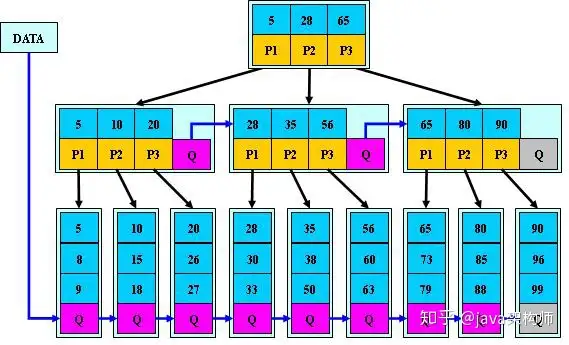
## 特点
- B*树定义了非叶子结点关键字个数至少为(2/3)*M，即块的最低使用率为2/3(代替B+树的1/2)。
- B+树的分裂:当一个结点满时，分配一个新的结点，并将原结点中1/2的数据复制到新结点，最后在父结点中增加新结点的指针;B+树的分裂只影响原结点和父结点，而不会影响兄弟结点，所以它不需要指向兄弟的指针;
- `B*`树的分裂:当一个结点满时，如果它的下一个兄弟结点未满，那么将一部分数据移到兄弟结点中，再在原结点插入关键字，最后修改父结点中兄弟结点的关键字(因为兄弟结点的关键字范围改变了);如果兄弟也满了，则在原结点与兄弟结点之间增加新结点，并各复制1/3的数据到新结点，最后在父结点增加新结点的指针;
- 所以，B*树分配新结点的概率比B+树要低，空间使用率更高，在B+树基础上，为非叶子结点也增加链表指针，将结点的最低利用率从1/2提高到2/3。