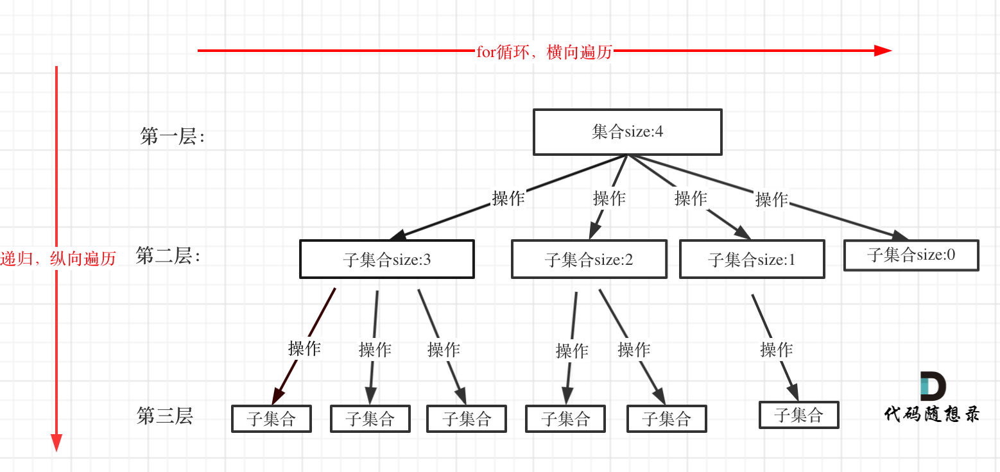

# 概念
- 算法思想:在包含问题的所有解的解空间树中，按照深度优先搜索的策略，从根节点出发深度搜索解空间树。当搜索到某一节点时，要先判断该节点是否包含问题的解，如果包含就从该节点出发继续深度搜索下去，否则逐层向上回溯。一般在搜索的过程中都会添加相应的**剪枝函数**，**避免无效解的搜索**，**提高算法效率**。
- 解空间:解空间就是所有解的可能取值构成的空间，一个解往往包含了得到这个解的每一步，往往就是对应解空间树中一条从根节点到叶子节点的路径。子集树和排列树都是一种解空间，它们不是真实存在的数据结构，也就是说并不是真的有这样一颗树，只是抽象出的解空间树。
## 回溯法的效率
**虽然回溯法很难，很不好理解，但是回溯法并不是什么高效的算法**。

**因为回溯的本质是穷举，穷举所有可能，然后选出我们想要的答案**，如果想让回溯法高效一些，可以加一些剪枝的操作，但也改不了回溯法就是穷举的本质。
## 回溯法解决的问题

回溯法，一般可以解决如下几种问题：

- 组合问题：N个数里面按一定规则找出k个数的集合
- 切割问题：一个字符串按一定规则有几种切割方式
- 子集问题：一个N个数的集合里有多少符合条件的子集
- 排列问题：N个数按一定规则全排列，有几种排列方式
- 棋盘问题：N皇后，解数独等等
## 如何理解回溯法

**回溯法解决的问题都可以抽象为树形结构**，是的，我指的是所有回溯法的问题都可以抽象为树形结构！
因为回溯法解决的都是在集合中递归查找子集，**集合的大小就构成了树的宽度，递归的深度就构成了树的深度**。
递归就要有终止条件，所以必然是一棵高度有限的树（N叉树）。
# 回溯法模板
## 回溯函数模板返回值以及参数

- 在回溯算法中，我的习惯是函数起名字为backtracking，这个起名大家随意。
- 回溯算法中函数返回值一般为void。
- 再来看一下参数，因为回溯算法需要的参数可不像二叉树递归的时候那么容易一次性确定下来，所以一般是先写逻辑，然后需要什么参数，就填什么参数。
回溯函数伪代码如下：

```
void backtracking(参数)
```

## 回溯函数终止条件

- 既然是树形结构，那么我们在讲解二叉树的递归的时候，就知道遍历树形结构一定要有终止条件。所以回溯也有要终止条件。
- 什么时候达到了终止条件，树中就可以看出，一般来说搜到叶子节点了，也就找到了满足条件的一条答案，把这个答案存放起来，并结束本层递归。
所以回溯函数终止条件伪代码如下：

```
if (终止条件) {
    存放结果;
    return;
}
```

## 回溯搜索的遍历过程

在上面我们提到了，回溯法一般是在集合中递归搜索，**集合的大小构成了树的宽度，递归的深度构成的树的深度**。
如图：



注意图中，我特意举例集合大小和孩子的数量是相等的！
回溯函数遍历过程伪代码如下：

```
for (选择：本层集合中元素（树中节点孩子的数量就是集合的大小）) {
    处理节点;
    backtracking(路径，选择列表); // 递归
    回溯，撤销处理结果
}
```

- for循环就是遍历集合区间，可以理解一个节点有多少个孩子，这个for循环就执行多少次。

- backtracking这里自己调用自己，实现递归。

- 大家可以从图中看出**for循环可以理解是横向遍历，backtracking（递归）就是纵向遍历**，这样就把这棵树全遍历完了，一般来说，搜索叶子节点就是找的其中一个结果了。

分析完过程，回溯算法模板框架如下：

```
void backtracking(参数) {
    if (终止条件) {
        存放结果;
        return;
    }

    for (选择：本层集合中元素（树中节点孩子的数量就是集合的大小）) {
        处理节点;
        backtracking(路径，选择列表); // 递归
        回溯，撤销处理结果
    }
}

```

**这份模板很重要，后面做回溯法的题目都靠它了！**
如果从来没有学过回溯算法的录友们，看到这里会有点懵，后面开始讲解具体题目的时候就会好一些了，已经做过回溯法题目的录友，看到这里应该会感同身受了。
