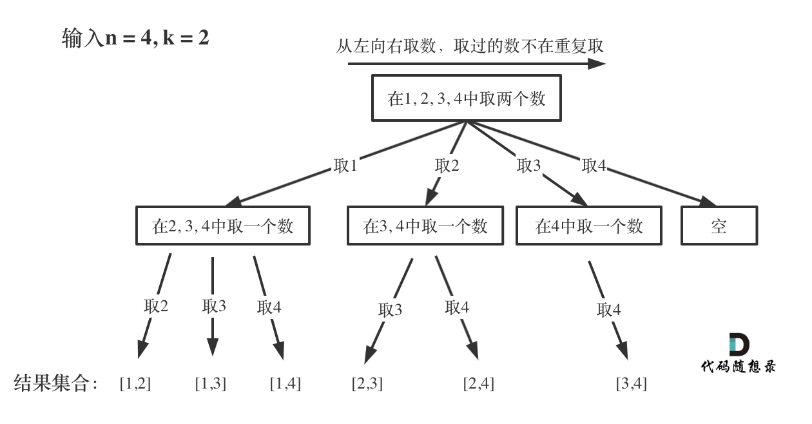
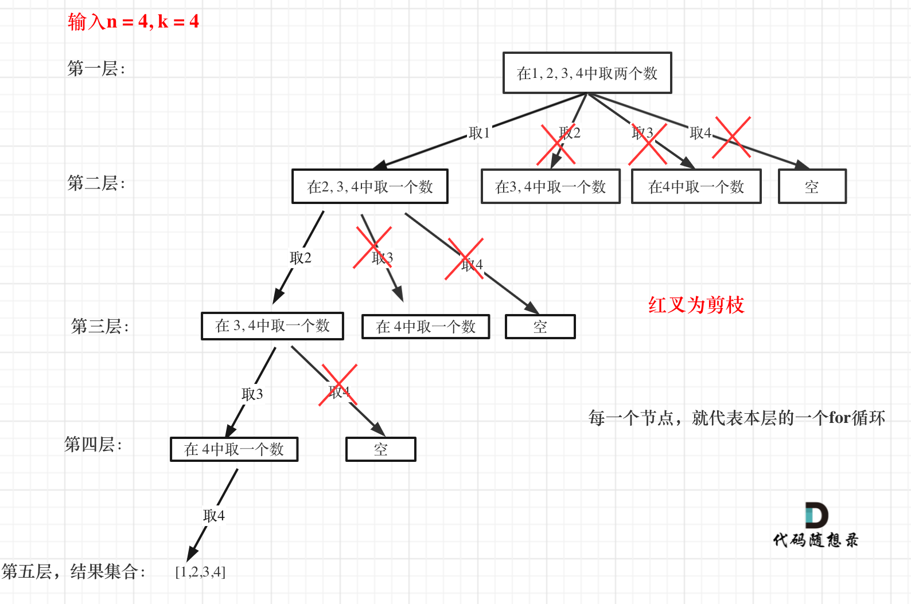

# [77. 组合 - 力扣（LeetCode）](https://leetcode.cn/problems/combinations/description/)

给定两个整数 `n` 和 `k`，返回范围 `[1, n]` 中所有可能的 `k` 个数的组合。
你可以按 **任何顺序** 返回答案。

示例 1：
输入：n = 4, k = 2
输出：
`[[2,4],[3,4],[2,3],[1,2],[1,3],[1,4]]`

示例 2：
输入：n = 1, k = 1
输出：`[[1]]`

提示：
- `1 <= n <= 20`
- `1 <= k <= n`
## 解题思路

## 解题步骤
1. 递归函数的意义，参数，返回值
2. 递归终止条件
3. 单层递归逻辑
## 代码
```cpp
class Solution 
{
private:
    vector<vector<int>> result;//存放符合条件的最终结果
    vector<int> path; //存放符合条件的集合
    //递归回溯函数，startIndex参数是每次递归要搜索的起始位置
    void backTracking(int n, int k, int startIndex)
    {
        //确定递归终止条件，如果集合个数达到k,则将集合存入结果并返回。
        if (path.size() == k)
        {
            result.push_back(path);//存放结果
            return;
        }
        //单层递归逻辑
        for (int i = startIndex; i <= n; i++)
        {
            path.push_back(i);//处理i节点
            backTracking(n, k, i + 1);//递归i+1
            path.pop_back();//回溯，撤销处理的节点
        }

    }
public:
    vector<vector<int>> combine(int n, int k) 
    {
        backTracking(n, k, 1);
        return result;
    }
};
```
## 剪枝优化
- 举一个例子，n = 4，k = 4的话，那么第一层for循环的时候，从元素2开始的遍历都没有意义了。 在第二层for循环，从元素3开始的遍历都没有意义了。元素无法凑齐四个。
- 
- **如果for循环选择的起始位置之后的元素个数 已经不足 我们需要的元素个数了，那么就没有必要搜索了**。
### 剪枝操作
1. 已经选择的元素个数：path.size();
2. 还需要的元素个数为: k - path.size();
3. 在集合n中至多要从该起始位置 : n - (k - path.size()) + 1，开始遍历
4. 为什么有个+1呢，因为包括起始位置，我们要是一个左闭的集合。
举个例子，n = 4，k = 3， 目前已经选取的元素为0（path.size为0），n - (k - 0) + 1 即 4 - ( 3 - 0) + 1 = 2。
从2开始搜索都是合理的，可以是组合`[2, 3, 4]`。
### 代码
```cpp
class Solution 
{
private:
    vector<vector<int>> result;//存放符合条件的最终结果
    vector<int> path; //存放符合条件的集合
    //递归回溯函数，startIndex参数是每次递归要搜索的起始位置
    void backTracking(int n, int k, int startIndex)
    {
        //确定递归终止条件，如果集合个数达到k,则将集合存入结果并返回。
        if (path.size() == k)
        {
            result.push_back(path);//存放结果
            return;
        }
        //单层递归逻辑,i <= n - (k - path.size()) + 1条件剪枝
        for (int i = startIndex; i <= n - (k - path.size()) + 1; i++)
        {
            path.push_back(i);//处理i节点
            backTracking(n, k, i + 1);//递归i+1
            path.pop_back();//回溯，撤销处理的节点
        }

    }
public:
    vector<vector<int>> combine(int n, int k) 
    {
        backTracking(n, k, 1);
        return result;
    }
};
```