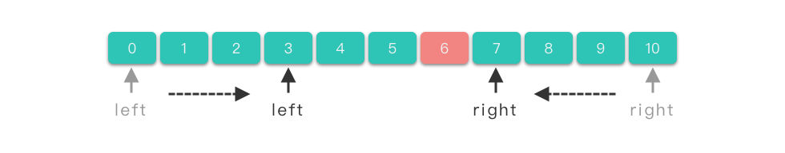
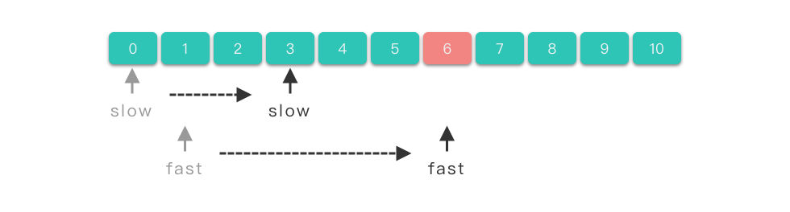
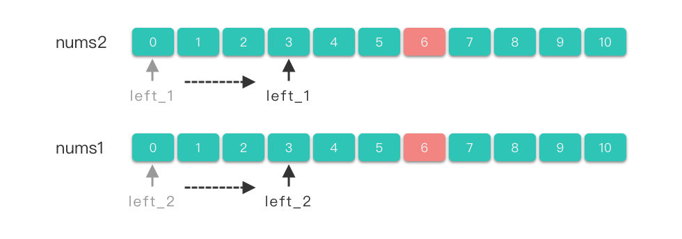

## [1. 双指针简介](https://algo.itcharge.cn/01.Array/04.Array-Two-Pointers/01.Array-Two-Pointers/#_1-%E5%8F%8C%E6%8C%87%E9%92%88%E7%AE%80%E4%BB%8B)

> **双指针（Two Pointers）**：指的是在遍历元素的过程中，不是使用单个指针进行访问，而是使用两个指针进行访问，从而达到相应的目的。如果两个指针方向相反，则称为「对撞指针」。如果两个指针方向相同，则称为「快慢指针」。如果两个指针分别属于不同的数组 / 链表，则称为「分离双指针」。

在数组的区间问题上，暴力算法的时间复杂度往往是 𝑂(𝑛2)O(n2)。而双指针利用了区间「单调性」的性质，可以将时间复杂度降到 𝑂(𝑛)O(n)。

## [2. 对撞指针](https://algo.itcharge.cn/01.Array/04.Array-Two-Pointers/01.Array-Two-Pointers/#_2-%E5%AF%B9%E6%92%9E%E6%8C%87%E9%92%88)

> **对撞指针**：指的是两个指针 𝑙𝑒𝑓𝑡、𝑟𝑖𝑔ℎ𝑡 分别指向序列第一个元素和最后一个元素，然后 𝑙𝑒𝑓𝑡left 指针不断递增，𝑟𝑖𝑔ℎ𝑡不断递减，直到两个指针的值相撞（即` 𝑙𝑒𝑓𝑡==𝑟𝑖𝑔ℎ𝑡left==right`），或者满足其他要求的特殊条件为止。



对撞指针

### [2.1 对撞指针求解步骤](https://algo.itcharge.cn/01.Array/04.Array-Two-Pointers/01.Array-Two-Pointers/#_2-1-%E5%AF%B9%E6%92%9E%E6%8C%87%E9%92%88%E6%B1%82%E8%A7%A3%E6%AD%A5%E9%AA%A4)

1. 使用两个指针 𝑙𝑒𝑓𝑡，𝑟𝑖𝑔ℎ𝑡。𝑙𝑒𝑓𝑡 指向序列第一个元素，即：𝑙𝑒𝑓𝑡=0，𝑟𝑖𝑔ℎ𝑡 指向序列最后一个元素，即：𝑟𝑖𝑔ℎ𝑡=𝑙𝑒𝑛(𝑛𝑢𝑚𝑠)−1。
2. 在循环体中将左右指针相向移动，当满足一定条件时，将左指针右移，𝑙𝑒𝑓𝑡+=1。当满足另外一定条件时，将右指针左移，𝑟𝑖𝑔ℎ𝑡−=1。
3. 直到两指针相撞（即` 𝑙𝑒𝑓𝑡==𝑟𝑖𝑔ℎ𝑡`），或者满足其他要求的特殊条件时，跳出循环体。

### [2.2 对撞指针伪代码模板](https://algo.itcharge.cn/01.Array/04.Array-Two-Pointers/01.Array-Two-Pointers/#_2-2-%E5%AF%B9%E6%92%9E%E6%8C%87%E9%92%88%E4%BC%AA%E4%BB%A3%E7%A0%81%E6%A8%A1%E6%9D%BF)

```
left, right = 0, len(nums) - 1

while left < right:
    if 满足要求的特殊条件:
        return 符合条件的值 
    elif 一定条件 1:
        left += 1
    elif 一定条件 2:
        right -= 1

return 没找到 或 找到对应值
```

### [2.3 对撞指针适用范围](https://algo.itcharge.cn/01.Array/04.Array-Two-Pointers/01.Array-Two-Pointers/#_2-3-%E5%AF%B9%E6%92%9E%E6%8C%87%E9%92%88%E9%80%82%E7%94%A8%E8%8C%83%E5%9B%B4)

对撞指针一般用来解决有序数组或者字符串问题：

- 查找有序数组中满足某些约束条件的一组元素问题：比如二分查找、数字之和等问题。
- 字符串反转问题：反转字符串、回文数、颠倒二进制等问题。

下面我们根据具体例子来讲解如何使用对撞指针来解决问题。

### [2.4 两数之和 II - 输入有序数组](https://algo.itcharge.cn/01.Array/04.Array-Two-Pointers/01.Array-Two-Pointers/#_2-4-%E4%B8%A4%E6%95%B0%E4%B9%8B%E5%92%8C-ii-%E8%BE%93%E5%85%A5%E6%9C%89%E5%BA%8F%E6%95%B0%E7%BB%84)

#### [2.4.1 题目链接](https://algo.itcharge.cn/01.Array/04.Array-Two-Pointers/01.Array-Two-Pointers/#_2-4-1-%E9%A2%98%E7%9B%AE%E9%93%BE%E6%8E%A5)

- [167. 两数之和 II - 输入有序数组 - 力扣（LeetCode）](https://leetcode.cn/problems/two-sum-ii-input-array-is-sorted/)

#### [2.4.2 题目大意](https://algo.itcharge.cn/01.Array/04.Array-Two-Pointers/01.Array-Two-Pointers/#_2-4-2-%E9%A2%98%E7%9B%AE%E5%A4%A7%E6%84%8F)

**描述**：给定一个下标从 11 开始计数、升序排列的整数数组：𝑛𝑢𝑚𝑏𝑒𝑟𝑠和一个目标值 𝑡𝑎𝑟𝑔𝑒𝑡。

**要求**：从数组中找出满足相加之和等于 𝑡𝑎𝑟𝑔𝑒𝑡的两个数，并返回两个数在数组中下的标值。

**说明**：

- $2≤𝑛𝑢𝑚𝑏𝑒𝑟𝑠.𝑙𝑒𝑛𝑔𝑡ℎ≤3∗10^4$
- $−1000 ≤ 𝑛𝑢𝑚𝑏𝑒𝑟𝑠[𝑖] ≤ 1000$
- 𝑛𝑢𝑚𝑏𝑒𝑟𝑠按非递减顺序排列。
- −1000≤𝑡𝑎𝑟𝑔𝑒𝑡≤1000
- 仅存在一个有效答案。

**示例**：

- 示例 1：

```
输入：numbers = [2,7,11,15], target = 9
输出：[1,2]
解释：2 与 7 之和等于目标数 9 。因此 index1 = 1, index2 = 2 。返回 [1, 2] 。
```

- 示例 2：

```
输入：numbers = [2,3,4], target = 6
输出：[1,3]
解释：2 与 4 之和等于目标数 6 。因此 index1 = 1, index2 = 3 。返回 [1, 3] 。
```

#### [2.4.3 解题思路](https://algo.itcharge.cn/01.Array/04.Array-Two-Pointers/01.Array-Two-Pointers/#_2-4-3-%E8%A7%A3%E9%A2%98%E6%80%9D%E8%B7%AF)

这道题如果暴力遍历数组，从中找到相加之和等于 𝑡𝑎𝑟𝑔𝑒𝑡target 的两个数，时间复杂度为 𝑂(𝑛2)O(n2)，可以尝试一下。

```python
class Solution:
    def twoSum(self, numbers: List[int], target: int) -> List[int]:
        size = len(numbers)
        for i in range(size):
            for j in range(i + 1, size):
                if numbers[i] + numbers[j] == target:
                    return [i + 1, j + 1]
        return [-1, -1]
```

结果不出意外的超时了。所以我们要想办法减少时间复杂度。

##### [思路 1：对撞指针](https://algo.itcharge.cn/01.Array/04.Array-Two-Pointers/01.Array-Two-Pointers/#%E6%80%9D%E8%B7%AF-1-%E5%AF%B9%E6%92%9E%E6%8C%87%E9%92%88)

可以考虑使用对撞指针来减少时间复杂度。具体做法如下：

1. 使用两个指针 𝑙𝑒𝑓𝑡，𝑟𝑖𝑔ℎ𝑡。𝑙𝑒𝑓𝑡 指向数组第一个值最小的元素位置，𝑟𝑖𝑔ℎ𝑡 指向数组值最大元素位置。
2. 判断两个位置上的元素的和与目标值的关系。
    1. 如果元素和等于目标值，则返回两个元素位置。
    2. 如果元素和大于目标值，则让 𝑟𝑖𝑔ℎ𝑡 左移，继续检测。
    3. 如果元素和小于目标值，则让 𝑙𝑒𝑓𝑡 右移，继续检测。
3. 直到 𝑙𝑒𝑓𝑡 和 𝑟𝑖𝑔ℎ𝑡 移动到相同位置停止检测。
4. 如果最终仍没找到，则返回 $[−1,−1][−1,−1]$。

##### [思路 1：代码](https://algo.itcharge.cn/01.Array/04.Array-Two-Pointers/01.Array-Two-Pointers/#%E6%80%9D%E8%B7%AF-1-%E4%BB%A3%E7%A0%81)

```python
class Solution:
    def twoSum(self, numbers: List[int], target: int) -> List[int]:
        left = 0
        right = len(numbers) - 1
        while left < right:
            total = numbers[left] + numbers[right]
            if total == target:
                return [left + 1, right + 1]
            elif total < target:
                left += 1
            else:
                right -= 1
        return [-1, -1]
```

##### [思路 1：复杂度分析](https://algo.itcharge.cn/01.Array/04.Array-Two-Pointers/01.Array-Two-Pointers/#%E6%80%9D%E8%B7%AF-1-%E5%A4%8D%E6%9D%82%E5%BA%A6%E5%88%86%E6%9E%90)

- **时间复杂度**：𝑂(𝑛)O(n)。
- **空间复杂度**：𝑂(1)O(1)。只用到了常数空间存放若干变量。

### [2.5 验证回文串](https://algo.itcharge.cn/01.Array/04.Array-Two-Pointers/01.Array-Two-Pointers/#_2-5-%E9%AA%8C%E8%AF%81%E5%9B%9E%E6%96%87%E4%B8%B2)

#### [2.5.1 题目链接](https://algo.itcharge.cn/01.Array/04.Array-Two-Pointers/01.Array-Two-Pointers/#_2-5-1-%E9%A2%98%E7%9B%AE%E9%93%BE%E6%8E%A5)

- [125. 验证回文串 - 力扣（LeetCode）](https://leetcode.cn/problems/valid-palindrome/)

#### [2.5.2 题目大意](https://algo.itcharge.cn/01.Array/04.Array-Two-Pointers/01.Array-Two-Pointers/#_2-5-2-%E9%A2%98%E7%9B%AE%E5%A4%A7%E6%84%8F)

**描述**：给定一个字符串 𝑠。

**要求**：判断是否为回文串（只考虑字符串中的字母和数字字符，并且忽略字母的大小写）。

**说明**：

- 回文串：正着读和反着读都一样的字符串。
- $1≤𝑠.𝑙𝑒𝑛𝑔𝑡ℎ≤2∗10^5$
- 𝑠 仅由可打印的 ASCII 字符组成。

**示例**：

```
输入: "A man, a plan, a canal: Panama"
输出：true
解释："amanaplanacanalpanama" 是回文串。


输入："race a car"
输出：false
解释："raceacar" 不是回文串。
```

#### [2.5.3 解题思路](https://algo.itcharge.cn/01.Array/04.Array-Two-Pointers/01.Array-Two-Pointers/#_2-5-3-%E8%A7%A3%E9%A2%98%E6%80%9D%E8%B7%AF)

##### [思路 1：对撞指针](https://algo.itcharge.cn/01.Array/04.Array-Two-Pointers/01.Array-Two-Pointers/#%E6%80%9D%E8%B7%AF-1-%E5%AF%B9%E6%92%9E%E6%8C%87%E9%92%88-1)

1. 使用两个指针 𝑙𝑒𝑓𝑡，𝑟𝑖𝑔ℎ𝑡。𝑙𝑒𝑓𝑡 指向字符串开始位置，𝑟𝑖𝑔ℎ𝑡指向字符串结束位置。
2. 判断两个指针对应字符是否是字母或数字。 通过 𝑙𝑒𝑓𝑡右移、𝑟𝑖𝑔ℎ𝑡 左移的方式过滤掉字母和数字以外的字符。
3. 然后判断 `𝑠[𝑠𝑡𝑎𝑟𝑡]` 是否和 `𝑠[𝑒𝑛𝑑] `相等（注意大小写）。
    1. 如果相等，则将 𝑙𝑒𝑓𝑡 右移、𝑟𝑖𝑔ℎ𝑡 左移，继续进行下一次过滤和判断。
    2. 如果不相等，则说明不是回文串，直接返回 𝐹𝑎𝑙𝑠𝑒。
4. 如果遇到 `𝑙𝑒𝑓𝑡==𝑟𝑖𝑔ℎ𝑡`，跳出循环，则说明该字符串是回文串，返回 𝑇𝑟𝑢𝑒。

##### [思路 1：代码](https://algo.itcharge.cn/01.Array/04.Array-Two-Pointers/01.Array-Two-Pointers/#%E6%80%9D%E8%B7%AF-1-%E4%BB%A3%E7%A0%81-1)

```python
class Solution:
    def isPalindrome(self, s: str) -> bool:
        left = 0
        right = len(s) - 1
        
        while left < right:
            if not s[left].isalnum():
                left += 1
                continue
            if not s[right].isalnum():
                right -= 1
                continue
            
            if s[left].lower() == s[right].lower():
                left += 1
                right -= 1
            else:
                return False
        return True
```

##### [思路 1：复杂度分析](https://algo.itcharge.cn/01.Array/04.Array-Two-Pointers/01.Array-Two-Pointers/#%E6%80%9D%E8%B7%AF-1-%E5%A4%8D%E6%9D%82%E5%BA%A6%E5%88%86%E6%9E%90-1)

- **时间复杂度**：𝑂(𝑙𝑒𝑛(𝑠))O(len(s))。
- **空间复杂度**：𝑂(𝑙𝑒𝑛(𝑠))O(len(s))。

### [2.6 盛最多水的容器](https://algo.itcharge.cn/01.Array/04.Array-Two-Pointers/01.Array-Two-Pointers/#_2-6-%E7%9B%9B%E6%9C%80%E5%A4%9A%E6%B0%B4%E7%9A%84%E5%AE%B9%E5%99%A8)

#### [2.6.1 题目链接](https://algo.itcharge.cn/01.Array/04.Array-Two-Pointers/01.Array-Two-Pointers/#_2-6-1-%E9%A2%98%E7%9B%AE%E9%93%BE%E6%8E%A5)

- [11. 盛最多水的容器 - 力扣（LeetCode）](https://leetcode.cn/problems/container-with-most-water/)

#### [2.6.2 题目大意](https://algo.itcharge.cn/01.Array/04.Array-Two-Pointers/01.Array-Two-Pointers/#_2-6-2-%E9%A2%98%E7%9B%AE%E5%A4%A7%E6%84%8F)

**描述**：给定 𝑛n 个非负整数 𝑎1,𝑎2,...,𝑎𝑛a1​,a2​,...,an​，每个数代表坐标中的一个点 (𝑖,𝑎𝑖)(i,ai​)。在坐标内画 𝑛n 条垂直线，垂直线 𝑖i 的两个端点分别为 (𝑖,𝑎𝑖)(i,ai​) 和 (𝑖,0)(i,0)。

**要求**：找出其中的两条线，使得它们与 𝑥x 轴共同构成的容器可以容纳最多的水。


**示例**：

```
输入：[1,8,6,2,5,4,8,3,7]
输出：49 
解释：图中垂直线代表输入数组 [1,8,6,2,5,4,8,3,7]。在此情况下，容器能够容纳水（表示为蓝色部分）的最大值为 49。
```

#### [2.6.3 解题思路](https://algo.itcharge.cn/01.Array/04.Array-Two-Pointers/01.Array-Two-Pointers/#_2-6-3-%E8%A7%A3%E9%A2%98%E6%80%9D%E8%B7%AF)

##### [思路 1：对撞指针](https://algo.itcharge.cn/01.Array/04.Array-Two-Pointers/01.Array-Two-Pointers/#%E6%80%9D%E8%B7%AF-1-%E5%AF%B9%E6%92%9E%E6%8C%87%E9%92%88-2)

从示例中可以看出，如果确定好左右两端的直线，容纳的水量是由「左右两端直线中较低直线的高度 * 两端直线之间的距离」所决定的。所以我们应该使得「」，这样才能使盛水面积尽可能的大。

可以使用对撞指针求解。移动较低直线所在的指针位置，从而得到不同的高度和面积，最终获取其中最大的面积。具体做法如下：

1. 使用两个指针 𝑙𝑒𝑓𝑡，𝑟𝑖𝑔ℎ𝑡。𝑙𝑒𝑓𝑡 指向数组开始位置，𝑟𝑖𝑔ℎ𝑡指向数组结束位置。
2. 计算 𝑙𝑒𝑓𝑡 和 𝑟𝑖𝑔ℎ𝑡 所构成的面积值，同时维护更新最大面积值。
3. 判断 𝑙𝑒𝑓𝑡 和 𝑟𝑖𝑔ℎ𝑡的高度值大小。
    1. 如果 𝑙𝑒𝑓𝑡 指向的直线高度比较低，则将 𝑙𝑒𝑓𝑡 指针右移。
    2. 如果 𝑟𝑖𝑔ℎ𝑡 指向的直线高度比较低，则将 𝑟𝑖𝑔ℎ𝑡 指针左移。
4. 如果遇到 `𝑙𝑒𝑓𝑡==𝑟𝑖𝑔ℎ𝑡`，跳出循环，最后返回最大的面积。

##### [思路 1：代码](https://algo.itcharge.cn/01.Array/04.Array-Two-Pointers/01.Array-Two-Pointers/#%E6%80%9D%E8%B7%AF-1-%E4%BB%A3%E7%A0%81-2)

```python
class Solution:
    def maxArea(self, height: List[int]) -> int:
        left = 0
        right = len(height) - 1
        ans = 0
        while left < right:
            area = min(height[left], height[right]) * (right-left)
            ans = max(ans, area)
            if height[left] < height[right]:
                left += 1
            else:
                right -= 1
        return ans
```

##### [思路 1：复杂度分析](https://algo.itcharge.cn/01.Array/04.Array-Two-Pointers/01.Array-Two-Pointers/#%E6%80%9D%E8%B7%AF-1-%E5%A4%8D%E6%9D%82%E5%BA%A6%E5%88%86%E6%9E%90-2)

- **时间复杂度**：𝑂(𝑛)O(n)。
- **空间复杂度**：𝑂(1)O(1)。

## [3. 快慢指针](https://algo.itcharge.cn/01.Array/04.Array-Two-Pointers/01.Array-Two-Pointers/#_3-%E5%BF%AB%E6%85%A2%E6%8C%87%E9%92%88)

> **快慢指针**：指的是两个指针从同一侧开始遍历序列，且移动的步长一个快一个慢。移动快的指针被称为 「快指针（fast）」，移动慢的指针被称为「慢指针（slow）」。两个指针以不同速度、不同策略移动，直到快指针移动到数组尾端，或者两指针相交，或者满足其他特殊条件时为止。



快慢指针

### [3.1 快慢指针求解步骤](https://algo.itcharge.cn/01.Array/04.Array-Two-Pointers/01.Array-Two-Pointers/#_3-1-%E5%BF%AB%E6%85%A2%E6%8C%87%E9%92%88%E6%B1%82%E8%A7%A3%E6%AD%A5%E9%AA%A4)

1. 使用两个指针 𝑠𝑙𝑜𝑤、𝑓𝑎𝑠𝑡。𝑠𝑙𝑜𝑤 一般指向序列第一个元素，即：𝑠𝑙𝑜𝑤=0，𝑓𝑎𝑠𝑡 一般指向序列第二个元素，即：𝑓𝑎𝑠𝑡=1。
2. 在循环体中将左右指针向右移动。当满足一定条件时，将慢指针右移，即 𝑠𝑙𝑜𝑤+=1。当满足另外一定条件时（也可能不需要满足条件），将快指针右移，即 𝑓𝑎𝑠𝑡+=1。
3. 到快指针移动到数组尾端（即 `𝑓𝑎𝑠𝑡==𝑙𝑒𝑛(𝑛𝑢𝑚𝑠)−1`），或者两指针相交，或者满足其他特殊条件时跳出循环体。

### [3.2 快慢指针伪代码模板](https://algo.itcharge.cn/01.Array/04.Array-Two-Pointers/01.Array-Two-Pointers/#_3-2-%E5%BF%AB%E6%85%A2%E6%8C%87%E9%92%88%E4%BC%AA%E4%BB%A3%E7%A0%81%E6%A8%A1%E6%9D%BF)

```
slow = 0
fast = 1
while 没有遍历完：
    if 满足要求的特殊条件:
        slow += 1
    fast += 1
return 合适的值
```

### [3.3 快慢指针适用范围](https://algo.itcharge.cn/01.Array/04.Array-Two-Pointers/01.Array-Two-Pointers/#_3-3-%E5%BF%AB%E6%85%A2%E6%8C%87%E9%92%88%E9%80%82%E7%94%A8%E8%8C%83%E5%9B%B4)

快慢指针一般用于处理数组中的移动、删除元素问题，或者链表中的判断是否有环、长度问题。关于链表相关的双指针做法我们到链表章节再详细讲解。

下面我们根据具体例子来讲解如何使用快慢指针来解决问题。

### [3.4 删除有序数组中的重复项](https://algo.itcharge.cn/01.Array/04.Array-Two-Pointers/01.Array-Two-Pointers/#_3-4-%E5%88%A0%E9%99%A4%E6%9C%89%E5%BA%8F%E6%95%B0%E7%BB%84%E4%B8%AD%E7%9A%84%E9%87%8D%E5%A4%8D%E9%A1%B9)

#### [3.4.1 题目链接](https://algo.itcharge.cn/01.Array/04.Array-Two-Pointers/01.Array-Two-Pointers/#_3-4-1-%E9%A2%98%E7%9B%AE%E9%93%BE%E6%8E%A5)

- [26. 删除有序数组中的重复项 - 力扣（LeetCode）](https://leetcode.cn/problems/remove-duplicates-from-sorted-array/)

#### [3.4.2 题目大意](https://algo.itcharge.cn/01.Array/04.Array-Two-Pointers/01.Array-Two-Pointers/#_3-4-2-%E9%A2%98%E7%9B%AE%E5%A4%A7%E6%84%8F)

**描述**：给定一个有序数组 𝑛𝑢𝑚𝑠nums。

**要求**：删除数组 𝑛𝑢𝑚𝑠nums 中的重复元素，使每个元素只出现一次。并输出去除重复元素之后数组的长度。

**说明**：

- 不能使用额外的数组空间，在原地修改数组，并在使用 𝑂(1)O(1) 额外空间的条件下完成。

**示例**：

- 示例 1：

```
输入：nums = [1,1,2]
输出：2, nums = [1,2,_]
解释：函数应该返回新的长度 2 ，并且原数组 nums 的前两个元素被修改为 1, 2 。不需要考虑数组中超出新长度后面的元素。
```

- 示例 2：

```
输入：nums = [0,0,1,1,1,2,2,3,3,4]
输出：5, nums = [0,1,2,3,4]
解释：函数应该返回新的长度 5 ， 并且原数组 nums 的前五个元素被修改为 0, 1, 2, 3, 4 。不需要考虑数组中超出新长度后面的元素。
```

#### [3.4.3 解题思路](https://algo.itcharge.cn/01.Array/04.Array-Two-Pointers/01.Array-Two-Pointers/#_3-4-3-%E8%A7%A3%E9%A2%98%E6%80%9D%E8%B7%AF)

##### [思路 1：快慢指针](https://algo.itcharge.cn/01.Array/04.Array-Two-Pointers/01.Array-Two-Pointers/#%E6%80%9D%E8%B7%AF-1-%E5%BF%AB%E6%85%A2%E6%8C%87%E9%92%88)

因为数组是有序的，那么重复的元素一定会相邻。

删除重复元素，实际上就是将不重复的元素移到数组左侧。考虑使用双指针。具体算法如下：

1. 定义两个快慢指针 𝑠𝑙𝑜𝑤，𝑓𝑎𝑠𝑡。其中 𝑠𝑙𝑜𝑤指向去除重复元素后的数组的末尾位置。𝑓𝑎𝑠𝑡 指向当前元素。
2. 令 𝑠𝑙𝑜𝑤 在后， 𝑓𝑎𝑠𝑡 在前。令 𝑠𝑙𝑜𝑤=0，𝑓𝑎𝑠𝑡=1f。
3. 比较 𝑠𝑙𝑜𝑤位置上元素值和 𝑓𝑎𝑠𝑡 位置上元素值是否相等。
    - 如果不相等，则将 𝑠𝑙𝑜𝑤 右移一位，将 𝑓𝑎𝑠𝑡 指向位置的元素复制到 𝑠𝑙𝑜𝑤位置上。
4. 将 𝑓𝑎𝑠𝑡 右移 11 位。
5. 重复上述 3∼43∼4 步，直到 𝑓𝑎𝑠𝑡 等于数组长度。
6. 返回 𝑠𝑙𝑜𝑤+1 即为新数组长度。

##### [思路 1：代码](https://algo.itcharge.cn/01.Array/04.Array-Two-Pointers/01.Array-Two-Pointers/#%E6%80%9D%E8%B7%AF-1-%E4%BB%A3%E7%A0%81-3)

```python
class Solution:
    def removeDuplicates(self, nums: List[int]) -> int:
        if len(nums) <= 1:
            return len(nums)
        
        slow, fast = 0, 1

        while (fast < len(nums)):
            if nums[slow] != nums[fast]:
                slow += 1
                nums[slow] = nums[fast]
            fast += 1
            
        return slow + 1
```

##### [思路 1：复杂度分析](https://algo.itcharge.cn/01.Array/04.Array-Two-Pointers/01.Array-Two-Pointers/#%E6%80%9D%E8%B7%AF-1-%E5%A4%8D%E6%9D%82%E5%BA%A6%E5%88%86%E6%9E%90-3)

- **时间复杂度**：𝑂(𝑛)O(n)。
- **空间复杂度**：𝑂(1)O(1)。

## [4. 分离双指针](https://algo.itcharge.cn/01.Array/04.Array-Two-Pointers/01.Array-Two-Pointers/#_4-%E5%88%86%E7%A6%BB%E5%8F%8C%E6%8C%87%E9%92%88)

> **分离双指针**：两个指针分别属于不同的数组，两个指针分别在两个数组中移动。



分离双指针

### [4.1 分离双指针求解步骤](https://algo.itcharge.cn/01.Array/04.Array-Two-Pointers/01.Array-Two-Pointers/#_4-1-%E5%88%86%E7%A6%BB%E5%8F%8C%E6%8C%87%E9%92%88%E6%B1%82%E8%A7%A3%E6%AD%A5%E9%AA%A4)

1. 使用两个指针 𝑙𝑒𝑓𝑡_1、𝑙𝑒𝑓𝑡_2。𝑙𝑒𝑓𝑡_1 指向第一个数组的第一个元素，即：𝑙𝑒𝑓𝑡_1=0，𝑙𝑒𝑓𝑡_2指向第二个数组的第一个元素，即：𝑙𝑒𝑓𝑡‾2=0。
2. 当满足一定条件时，两个指针同时右移，即 left​1+=1、left​2+=1。
3. 当满足另外一定条件时，将left​1 指针右移，即left​1+=1。
4. 当满足其他一定条件时，将 left​2 指针右移，即 𝑙𝑒𝑓𝑡‾2+=1。
5. 当其中一个数组遍历完时或者满足其他特殊条件时跳出循环体。

### [4.2 分离双指针伪代码模板](https://algo.itcharge.cn/01.Array/04.Array-Two-Pointers/01.Array-Two-Pointers/#_4-2-%E5%88%86%E7%A6%BB%E5%8F%8C%E6%8C%87%E9%92%88%E4%BC%AA%E4%BB%A3%E7%A0%81%E6%A8%A1%E6%9D%BF)

```
left_1 = 0
left_2 = 0

while left_1 < len(nums1) and left_2 < len(nums2):
    if 一定条件 1:
        left_1 += 1
        left_2 += 1
    elif 一定条件 2:
        left_1 += 1
    elif 一定条件 3:
        left_2 += 1
```

### [4.3 分离双指针使用范围](https://algo.itcharge.cn/01.Array/04.Array-Two-Pointers/01.Array-Two-Pointers/#_4-3-%E5%88%86%E7%A6%BB%E5%8F%8C%E6%8C%87%E9%92%88%E4%BD%BF%E7%94%A8%E8%8C%83%E5%9B%B4)

分离双指针一般用于处理有序数组合并，求交集、并集问题。

下面我们根据具体例子来讲解如何使用分离双指针来解决问题。

### [4.4 两个数组的交集](https://algo.itcharge.cn/01.Array/04.Array-Two-Pointers/01.Array-Two-Pointers/#_4-4-%E4%B8%A4%E4%B8%AA%E6%95%B0%E7%BB%84%E7%9A%84%E4%BA%A4%E9%9B%86)

#### [4.4.1 题目链接](https://algo.itcharge.cn/01.Array/04.Array-Two-Pointers/01.Array-Two-Pointers/#_4-4-1-%E9%A2%98%E7%9B%AE%E9%93%BE%E6%8E%A5)

- [349. 两个数组的交集 - 力扣（LeetCode）](https://leetcode.cn/problems/intersection-of-two-arrays/)

#### [4.4.2 题目大意](https://algo.itcharge.cn/01.Array/04.Array-Two-Pointers/01.Array-Two-Pointers/#_4-4-2-%E9%A2%98%E7%9B%AE%E5%A4%A7%E6%84%8F)

**描述**：给定两个数组 𝑛𝑢𝑚𝑠1nums1 和 𝑛𝑢𝑚𝑠2nums2。

**要求**：返回两个数组的交集。重复元素只计算一次。

**示例**：

- 示例 1：

```
输入：nums1 = [1,2,2,1], nums2 = [2,2]
输出：[2]
示例 2：
```

- 示例 2：

```
输入：nums1 = [4,9,5], nums2 = [9,4,9,8,4]
输出：[9,4]
解释：[4,9] 也是可通过的
```

#### [4.4.3 解题思路](https://algo.itcharge.cn/01.Array/04.Array-Two-Pointers/01.Array-Two-Pointers/#_4-4-3-%E8%A7%A3%E9%A2%98%E6%80%9D%E8%B7%AF)

##### [思路 1：分离双指针](https://algo.itcharge.cn/01.Array/04.Array-Two-Pointers/01.Array-Two-Pointers/#%E6%80%9D%E8%B7%AF-1-%E5%88%86%E7%A6%BB%E5%8F%8C%E6%8C%87%E9%92%88)

1. 对数组 𝑛𝑢𝑚𝑠1、𝑛𝑢𝑚𝑠2 先排序。
2. 使用两个指针 𝑙𝑒𝑓𝑡‾1、𝑙𝑒𝑓𝑡‾2。𝑙𝑒𝑓𝑡‾1 指向第一个数组的第一个元素，即：𝑙𝑒𝑓𝑡‾1=0，𝑙𝑒𝑓𝑡 指向第二个数组的第一个元素，即：𝑙𝑒𝑓𝑡‾2=0。
3. 如果 `nums1[left​1]==nums2[left​2]`，则将其加入答案数组（注意去重），并将 𝑙𝑒𝑓𝑡‾1 和 𝑙𝑒𝑓𝑡‾2 右移。
4. 如果 `𝑛𝑢𝑚𝑠1[𝑙𝑒𝑓𝑡‾1]<𝑛𝑢𝑚𝑠2[𝑙𝑒𝑓𝑡‾2]`，则将 𝑙𝑒𝑓𝑡‾1left​1 右移。
5. 如果 `𝑛𝑢𝑚𝑠1[𝑙𝑒𝑓𝑡‾1]>𝑛𝑢𝑚𝑠2[𝑙𝑒𝑓𝑡‾2]`，则将 𝑙𝑒𝑓𝑡‾2left​2 右移。
6. 最后返回答案数组。

##### [思路 1：代码](https://algo.itcharge.cn/01.Array/04.Array-Two-Pointers/01.Array-Two-Pointers/#%E6%80%9D%E8%B7%AF-1-%E4%BB%A3%E7%A0%81-4)

```python
class Solution:
    def intersection(self, nums1: List[int], nums2: List[int]) -> List[int]:
        nums1.sort()
        nums2.sort()

        left_1 = 0
        left_2 = 0
        res = []
        while left_1 < len(nums1) and left_2 < len(nums2):
            if nums1[left_1] == nums2[left_2]:
                if nums1[left_1] not in res:
                    res.append(nums1[left_1])
                left_1 += 1
                left_2 += 1
            elif nums1[left_1] < nums2[left_2]:
                left_1 += 1
            elif nums1[left_1] > nums2[left_2]:
                left_2 += 1
        return res
```

##### [思路 1：复杂度分析](https://algo.itcharge.cn/01.Array/04.Array-Two-Pointers/01.Array-Two-Pointers/#%E6%80%9D%E8%B7%AF-1-%E5%A4%8D%E6%9D%82%E5%BA%A6%E5%88%86%E6%9E%90-4)

- **时间复杂度**：𝑂(𝑛)O(n)。
- **空间复杂度**：𝑂(1)O(1)。

## [5. 双指针总结](https://algo.itcharge.cn/01.Array/04.Array-Two-Pointers/01.Array-Two-Pointers/#_5-%E5%8F%8C%E6%8C%87%E9%92%88%E6%80%BB%E7%BB%93)

双指针分为「对撞指针」、「快慢指针」、「分离双指针」。

- **对撞指针**：两个指针方向相反。适合解决查找有序数组中满足某些约束条件的一组元素问题、字符串反转问题。
- **快慢指针**：两个指针方向相同。适合解决数组中的移动、删除元素问题，或者链表中的判断是否有环、长度问题。
- **分离双指针**：两个指针分别属于不同的数组 / 链表。适合解决有序数组合并，求交集、并集问题。