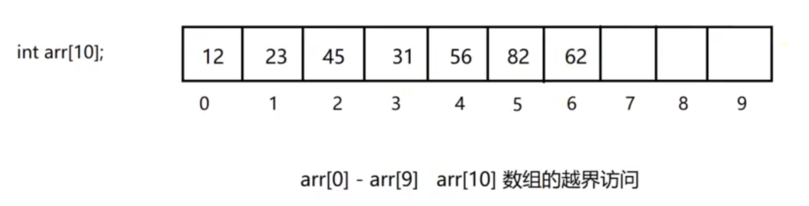

# 数组复习


- 特点：内存是连续的
- 优点：
	- 索引访问（随机访问）时间复杂度是O(1)·
	- 末尾元素增删元素时间复杂度是O(1)，不涉及元素移动
	- 访问相邻位置元素非常方便，指针的加减
- 缺点
	- 非末尾元素增删需要大量的数据移动
	- 搜索的时间复杂度
		- 无序数组：线性搜索O(n)
		- 有序数组：二分搜索O(logn)
		- 数组扩容消耗比较大O(n)
# 线性表代码
```cpp
#include <iostream>
#include <stdexcept>

// 模板类 SequenceList，用于定义顺序表的数据结构
template<class T>
class SequenceList
{
private:
	T* data;// 指向存储顺序表元素的动态数组
	int size;// 元素个数
	int capacity;// 顺序表容量
	//重定义容量函数
	void resize(int new_capacity)
	{
		T* new_data = new T[new_capacity];//分配新容量数组
		// 将旧数组的数据复制到新数组
		//参数1：新数据；参数2：元数据；参数3：要拷贝的数据量
		memcpy(new_data, data, sizeof(T) * capacity);
		delete[] data;//释放旧数组内存
		data = new_data;//将数据指针指向新数组
		capacity = new_capacity;//更新容量
	}
public:
	//构造函数，初始化顺序表
	SequenceList(int init_capacity = 10): capacity(init_capacity), size(0)
	{
		//判断容量是否合法
		if (init_capacity <= 0)
		{
			throw std::invalid_argument("Capacity must be greater than 0");
		}
		data = new T[capacity];//分配初始容量数组
	}
	//析构函数
	~SequenceList()
	{
		delete[] data;//释放动态数组内存，但指针地址仍然存在
		data = nullptr;//指针置空
	}
	//尾插函数
	void append(T value)
	{
		//判断动态数组是否已满
		if (size == capacity)
		{
			resize(capacity * 2);// 如果容量已满，重新调整容量为原来的两倍
		}
		data[size++] = value;//在末尾增加元素并自增元素个数
	}
	//插入函数
	void insert(int index, T value)
	{
		//判断索引是否合法
		if (index < 0 || index > size)
		{
			throw std::out_of_range("Index out of range");
		}
		//判断动态数组是否已满
		if (size == capacity)
		{
			resize(capacity * 2);// 如果容量已满，重新调整容量为原来的两倍
		}
		//将插入位置后的元素后移,为避免索引溢出，这里用i = size而不是size-1
		for (int i = size; i > index; --i)
		{
			data[i] = data[i - 1];
		}
		data[index] = value;// 在指定位置插入新元素
		size++;
	}
	//移除函数
	void remove(int index)
	{
		//判断索引是否合法
		if (index < 0 || index >= size)
		{
			throw std::out_of_range("Index out of range");
		}
		// 将删除位置后的元素前移
		for (int i = index; i < size - 1; ++i)
		{
			data[i] = data[i + 1];
		}
		size--;
	}
	//索引函数
	T get(int index) const
	{
		if (index < 0 || index >= size) {
			throw std::out_of_range("Index out of range");
		}
		return data[index]; // 返回指定位置的元素
	}
	//查找函数
	int find(T value)
	{
		for (int i = 0; i < size; ++i)
		{
			if (data[i] == value)
			{
				return i;
			}
		}
		return -1;
	}
	//修改函数
	void set(int index, T value)
	{
		if (index < 0 || index >= size) {
			throw std::out_of_range("Index out of range");
		}
		data[index] = value; // 设置指定位置的元素值
	}
	//获取长度
	int getSize() const
	{
		return size;
	}
	//是否为空
	bool isEmpty() const
	{
		return size == 0;
	}
	//打印函数
	void print() const
	{
		for (int i = 0; i < size; ++i)
		{
			std::cout << data[i] << " ";
		}
		std::cout << std::endl;
	}
};
//测试函数
int main() {
	// 创建一个整数类型的顺序表
	SequenceList<int> list;

	// 向顺序表添加元素
	list.append(10);
	list.append(20);
	list.append(30);

	// 在指定位置插入元素
	list.insert(1, 15);

	// 打印顺序表的元素
	list.print();

	// 删除指定位置的元素
	list.remove(2);

	// 打印删除元素后的顺序表
	std::cout << "After removing element at index 2: ";
	list.print();

	return 0;
}
```
