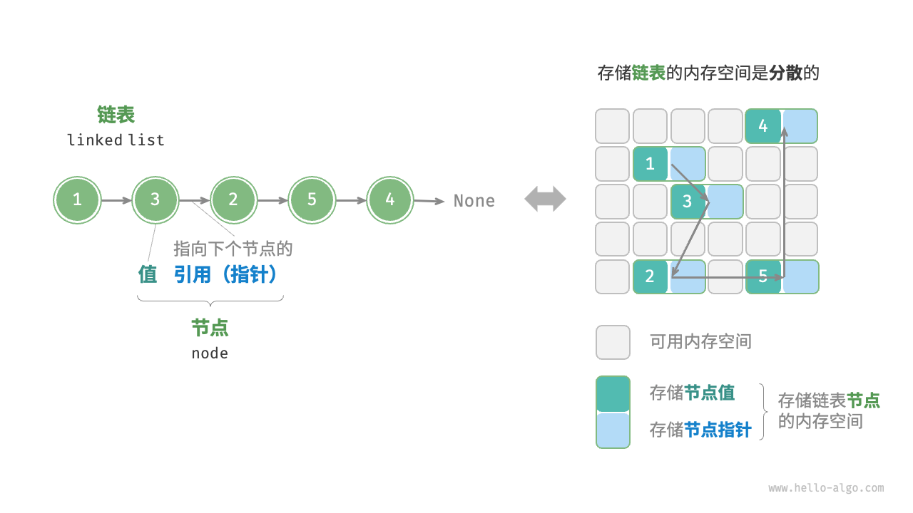
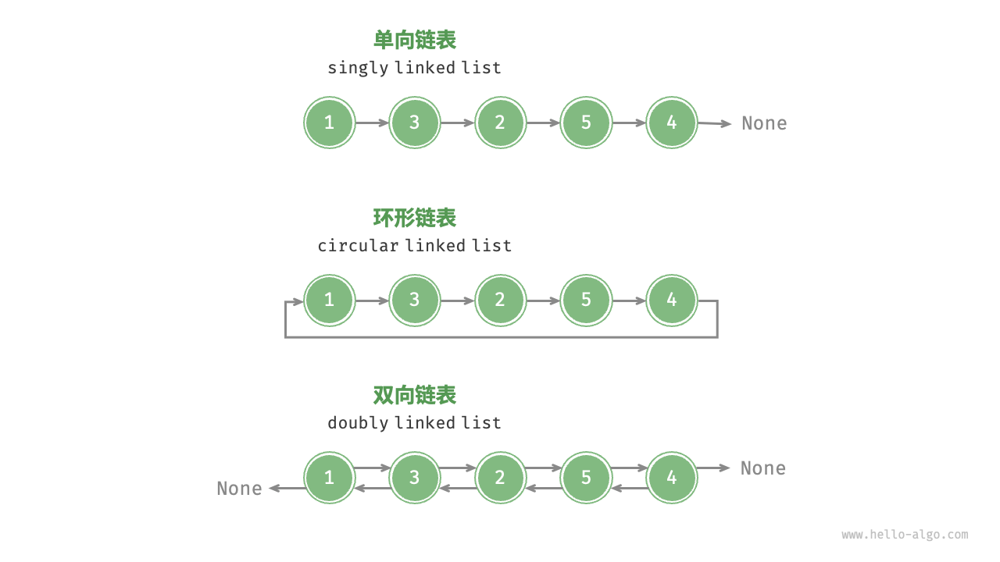

# 特点

特点：每个节点都是在堆内存中独立存在的，内存结构上不连续
- 优点
	- 内存利用率高，不需要大块连续内存
	- 插入和删除节点不需要移动其他节点，时间复杂度O(1)
	- 不需要专门的扩容操作
- 缺点
	- 内存占用量大，每个节点多出指针空间
	- 节点内存不连续，无法进行内存索引访问（随机访问）
	- 搜索效率不高，只能从头节点开始遍历

- 分类
	- **单向链表**：即前面介绍的普通链表。单向链表的节点包含值和指向下一节点的引用两项数据。我们将首个节点称为头节点，将最后一个节点称为尾节点，尾节点指向空 `None` 。
	- **环形链表**：如果我们令单向链表的尾节点指向头节点（首尾相接），则得到一个环形链表。在环形链表中，任意节点都可以视作头节点。
	- **双向链表**：与单向链表相比，双向链表记录了两个方向的引用。双向链表的节点定义同时包含指向后继节点（下一个节点）和前驱节点（上一个节点）的引用（指针）。相较于单向链表，双向链表更具灵活性，可以朝两个方向遍历链表，但相应地也需要占用更多的内存空间。

# 链表和数组的选择
- 当查找，访问和搜索操作比较多时使用数组
- 当增加和删除操作多时使用链表
# 虚拟头节点
虚拟头节点（也称为哑节点或哨兵节点）是链表数据结构中的一种技巧，用于简化边界条件的处理，特别是在涉及插入、删除或其他操作时。它是一个额外的节点，通常在链表的头部，用于消除对头节点的特殊处理，从而使代码更加简洁和易于维护。

## 虚拟头节点的作用

1. **简化插入操作**：在没有虚拟头节点的情况下，如果要在链表头部插入一个新节点，需要处理链表为空或非空的情况。而有了虚拟头节点后，可以统一在虚拟头节点之后插入新节点，从而避免特殊处理。
2. **简化删除操作**：类似地，在删除链表头部节点时，有了虚拟头节点后，可以始终删除虚拟头节点之后的节点，避免处理删除头节点的特殊情况。
3. **简化遍历操作**：在遍历链表时，由于虚拟头节点始终存在，可以从虚拟头节点开始遍历，统一处理逻辑。
## 总结
通过引入虚拟头节点，可以使链表操作更加统一和简洁，避免了对头节点的特殊处理。这样可以减少错误，提高代码的可维护性。
# 单项链表
## 代码
```cpp
#include <iostream>
#include <stdexcept>
using eleType = int;

//实现链表节点结构体
struct ListNode
{
	eleType data;//数据域
	ListNode* next;//指针域
	//构造函数，初始化列表，参数1：数据域的值
	ListNode(eleType x) : data(x), next(nullptr) {}
};
//实现链表类
class LinkedList
{
private:
	ListNode* head;//头节点
	int size;//链表长度
public:
	LinkedList() : head(nullptr), size(0) {} //构造函数
	~LinkedList(); //析构函数
	void push_back(eleType val);//尾插法
	void push_front(eleType val);//头插法
	void insert(int index, eleType value); //插入
	void remove(int index); //按索引移除
	void erase(eleType value);//按值移除
	ListNode* find(eleType value); //查找
	ListNode* get(int index);//索引
	void update(int index, eleType value); //修改
	void print();//打印
};
//析构函数实现
LinkedList::~LinkedList()
{
	ListNode* curr = head;//设置当前节点为头节点
	//遍历链表
	while (curr)
	{
		ListNode* tmp = curr;//设置临时变量接受当前节点
		curr = curr->next;//当前节点指向下一个节点
		delete tmp;//清除临时变量
	}
}
//尾插法
void LinkedList::push_back(eleType val)
{
	ListNode* newNode = new ListNode(val);//初始化要插入的节点
	// 处理链表为空的情况
	if (head == nullptr)
	{
		head = newNode;
	}
	else
	{
		//定义游标节点curr作为当前节点
		ListNode* curr = head;
		//遍历链表,到尾部节点
		while (curr->next != nullptr)
		{
			curr = curr->next;
		}
		//执行尾插
		curr->next = newNode;
	}
	++size; // 更新链表长度
}
//头插法实现
void LinkedList::push_front(eleType val)
{
	ListNode* newNode = new ListNode(val);
	if (head == nullptr)
	{
		head = newNode;
	}
	else
	{
		newNode->next = head;
		head = newNode;
	}
}


//插入函数实现
void LinkedList::insert(int index, eleType value)
{
	//判断插入索引是否合法，允许尾插所以index可以等于size
	if (index < 0 || index > size)
	{
		//抛出异常
		throw std::out_of_range("Invalid Index\n");
	}
	//利用参数生成节点,调用结构体构造函数
	ListNode* newNode = new ListNode(value);
	//如果插入索引为0，执行头插法
	if (index == 0)
	{
		newNode->next = head;//新节点指向头节点
		head = newNode;//链表的头节点设置为新节点
	}
	//其他情况执行普通插入
	else
	{
		ListNode* curr = head;//定义游标节点curr作为当前节点
		//通过遍历获得插入位置的前趋节点
		for (int i = 0; i < index - 1; ++i)
		{
			curr = curr->next;
		}
		newNode->next = curr->next;//设置新节点指向前趋节点的后继节点
		curr->next = newNode;//设置前趋节点指向新节点
	}
	++size;//链表长度自增
}
//移除函数实现
void LinkedList::remove(int index)
{
	//判断索引是否合法
	if (index < 0 || index >= size)
	{
		throw std::out_of_range("Invalid Index\n");
	}
	//如果索引为0，执行头删法
	if (index == 0)
	{
		ListNode* tmp = head;//储存头接待到tmp
		head = head->next;//设置链表的头节点为原头节点的后继
		delete tmp;//清除临时变量
	}
	//其余情况执行普通删除
	else
	{
		ListNode* curr = head;//设置游标节点
		//遍历链表找到索引位置的前趋节点
		for (int i = 0; i < index - 1; ++i)
		{
			curr = curr->next;
		}
		ListNode* tmp = curr->next;//缓存要删除的节点
		curr->next = tmp->next;//设置前趋节点指向删除节点的后继节点
		delete tmp;//清除要删除的节点
	}
	--size;//链表长度减一
}
//按值移除函数实现
void LinkedList::erase(eleType val)
{
	//如果头节点为空，返回
	if (!head) return;
	//如果要删除的是头节点，执行头删法
	if (head->data == val)
	{
		ListNode* tmp = head;
		head = head->next;
		delete tmp;
		size--;
	}
	//如果删除的位置不是头节点
	else
	{
		ListNode* curr = head;//定义游标节点
		//当游标节点存在且游标节点的指针域不为空时，如果游标节点的指针域为空就无法判断下个节点的值是不是val
		while (curr && curr->next)
		{
			//如果游标节点的下个节点数据域等于val
			if (curr->next->data == val)
			{
				ListNode* tmp = curr->next;//临时节点接收游标节点的下个节点
				curr->next = curr->next->next;//游标节点指向游标节点的后继的后继
				delete tmp;//清除临时节点
				size--;//长度自减
			}
			//如果游标节点的下个节点数据域不等于val，往下遍历
			else
			{
				curr = curr->next;
			}
		}
	}
}
//查找函数实现
ListNode* LinkedList::find(eleType value)
{
	ListNode* curr = head;//设置链表游标节点
	//遍历链表,如果链表存在并且节点值不等于value，则进入下个节点
	//循环跳出的条件是1.链表遍历完返回NULL，2.找到对应节点并返回
	while (curr && curr->data != value)
	{
		curr = curr->next;
	}
	return curr;
}
//索引函数实现
ListNode* LinkedList::get(int index)
{
	//判断索引是否合法
	if (index < 0 || index >= size)
	{
		throw std::out_of_range("Invalid Index\n");
	}
	ListNode* curr = head;//设置游标节点
	//遍历链表找到索引节点
	for (int i = 0; i < index; ++i)
	{
		curr = curr->next;
	}
	return curr;//返回索引节点
}
//更新函数实现
void LinkedList::update(int index, eleType value)
{
	//调用get函数找到索引节点,修改索引节点的值为value
	get(index)->data = value;
}
//打印函数实现
void LinkedList::print()
{
	ListNode* curr = head;//设置游标节点
	//遍历链表打印节点
	while (curr)
	{
		std::cout << curr->data << " ";
		curr = curr->next;
	}
	std::cout << std::endl;//换行
}
//测试函数
int main()
{
	//实例化链表
	LinkedList list;
	//链表插入值
	for (int i = 0; i < 5; ++i)
	{
		list.insert(i, i * 10);
	}
	//打印链表
	list.print();
	//移除元素
	list.remove(1);
	list.print();
	//更新元素
	list.update(2, 100);
	list.print();
	ListNode* curr = list.find(100);
	std::cout << curr->data << std::endl;
	std::cout << list.get(2)->data << std::endl;
	list.print();
	list.push_back(20);
	list.push_back(20);
	list.push_back(60);
	list.push_back(70);
	list.push_back(20);
	list.print();
	list.erase(20);
	list.print();
	list.push_front(0);
	list.push_front(1);
	list.push_front(2);
	list.print();
}
```