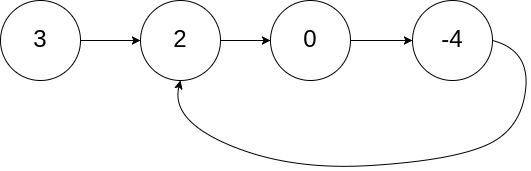
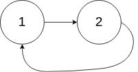
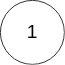
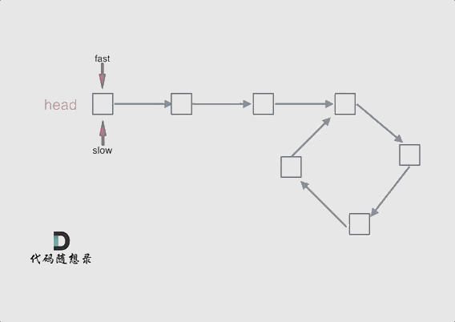
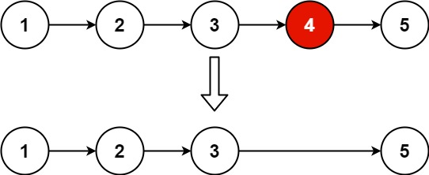

# 单链表逆序问题
## 问题描述
[206. 反转链表](https://leetcode.cn/problems/reverse-linked-list/)
- 给你单链表的头节点 `head` ，请你反转链表，并返回反转后的链表。

## 解题思路
- 利用头插法将头节点的后继节点遍历头插
1. 定义一个指针指向头节点的后继节点，头节点的指针域置空
2. 从头节点的后继节点开始执行头插法依次头插到头节点的后面
## 代码
```cpp
class Solution {
public:
    ListNode* reverseList(ListNode* head) 
    {
        //处理空链表或只有一个节点的情况。
        if (head == nullptr || head->next == nullptr) 
        {
            return head;
        }
        //定义游标节点p指向head的后继节点，作为要操作的节点
        ListNode* p = head->next;
        //断开头节点的地址域
        head->next = nullptr;
        //遍历链表,如果 head->next = nullptr 跳出循环
        while (p) 
        {
            ListNode* q = p->next;//定义游标节点q指向p的后继节点
            p->next = head;//要操作节点指向头节点
            head = p;//要操作的节点作为头节点
            p = q;//要操作的节点后移
        }

        return head;
    }
};
```
# 单链表倒数第k个节点
## 问题描述
[返回倒数第 k 个节点](https://leetcode.cn/problems/kth-node-from-end-of-list-lcci/)

实现一种算法，找出单向链表中倒数第 k 个节点。返回该节点的值。

**示例：**

**输入：** 1->2->3->4->5 和 _k_ = 2
**输出：** 4

**说明：**
给定的 _k_ 保证是有效的。
## 解题思路
- 此问题会首先想到求链表元素个数n，然后n-k-1得出正数第几个节点，但这种方法需要两次遍历链表，时间复杂度为O(n^2),效率太低。
- 仍然采用双指针的方法，prev指针指向头节点，curr指针指向第K个节点，然后同时后移两个指针，直到curr指针指向nullptr，利用两个指针之间的距离K得出prev指针指向的就是倒数第k个节点。

## 代码
```cpp
class Solution {
public:
    int kthToLast(ListNode* head, int k) 
    {
	    //定义双指针
        ListNode* prev = head;
        ListNode* curr = head;
        //便利循环使双指针之间的距离为n
        for (int i = 0; i < k; ++i)
        {
            curr = curr->next;//移动指针
        }
        // 同时移动 first 和 second 直到 first 到达链表末尾
        while(curr)
        {
            prev = prev->next;
            curr = curr->next;
        }
        // prev 指向的是倒数第 n 个节点
        return prev->val;
    }
};
```
# 合并两个有序链表
## 问题描述
[21. 合并两个有序链表](https://leetcode.cn/problems/merge-two-sorted-lists/)
将两个升序链表合并为一个新的 **升序** 链表并返回。新链表是通过拼接给定的两个链表的所有节点组成的。 

**示例 1：**


## 解题思路
这个题目的目的是将两个已经排序好的链表合并成一个新的排序链表。要完成这个任务，我们可以使用一个虚拟头节点和一个指针来跟踪合并后的链表的最后一个节点。具体步骤如下：

### 解题思路

1. **创建虚拟头节点**：
    
    - 创建一个虚拟头节点，用于简化处理链表合并的逻辑。这个虚拟头节点的值可以是任意的，因为它不会包含在最终的合并链表中。
2. **初始化指针**：
    
    - 使用一个指针 `last` 来跟踪合并链表的最后一个节点。最初，`last` 指向虚拟头节点。
3. **遍历链表**：
    
    - 使用 `while` 循环同时遍历 `list1` 和 `list2`，直到其中一个链表为空。
    - 在每次迭代中，比较 `list1` 和 `list2` 当前节点的值。
    - 将较小的节点链接到合并链表的最后一个节点，并将对应的指针移动到下一个节点。
4. **处理剩余节点**：
    
    - 当 `list1` 或 `list2` 其中一个为空时，将另一个链表的剩余部分链接到合并链表的最后一个节点。
5. **返回结果**：
    
    - 返回虚拟头节点的下一个节点（即合并后的链表的头节点）。
## 代码
```cpp
class Solution {
public:
    ListNode* mergeTwoLists(ListNode* list1, ListNode* list2) 
    {
        //创建虚拟头节点
        ListNode* head = new ListNode();
        //定义游标节点作为新链表的末位节点
        ListNode* last = head;
        //同时遍历两个链表
        while (list1 && list2)
        {
            //如果链表1的当前值小于链表2的当前值，将链表1的当前节点尾插到新链表
            if (list1->val < list2->val)
            {
                last->next = list1;//新链表尾插节点
                list1 = list1->next;//移动链表1游标节点
            }
            //如果链表1的当前值大于等于链表2的当前值，将链表2的当前值尾插到新链表
            else
            {
                last->next = list2;//新链表尾插节点
                list2 = list2->next;//移动链表2游标节点

            }
            //每次插入移动新链表末位游标
            last = last->next;
        }
        //遍历完成后两个链表不等长，最多只有一个还未被合并完，我们直接将链表末尾指向未合并完的链表即可

        //如果链表1遍历完成，则将链表2的剩余节点尾插到新链表
        if(list1 == nullptr)
        {
            last->next = list2;
        }
        //如果链表2遍历完成，则将链表1的剩余节点尾插到新链表
        else if(list2 == nullptr)
        {
            last->next = list1;
        }
        //移除虚拟头节点
        ListNode* mergedHead = head->next;
        delete head;
        head = nullptr;
        //返回合并后的新链表
        return mergedHead;
    }
```

# 判断单链表是否存在环和入口节点
## 问题描述
[142. 环形链表 II](https://leetcode.cn/problems/linked-list-cycle-ii/)

给定一个链表的头节点  `head` ，返回链表开始入环的第一个节点。 _如果链表无环，则返回 `null`。_

如果链表中有某个节点，可以通过连续跟踪 `next` 指针再次到达，则链表中存在环。 为了表示给定链表中的环，评测系统内部使用整数 `pos` 来表示链表尾连接到链表中的位置（**索引从 0 开始**）。如果 `pos` 是 `-1`，则在该链表中没有环。**注意：`pos` 不作为参数进行传递**，仅仅是为了标识链表的实际情况。

**不允许修改** 链表。

**示例 1：**



**输入：**head =` [3,2,0,-4]`, pos = 1
**输出：**返回索引为 1 的链表节点
**解释：**链表中有一个环，其尾部连接到第二个节点。

**示例 2：**



**输入：**head = `[1,2]`, pos = 0
**输出：**返回索引为 0 的链表节点
**解释：**链表中有一个环，其尾部连接到第一个节点。

**示例 3：**



**输入：**head =` [1]`, pos = -1
**输出：**返回 null
**解释：**链表中没有环。

**提示：**

- 链表中节点的数目范围在范围 `[0, 104]` 内
- `-105 <= Node.val <= 105`
- `pos` 的值为 `-1` 或者链表中的一个有效索引
## 解题思路
1. 思路1：遍历链表并记录每个节点的地址域，如果出现重复的地址域则说明该链表是环形链表，该地址域节点是入口节点
2. 思路2：利用双指针的快慢指针
- 断链表是否有环：定义快慢指针指向头节点，慢指针`slow`每次位移一个节点，快指针`fast`每次位移两个节点。如果链表无环，则快指针最终指向`nullptr`。如果链表有环，则会出现`fast == slow`，因为他们之间的相对速度是一个节点，因此在环中快指针是以每次一个节点的速度追慢指针，肯定会相遇。

- 找到环入口节点：
1. 设头节点到环入口节点距离为`x`，入口节点到快慢指针相遇节点的距离为`y`，快慢指针相遇节点到入口节点的距离为`z`
2. 根据快慢指针移动速度可知：fast遍历节点的数量 = slow遍历节点的数量 * 2
3. 假设快指针在环中转一圈就跟慢指针相遇 ( 其实转几圈都是一样的 )，则有：
$$
\begin{aligned}
fast遍历节点数量 &= slow遍历节点数量 * 2\\
x + y + z + y &= 2(x + y)\\
x + z + 2y &= 2x + 2y\\
x + z & = 2x\\
z &= x\\ 
\end{aligned}
$$
4. 可得出：==头节点==到==环入口节点==距离 = ==快慢指针相遇节点==到==尾节点==的距离
5. 因此，再定义双指针：p1指向头节点，p2指向快慢指针相遇节点，双指针同时逐步后移，双指针再次相遇的节点就是链表环的入口节点。

## 代码
```cpp
class Solution 
{
public:
    ListNode *detectCycle(ListNode *head) 
    {
        //定义快慢指针
        ListNode* fast = head;
        ListNode* slow = head;
        //遍历链表，fast和fast->next不为空
        //当`fast`为`nullptr`时，意味着链表已经遍历到末尾
        //如果`fast`存在但`fast->next`为`nullptr`，意味着当前节点是链表的最后一个节点
        while (fast && fast->next)
        {
            fast = fast->next->next;//快指针每步前进两次
            slow = slow->next;//慢指针每步前进一次
            //如果快慢指针相遇，则链表有环
            if (fast == slow)
            {
                //定义双指针
                ListNode* p1 = head;//定义指针p1指向头节点
                ListNode* p2 = fast;//定义指针指向相遇节点
                //同步后移双指针，直到双指针相遇跳出循环
                while (p1 != p2)
                {
                    p1 = p1->next;
                    p2 = p2->next;
                }
                //返回相遇的节点
                return p1;
            }

        }
        //链表无环，返回空
        return NULL;
    }
};
```
# 判断两个链表是否相交
## 问题描述
[160. 相交链表](https://leetcode.cn/problems/intersection-of-two-linked-lists/)

给你两个单链表的头节点 `headA` 和 `headB` ，请你找出并返回两个单链表相交的起始节点。如果两个链表不存在相交节点，返回 `null` 。

图示两个链表在节点 `c1` 开始相交：

[](attachments/33f40875c8851dcacbcb84122ca1a491_MD5.jpg)

题目数据 **保证** 整个链式结构中不存在环。

**注意**，函数返回结果后，链表必须 **保持其原始结构** 。

**自定义评测：**

**评测系统** 的输入如下（你设计的程序 **不适用** 此输入）：

- `intersectVal` - 相交的起始节点的值。如果不存在相交节点，这一值为 `0`
- `listA` - 第一个链表
- `listB` - 第二个链表
- `skipA` - 在 `listA` 中（从头节点开始）跳到交叉节点的节点数
- `skipB` - 在 `listB` 中（从头节点开始）跳到交叉节点的节点数

评测系统将根据这些输入创建链式数据结构，并将两个头节点 `headA` 和 `headB` 传递给你的程序。如果程序能够正确返回相交节点，那么你的解决方案将被 **视作正确答案** 。
## 解题思路
- 首先想到的思路是双指针分别指向两个链表头，然后同步后移比对，如果地址相等则该节点为相交节点，但是两个链表有可能不等长，那在对比的时候就永远不会相等
- 所以要先求出两个链表的长度差值，短的链表从头遍历，长的链表从第差值个节点遍历，使两个链表要遍历的部分等长，然后比对得出地址相同的节点。

## 代码
```cpp
class Solution 
{
public:
    ListNode *getIntersectionNode(ListNode *headA, ListNode *headB) 
    {
        //申请变量用于接受两个链表的长度
        int lenA = 0, lenB = 0;
        //申请双指针
        ListNode* p1 = headA;
        ListNode* p2 = headB;
        //获取链表1的长度
        while (p1)
        {
            lenA++;
            p1 = p1->next;
        }
        //获取链表2的长度
        while (p2)
        {
            lenB++;
            p2 = p2->next;
        }
        //重置双指针
        p1 = headA;
        p2 = headB;
        //如果链表1比链表2长
        if (lenA > lenB)
        {
            int offset = lenA - lenB;//获取链表之间的长度差值
            //偏移指针到差值位置，使两个链表要遍历的部分等长
            for (int i = 0; i < offset; ++i)
            {
                p1 = p1->next;
            }

        }
        //如果链表2比链表1长或等长
        else
        {
            int offset = lenB - lenA;//获取链表之间的长度差值
            //偏移指针到差值位置，使两个链表要遍历的部分等长
            for (int i = 0; i < offset; ++i)
            {
                p2 = p2->next;
            }
        }
        //移动双指针，直到双指针指向的地址相同时返回节点
        while (p1 && p2)
        {
            if (p1 == p2)
            {
                return p1;
            }
            p1 = p1->next;
            p2 = p2->next;
        }
        //链表无相交，返回NULL
        return NULL;
    }
};
```
# 删除链表倒数第n个节点
## 问题描述
[19. 删除链表的倒数第 N 个结点](https://leetcode.cn/problems/remove-nth-node-from-end-of-list/)

给你一个链表，删除链表的倒数第 `n` 个结点，并且返回链表的头结点。

**示例 1：**



**输入：**head = [1,2,3,4,5], n = 2
**输出：**[1,2,3,5]

**示例 2：**

**输入：**head = [1], n = 1
**输出：**[]

**示例 3：**

**输入：**head = [1,2], n = 1
**输出：**[1]
## 解题思路
- 仍然采用双指针的方法，prev指针指向头节点，curr指针指向第K - 1 个节点，然后同时后移两个指针，直到curr指针指向nullptr，利用两个指针之间的距离K得出prev指针指向的就是倒数第k个节点的前趋节点。然后利用前趋节点移除要删除的节点。
## 代码
```cpp
class Solution 
{
public:
    ListNode* removeNthFromEnd(ListNode* head, int n) 
    {
        // 初始化两个指针
        ListNode* first = head;
        ListNode* second = head;
        
        // 先移动 first 指针 n 步
        for (int i = 0; i < n; ++i) 
        {
            if (first == nullptr) return head; // 如果 n 超出链表长度，直接返回原始头节点
            first = first->next;
        }
        
        // 如果 first 为空，说明要删除的是头节点
        if (first == nullptr) 
        {
            ListNode* newHead = head->next;
            delete head; // 释放原始头节点的内存
            return newHead;
        }
        
        // 同时移动 first 和 second 指针
        // 直到 first 到达链表倒数第二位，此时second为要删除节点的前趋节点
        while (first->next != nullptr) 
        {
            first = first->next;
            second = second->next;
        }
        
        // 删除倒数第 n 个节点
        ListNode* nodeToDelete = second->next;
        second->next = second->next->next;
        delete nodeToDelete; // 释放删除节点的内存
        
        return head;
    }
};
```
# 旋转链表
## 问题描述
[61. 旋转链表](https://leetcode.cn/problems/rotate-list/)

中等

相关标签

相关企业

给你一个链表的头节点 `head` ，旋转链表，将链表每个节点向右移动 `k` 个位置。

**示例 1：**


**输入：**head = [1,2,3,4,5], k = 2
**输出：**[4,5,1,2,3]

**示例 2：**


**输入：**head = [0,1,2], k = 4
**输出：**[2,0,1]

**提示：**

- 链表中节点的数目在范围 `[0, 500]` 内
- `-100 <= Node.val <= 100`
- `0 <= k <= 2 * 10^9`
## 解题思路
- 问题可简化为将末尾的k个节点移动到链表头部，但是K可能大于链表节点个数，所以是将链表末尾的（k % 节点个数） 位元素移动到链表头部。
1. 求节点总个数size
2. 获得要移动的位数 num = (k % size)
3. 找到倒数第 num + 1位节点，就是要移动节点的前趋节点：双指针距离为k + 1 ,然后同时移动双指针，直到后面的指针为空
4. 搬运节点：1.末尾节点指向头节点；2.头节点等于倒数第num个节点；3.倒数第 num + 1位节点指向空
## 代码
```cpp
class Solution {
public:
    ListNode* rotateRight(ListNode* head, int k) 
    {
        //定义双指针
        ListNode* p = head;
        ListNode* q = head;
        //如果为空链表或k为0，直接返回原链表
        if (head == nullptr || k == 0)
        {
            return head;
        }
        //求出链表长度
        int number = 0;
        for (ListNode* k = head; k != nullptr; k = k->next)
        {
            number++;
        }
        //更新k的值为k模链表长度
        k = k % number;
        //将快指针指向第K个位置
        for (int i = 0; i < k; i++)
        {
            p = p->next;
        }
        //同时移动双指针直至快指针到达末尾节点的前一个节点
        //此时q节点为要搬运的开始节点的前趋节点
        while (p->next)
        {
            p = p->next;
            q = q->next;
        }
        //搬运节点，此时q节点为要搬运的开始节点的前趋节点，p指针为尾节点
        p->next = head;//末尾节点指向头节点
        head = q->next;//头节点重定位为要搬运的节点
        q->next = nullptr;//q作为新末尾节点指向空
        //返回链表
        return head;
    }
};
```