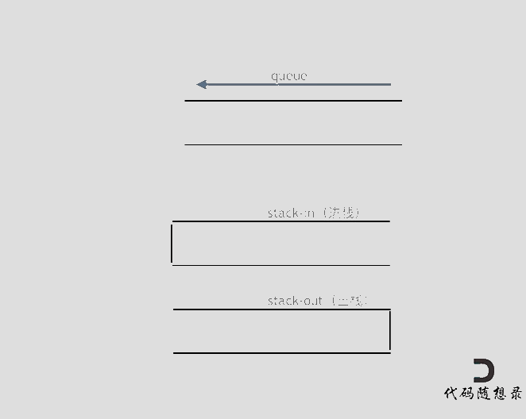

# 栈实现一个队列
## 题目描述
[用栈实现队列](https://leetcode.cn/problems/implement-queue-using-stacks/description/ "https://leetcode.cn/problems/implement-queue-using-stacks/description/")

|Category|Difficulty|Likes|Dislikes|
|---|---|---|---|
|algorithms|Easy (68.08%)|1139|-|

**Tags**

[`stack`](https://leetcode.cn/tag/stack?source=vscode "https://leetcode.cn/tag/stack?source=vscode") | [`design`](https://leetcode.cn/tag/design?source=vscode "https://leetcode.cn/tag/design?source=vscode")

**Companies**

`bloomberg` | `microsoft`

请你仅使用两个栈实现先入先出队列。队列应当支持一般队列支持的所有操作（`push`、`pop`、`peek`、`empty`）：

实现 `MyQueue` 类：

- `void push(int x)` 将元素 x 推到队列的末尾
- `int pop()` 从队列的开头移除并返回元素
- `int peek()` 返回队列开头的元素
- `boolean empty()` 如果队列为空，返回 `true` ；否则，返回 `false`

**说明：**

- 你 **只能** 使用标准的栈操作 —— 也就是只有 `push to top`, `peek/pop from top`, `size`, 和 `is empty` 操作是合法的。
- 你所使用的语言也许不支持栈。你可以使用 list 或者 deque（双端队列）来模拟一个栈，只要是标准的栈操作即可。

**示例 1：**

```
输入：
["MyQueue", "push", "push", "peek", "pop", "empty"]
[[], [1], [2], [], [], []]
输出：
[null, null, null, 1, 1, false]

解释：
MyQueue myQueue = new MyQueue();
myQueue.push(1); // queue is: [1]
myQueue.push(2); // queue is: [1, 2] (leftmost is front of the queue)
myQueue.peek(); // return 1
myQueue.pop(); // return 1, queue is [2]
myQueue.empty(); // return false
```

**提示：**

- `1 <= x <= 9`
- 最多调用 `100` 次 `push`、`pop`、`peek` 和 `empty`
- 假设所有操作都是有效的 （例如，一个空的队列不会调用 `pop` 或者 `peek` 操作）

**进阶：**

- 你能否实现每个操作均摊时间复杂度为 `O(1)` 的队列？换句话说，执行 `n` 个操作的总时间复杂度为 `O(n)` ，即使其中一个操作可能花费较长时间。
## 解题思路
- 需要两个栈**一个输入栈`s1`，一个输出栈`s2`， `s1`用于`push`操作，`s2`用于`pop`和`peek`。通过入栈两次再出栈使数据结果正序输出。
- 在`push`数据的时候，只要数据放进输入栈`s1`就好，
- **但在`pop`的时候，输出栈`s2`如果为空，就把输入栈`s1`数据全部导入到输出栈`s2`（注意是全部导入）**，再从输出栈`s2`弹出数据，如果输出栈不为空，则直接从出栈弹出数据就可以了。
- **如果进栈和出栈都为空的话，说明模拟的队列为空了。**

## 代码
```cpp
class MyQueue 
{

private:
    //初始化两个栈用于实现队列
    stack<int> s1;
    stack<int> s2;
public:
    MyQueue() {}
    //入队操作，将数据存入输入栈s1
    void push(int x) 
    {
        s1.push(x);
    }
    //出队操作
    int pop() 
    {
        //当输出栈为空时，将数据从输入栈导入到输出栈
        if (s2.empty())
        {
            while (!s1.empty())
            {
                s2.push(s1.top());
                s1.pop();
            }
        }
        //从输出栈弹出数据
        int val = s2.top();
        s2.pop();
        return val;
    }
    //查看队首元素
    int peek() 
    {
        //当输出栈为空时，将数据从输入栈导入到输出栈
        if (s2.empty())
        {
            while (!s1.empty())
            {
                s2.push(s1.top());
                s1.pop();
            }
        }
        //查看队首元素
        return s2.top();
    }
    //判空
    bool empty() 
    {
        //当两个栈都为空时，队列为空
        return s1.empty() && s2.empty();
    }
};
```
# 队列实现一个栈
## 题目描述
[用队列实现栈](https://leetcode.cn/problems/implement-stack-using-queues/description/ "https://leetcode.cn/problems/implement-stack-using-queues/description/")

|Category|Difficulty|Likes|Dislikes|
|---|---|---|---|
|algorithms|Easy (65.61%)|905|-|

**Tags**

[`stack`](https://leetcode.cn/tag/stack?source=vscode "https://leetcode.cn/tag/stack?source=vscode") | [`design`](https://leetcode.cn/tag/design?source=vscode "https://leetcode.cn/tag/design?source=vscode")

**Companies**

`bloomberg`

请你仅使用两个队列实现一个后入先出（LIFO）的栈，并支持普通栈的全部四种操作（`push`、`top`、`pop` 和 `empty`）。

实现 `MyStack` 类：

- `void push(int x)` 将元素 x 压入栈顶。
- `int pop()` 移除并返回栈顶元素。
- `int top()` 返回栈顶元素。
- `boolean empty()` 如果栈是空的，返回 `true` ；否则，返回 `false` 。

**注意：**

- 你只能使用队列的标准操作 —— 也就是 `push to back`、`peek/pop from front`、`size` 和 `is empty` 这些操作。
- 你所使用的语言也许不支持队列。 你可以使用 list （列表）或者 deque（双端队列）来模拟一个队列 , 只要是标准的队列操作即可。

**示例：**

```
输入：
["MyStack", "push", "push", "top", "pop", "empty"]
[[], [1], [2], [], [], []]
输出：
[null, null, null, 2, 2, false]

解释：
MyStack myStack = new MyStack();
myStack.push(1);
myStack.push(2);
myStack.top(); // 返回 2
myStack.pop(); // 返回 2
myStack.empty(); // 返回 False
```

**提示：**

- `1 <= x <= 9`
- 最多调用`100` 次 `push`、`pop`、`top` 和 `empty`
- 每次调用 `pop` 和 `top` 都保证栈不为空

**进阶：**你能否仅用一个队列来实现栈。
## 解题思路
- 可以使用两个队列来实现栈，也可以使用一个队列来实现栈
- 当使用两个队列来实现时：
	- 队列`q1`用于存放新入栈的元素，队列`q2`用于存放已调整好顺序的栈的元素
	- 入队：每次将元素 `x` 加入到 `q1` 中，然后将 `q2` 中的所有元素转移到 `q1`。这样做的结果是，`q1` 的队头元素将是最后加入的元素，即栈顶元素。最后，交换 `q1` 和 `q2`，确保 `q2` 总是存储实际的栈内容。
	- 出队时，直接出`q2`的队首元素
	- 查看队首元素，直接查看`q2`的队首元素
	- 判空，直接返回`q2`是否为空
- 使用一个队列`que`实现栈
	- 将元素依次入队，当元素个数大于1时，出队`que.size() -1`个元素，将出队的元素再次入队。就是将新入队元素的前面的元素全部添加到队尾，实现倒序插入。
	- 出队的时候直接弹出队首元素
	- 栈顶元素，直接查看队首元素
	- 判空，查看队列que是否为空
	- 元素个数，查看队列元素个数
## 代码
```cpp
class MyStack 
{
private:
	// 使用两个队列来实现栈的功能
    queue<int> q1;// 用于存储新推入的元素
    queue<int> q2;// 实际保存栈中元素的队列
public:
	// 构造函数
    MyStack() {}
	// push操作：将元素推入栈顶
    void push(int x) 
    {
	    // 将新元素加入q1队列
        q1.push(x);
		// 将q2队列中的所有元素转移到q1队列中
        while (!q2.empty())
        {
            q1.push(q2.front());// 将q2的队头元素推入q1
            q2.pop();// 移除q2的队头元素
        }
        // 交换q1和q2，确保q2总是保存最新的栈元素
        swap(q1, q2);
    }
	// pop操作：移除并返回栈顶元素
    int pop() 
    {
        int val = q2.front();
        q2.pop();
        return val;
    }
	// top操作：获取栈顶元素
    int top() 
    {
        return q2.front();
    }
	// empty操作：检查栈是否为空
    bool empty() 
    {
        return q2.empty();
    }
};
```