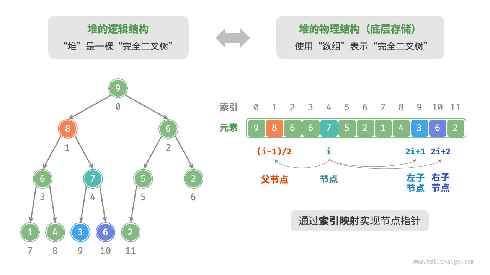

# 概念
堆（heap）是一种满足特定条件的完全二叉树，主要可分为两种类型，如图 8-1 所示。
完全二叉树是一种特殊的二叉树，除了最后一层外，所有层都是完全填满的，且最后一层的所有节点尽可能靠左排列。

- 小顶堆（min heap）：任意节点的值 ≤ 其子节点的值。
`arr[i] <= arr[2 * i + 1] && arr[i] <= arr[2 * i + 2]`
- 大顶堆（max heap）：任意节点的值 ≥ 其子节点的值。
`arr[i] >= arr[2 * i + 1] && arr[i] >= arr[2 * i + 2]`

# 特点
- 最底层节点靠左填充，其他层的节点都被填满。
- 我们将二叉树的根节点称为“堆顶”，将底层最靠右的节点称为“堆底”。
- 对于大顶堆（小顶堆），堆顶元素（根节点）的值是最大（最小）的。

# 实现
### 1.   堆的存储与表示
“二叉树”章节讲过，完全二叉树非常适合用数组来表示。由于堆正是一种完全二叉树，**因此我们将采用数组来存储堆**。

当使用数组表示二叉树时，元素代表节点值，索引代表节点在二叉树中的位置。**节点指针通过索引映射公式来实现**。

给定索引 𝑖 :
- 其左子节点的索引为：` 2𝑖+1` ，
- 右子节点的索引为： `2𝑖+2` ，
- 父节点的索引为：` (𝑖−1)/2`（向下整除）。
- 末尾有子节点的节点索引为：`(n - 1) / 2`，n为末尾元素索引。
当索引越界时，表示空节点或节点不存在。


### 2.   访问堆顶元素

堆顶元素即为二叉树的根节点，也就是列表的首个元素
### 3.   元素入堆

给定元素 `val` ，我们首先将其添加到堆底。添加之后，由于 `val` 可能大于堆中其他元素，堆的成立条件可能已被破坏，**因此需要修复从插入节点到根节点的路径上的各个节点**，这个操作被称为堆化（heapify）。

考虑从入堆节点开始，**从底至顶执行堆化**。我们比较插入节点与其父节点的值，如果插入节点更大，则将它们交换。然后继续执行此操作，从底至顶修复堆中的各个节点，直至越过根节点或遇到无须交换的节点时结束。
### 4.   堆顶元素出堆

堆顶元素是二叉树的根节点，即列表首元素。如果我们直接从列表中删除首元素，那么二叉树中所有节点的索引都会发生变化，这将使得后续使用堆化进行修复变得困难。为了尽量减少元素索引的变动，我们采用以下操作步骤。

1. 交换堆顶元素与堆底元素（交换根节点与最右叶节点）。
2. 交换完成后，将堆底从列表中删除（注意，由于已经交换，因此实际上删除的是原来的堆顶元素）。
3. 从根节点开始，**从顶至底执行堆化**。
# 代码
```cpp
#include <iostream>
#include <vector>
#include <functional>
#include <stdexcept>

template<typename T, typename Compare = std::less<T>>
class PriorityQueue {
private:
    std::vector<T> heap;
    Compare comp; // 比较函数对象

    // 获取父节点、左子节点和右子节点的索引
    int parent(int i) { return (i - 1) / 2; }
    int left(int i) { return 2 * i + 1; }
    int right(int i) { return 2 * i + 2; }

    // 堆化：向上调整
    void heapifyUp(int i) {
        while (i != 0 && comp(heap[i], heap[parent(i)])) {
            std::swap(heap[i], heap[parent(i)]);
            i = parent(i);
        }
    }

    // 堆化：向下调整
    void heapifyDown(int i) {
        int best = i;
        int l = left(i);
        int r = right(i);

        if (l < heap.size() && comp(heap[l], heap[best]))
            best = l;

        if (r < heap.size() && comp(heap[r], heap[best]))
            best = r;

        if (best != i) {
            std::swap(heap[i], heap[best]);
            heapifyDown(best);
        }
    }

public:
    // 构造函数：支持自定义比较函数
    PriorityQueue(Compare c = Compare()) : comp(c) {}

    // 插入元素
    void push(T value) {
        heap.push_back(value);
        heapifyUp(heap.size() - 1);
    }

    // 获取队列中的优先级最高的元素
    T top() {
        if (heap.empty()) {
            throw std::out_of_range("PriorityQueue is empty");
        }
        return heap.front();
    }

    // 删除优先级最高的元素
    void pop() {
        if (heap.empty()) {
            throw std::out_of_range("PriorityQueue is empty");
        }
        heap[0] = heap.back();
        heap.pop_back();
        heapifyDown(0);
    }

    // 判断队列是否为空
    bool empty() const {
        return heap.empty();
    }

    // 获取队列中的元素数量
    int size() const {
        return heap.size();
    }
};

int main() {
    // 默认情况下是最小堆（使用std::less）
    PriorityQueue<int> minPQ;
    minPQ.push(10);
    minPQ.push(20);
    minPQ.push(5);
    minPQ.push(30);

    std::cout << "Min Priority Queue top: " << minPQ.top() << std::endl; // Output: 5

    // 使用 std::greater 构建最大堆
    PriorityQueue<int, std::greater<int>> maxPQ;
    maxPQ.push(10);
    maxPQ.push(20);
    maxPQ.push(5);
    maxPQ.push(30);

    std::cout << "Max Priority Queue top: " << maxPQ.top() << std::endl; // Output: 30

    return 0;
}

```

# 应用
- **优先队列**：堆通常作为实现优先队列的首选数据结构，其入队和出队操作的时间复杂度均为 𝑂(log⁡𝑛) ，而建堆操作为 𝑂(𝑛) ，这些操作都非常高效。
- **堆排序**：给定一组数据，我们可以用它们建立一个堆，然后不断地执行元素出堆操作，从而得到有序数据。然而，我们通常会使用一种更优雅的方式实现堆排序，详见“堆排序”章节。
- **获取最大的 𝑘 个元素**：这是一个经典的算法问题，同时也是一种典型应用，例如选择热度前 10 的新闻作为微博热搜，选取销量前 10 的商品等。