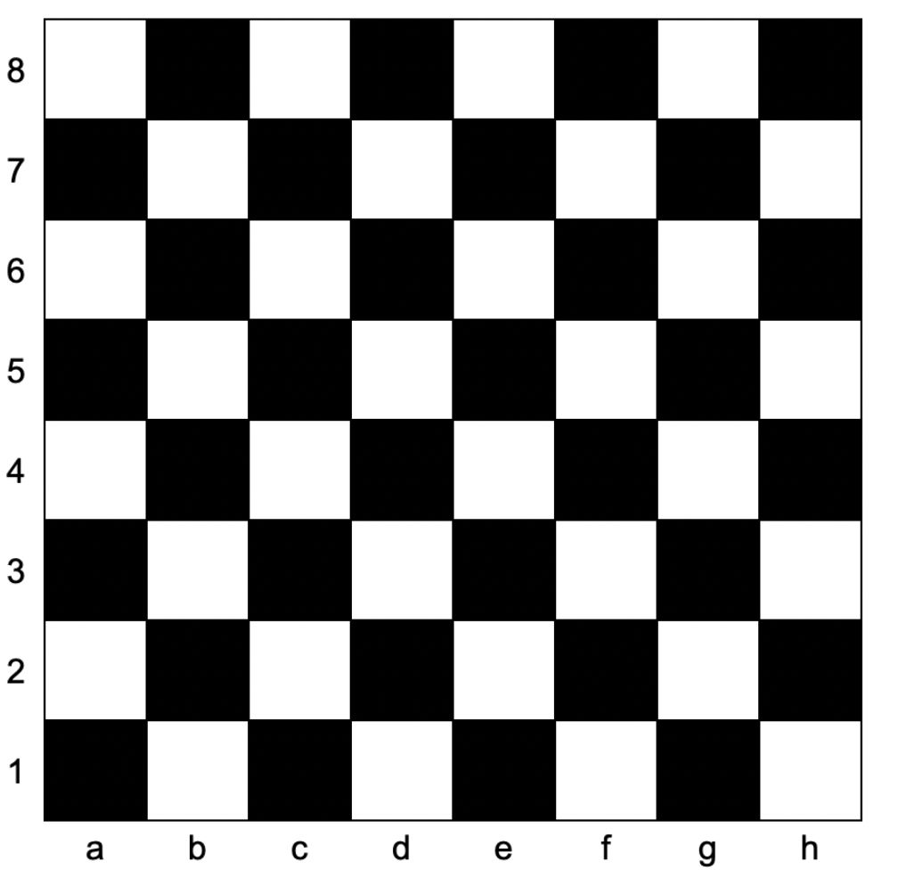

# 一.语言基础
## 力扣2235. 两整数相加
### 题目链接
- [2235. 两整数相加 - 力扣（LeetCode）](https://leetcode.cn/problems/add-two-integers/description/)
### 题目简介
- 给你两个整数 num1 和 num2，返回这两个整数的和。
### 算法分析
- 直接返回 num1 + num2 即可
### 源码解析
```cpp
class Solution {
public:
    int sum(int num1, int num2) {
        return num1 + num2;
    }
};
```
## 力扣1812. 判断国际象棋棋盘中一个格子的颜色
### 题目链接
- [1812. 判断国际象棋棋盘中一个格子的颜色 - 力扣（LeetCode）](https://leetcode.cn/problems/determine-color-of-a-chessboard-square/description/)
### 题目简介
> 给你一个坐标 coordinates ，它是一个字符串，表示国际象棋棋盘中一个格子的坐标。下图是国际象棋棋盘示意图。如果所给格子的颜色是白色，请你返回 true；如果是黑色，请返回 false 。
> 给定的坐标，一定代表国际象棋棋盘上一个存在的格子。
> 坐标第一个字符是字母，第二个字符是数字。


### 算法分析
- 把 a 到 h 转换成 0 到 7 的数字；
- 把 '1' 到 '8' 也转换成 0 到 7 的数字；
- 这个时候，a1 的位置就变成了 00， b1 的位置就变成了 10，以此类推，那么只要将两个维度的数相加，并且模2，就能知道它是黑色还是白色了。
### 源码解析
```cpp
class Solution {
public:
    bool squareIsWhite(string coordinates) {
        int x = coordinates[0] - 'a'; // (1)
        int y = coordinates[1] - 1; // (2)
        return (x + y) %2; // (3)
    }
};
```
1. `(1)` 行将第一个字符（字母）的ASCII码值减去字母 'a' 的ASCII码值（97），这样可以得到字母所对应的列数，因为在ASCII码表中，字母 'a' 对应着数字 97，字母 'b' 对应着数字 98，`'b' - 'a' = 1`以此类推。
    
2. `(2)` 行将第二个字符（数字）的ASCII码值减去字符 '1' 的ASCII码值（49），这样可以得到数字所对应的行数，因为在ASCII码表中，字符 '1' 对应着数字 1，字符 '2' 对应着数字 2，以此类推。
    
3. `(3)` 行将计算出的列数和行数相加，然后取余数。如果余数为 0，则表示格子是白色，返回 true；如果余数为 1，则表示格子是黑色，返回 false。
# 二.运算符
## 力扣2651. 计算列车到站时间
### 题目链接
[2651. 计算列车到站时间 - 力扣（LeetCode）](https://leetcode.cn/problems/calculate-delayed-arrival-time/description/)
### 题目简介
给你一个正整数 `arrivalTime` 表示列车正点到站的时间（单位：小时），另给你一个正整数 `delayedTime` 表示列车延误的小时数。
返回列车实际到站的时间。
注意，该问题中的时间采用 24 小时制。
### 算法分析
这个问题其实就是 arrivalTime 和 delayedTime 相加，如果超过了 24 则需要模上 24，如果没有超过就直接返回他们的和就可以了
### 源码解析
```cpp
class Solution {
public:
    int findDelayedArrivalTime(int arrivalTime, int delayedTime) {
        return (arrivalTime + delayedTime) % 24;
    }
};
```
## 力扣191. 位1的个数
### 题目链接
[191. 位1的个数 - 力扣（LeetCode）](https://leetcode.cn/problems/number-of-1-bits/description/)
### 题目简介
编写一个函数，输入是一个无符号整数（以二进制串的形式），返回其二进制表达式中 设置位（set bit 指在某数的二进制表示中值为 `1` 的二进制位）的个数（也被称为[汉明重量](https://baike.baidu.com/item/%E6%B1%89%E6%98%8E%E9%87%8D%E9%87%8F)）。
### 算法分析
利用一层循环，统计这个数字二进制的每一位上的 1 的个数，就可以了。
### 源码解析
```cpp
int hammingWeight(uint32_t n) // (0)
{
    int count = 0;         // (1)
    while(n) {         // (2)
        if (n & 1) {   // (3)
            ++count;       // (4)
        }
        n >>= 1;       // (5)
    }
    return count;          // (6)
}
```
0. 我们定义了一个函数`hammingWeight`，该函数接受一个32位无符号整数作为参数，并返回其汉明重量（即设置位的数量）。
1. 在函数内部，我们声明一个整数变量`count`，用于记录设置位的数量，初始化为0。
2. 接下来，我们使用了一个while循环来迭代处理输入的整数`n`。循环的终止条件是当`n`为0时停止，因为当`n`为0时，表示所有的位都已经被检查完毕。
3. 在循环内部，我们使用了位运算来检查`n`的最低位。具体来说，我们使用按位与运算`n & 1`来检查`n`的最低位是否为1。如果结果为1，则说明最低位是设置位，我们将`count`增加1。
4. 然后，我们使用右移运算`n >>= 1`将`n`向右移动一位，这样可以将下一个位移到最低位，以便在下一次迭代中检查。
5. 循环结束后，我们返回`count`，即为输入整数的汉明重量。
> [!NOTE] NOTE 
> - 当我们对一个数`n`执行`n & 1`的按位与运算时，实际上在进行的是一个位掩码操作。具体来说，我们将`n`的二进制表示中的最低位与二进制数`1`的最低位进行按位与操作。二进制数
`1`在内存中的表示通常为`000...01`，因此它只有最低位为1，其他位都是0。
> - 当我们对`n & 1`执行按位与操作时，结果的最低位将会等于`n`的最低位，而其他位都将为0。这是因为按位与操作的规则是：如果两个对应位都为1，则结果为1，否则为0。由于`1`的其他位都是0，所以只有`n`的最低位为1时，结果才会为1；如果`n`的最低位为0，那么结果也会为0。
> - 因此，当`n & 1`的结果为1时，表示`n`的最低位为1；而当结果为0时，表示`n`的最低位为0。这样，我们就可以利用按位与运算来检查一个整数的二进制表示中的最低位是否为1。