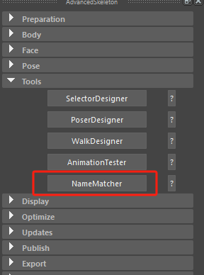
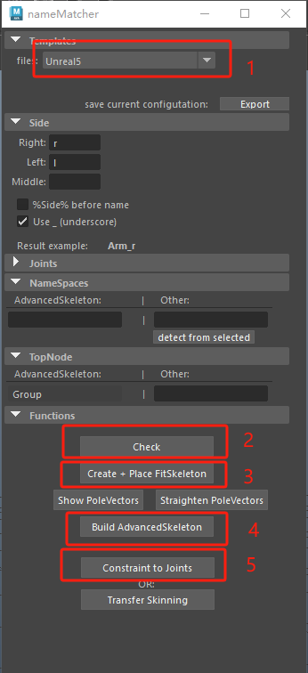
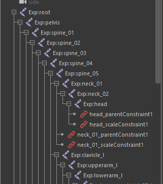
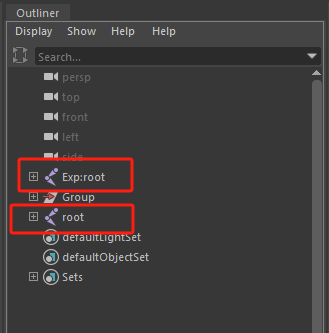

# 概述
- Maya的主角绑定如果用手动绑定的方式效率太低，所以大都采取绑定插件来绑定。一般大型公司都有自己写的绑定工具和流程。没有这样的条件可采用市面上的主流绑定框架和流程。主流绑定工具主要有：
	- Advanced Skeleton绑定插件：[Download - AnimationStudios](https://animationstudios.com.au/advanced-skeleton-download/)
	- mGear绑定框架：[mGear Framework](https://www.mgear-framework.com/)
- 要注意的是，用Advanced Skeleton绑定插件绑定的rig可以在没有安装Advanced Skeleton绑定插件的maya中打开；而mGear绑定框架无法在没有安装mGear绑定框架的maya中打开，因为mGear绑定框架自定义了自己的工具节点，借助这些节点才能正常使用mGear绑定的文件
- 此案例采用Advanced Skeleton绑定插件绑定
# 绑定流程
1. 安装Advanced Skeleton绑定插件
2. 借助Advanced Skeleton绑定插件中的NameMatcher工具来快速绑定带有虚幻引擎默认骨架的SkeletalMesh，具体操作可查看网络教程。
         
4. 将参与蒙皮的骨骼添加名称空间，具体工具：Windows -> General Editors -> Namespace Editor ->New ->Add Selected

5. 选中跟骨骼 Ctrl + D 复制一套骨骼出来

6. 用复制出来的骨骼一一约束绑定的FK控制器，这一步操作可以使用批量约束脚本来完成。
7. 这样导入FBX动画资产的时候，动画就会被传递到复制出来的骨骼上，复制出来的骨骼又会通过约束传递到FK控制器上，再通过绑定插件工具将FK动画烘焙为IK动画，即可修改动画，修改完毕后通过E参与蒙皮的骨架（Exp:root）导出动画。